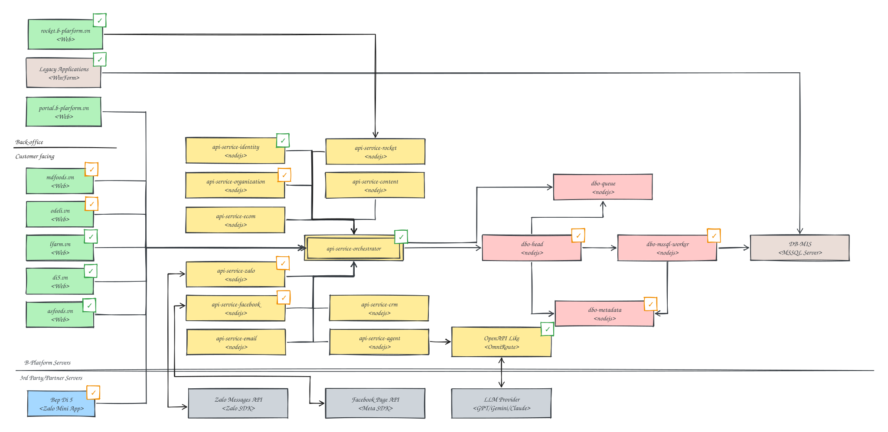

# Code Bases

This catalog is derived from [`component-design.excalidraw`](../diagrams/component-design.excalidraw), the authoritative architecture baseline. Only components represented as B-Platform applications are listed as codebases.

## Architecture layer diagram

## Legend

| Diagram representation | Meaning |
|---|---|
| Green box | Web application |
| Blue box | Partner application |
| Yellow or pink box | API application |
| Brown box | Legacy component |
| Grey box | External dependency—not a B-Platform codebase |
| Green check overlay | Ready to use / Published |
| Yellow check overlay | In Development |
| No overlay | Not started |

## B-Platform codebases

### Web applications

| Component | Technology / channel | Status | Purpose |
|---|---|---|---|
| [`rocket.b-plarform.vn`](./rocket-bplatform.md) | Web | **Ready to use / Published** | Rocket.Chat web interface. |
| [`portal.b-plarform.vn`](./bof-web-bplatform.md) | Web | **Not started** | B-Platform back-office portal. |
| [`mdfoods.vn`](./cfc-web-mdfoods.md) | Web | **In Development** | MDFoods customer-facing website. |
| [`odeli.vn`](./cfc-web-odeli.md) | Web | **In Development** | Odeli customer-facing website. |
| [`lfarm.vn`](./cfc-web-lfarm.md) | Web | **Ready to use / Published** | LFarm customer-facing website. |
| [`di5.vn`](./cfc-web-di5.md) | Web | **Ready to use / Published** | Dì 5 customer-facing website. |
| [`asfoods.vn`](./cfc-web-asfoods.md) | Web | **Ready to use / Published** | AS Foods customer-facing website. |

### Partner applications

| Component | Technology / channel | Status | Purpose |
|---|---|---|---|
| [`Bep Di 5`](./cfc-min-di5-zalo.md) | Zalo Mini App | **In Development** | Bếp Dì 5 customer experience delivered as a Zalo Mini App. |

### API applications

| Component | Technology / channel | Status | Purpose |
|---|---|---|---|
| [`api-service-identity`](./api-service-identity.md) | Node.js | **Ready to use / Published** | Identity and authentication service. |
| [`api-service-rocket`](./api-service-rocket.md) | Node.js | **Not started** | Rocket.Chat integration service. |
| [`api-service-organization`](./api-service-organization.md) | Node.js | **In Development** | Organization and B2B business service. |
| [`api-service-content`](./api-service-content.md) | Node.js | **Not started** | Content domain service. |
| [`api-service-ecom`](./api-service-ecom.md) | Node.js | **Not started** | E-commerce domain service. |
| [`api-service-orchestrator`](./api-service-orchestrator.md) | Node.js | **Ready to use / Published** | Orchestrates requests between API services. |
| [`api-service-zalo`](./api-service-zalo.md) | Node.js | **In Development** | Zalo integration service. |
| [`api-service-facebook`](./api-service-facebook.md) | Node.js | **In Development** | Facebook integration service. |
| [`api-service-crm`](./api-service-crm.md) | Node.js | **Not started** | Customer relationship management service. |
| [`api-service-agent`](./api-service-agent.md) | Node.js | **Not started** | AI agent orchestration service. |
| [`api-service-email`](./api-service-email.md) | Node.js | **Not started** | Email integration service. |
| [`dbo-queue`](./dbo-queue.md) | Node.js | **Not started** | Asynchronous database-operation ingress. |
| [`dbo-head`](./dbo-head.md) | Node.js | **In Development** | Database-operation planner and consolidator. |
| [`dbo-mssql-worker`](./dbo-mssql-worker.md) | Node.js | **In Development** | MSSQL database-operation worker. |
| [`dbo-metadata`](./dbo-metadata.md) | Node.js | **In Development** | Database worker and entity metadata catalog. |
| [`OpenAPI Like`](./openapi-like.md) | OmniRoute | **Ready to use / Published** | OmniRoute OpenAPI-compatible component. |

### Legacy components

| Component | Technology / channel | Status | Purpose |
|---|---|---|---|
| [`Legacy Applications`](./legacy-applications.md) | WinForm | **Ready to use / Published** | Existing Windows Forms applications. |
| [`DB-MIS`](./db-mis.md) | MSSQL Server | **Not started** | MIS database server as represented in the component design. |

## External dependencies

Grey components are integrations or infrastructure owned outside B-Platform. They are intentionally not included in the codebase catalog.

| Dependency | Technology / provider | Diagram marker |
|---|---|---|
| Zalo Messages API | Zalo SDK | Not started |
| Facebook Page API | Meta SDK | Not started |
| LLM Provider | GPT / Gemini / Claude | Not started |

## Source notes

- Names and statuses preserve the current diagram, including the `b-plarform.vn` spelling.
- `DB-MIS` is marked **Not started** because it has no status overlay, even though it is classified as legacy.
- Status here describes architecture delivery state, not GitHub repository existence.
