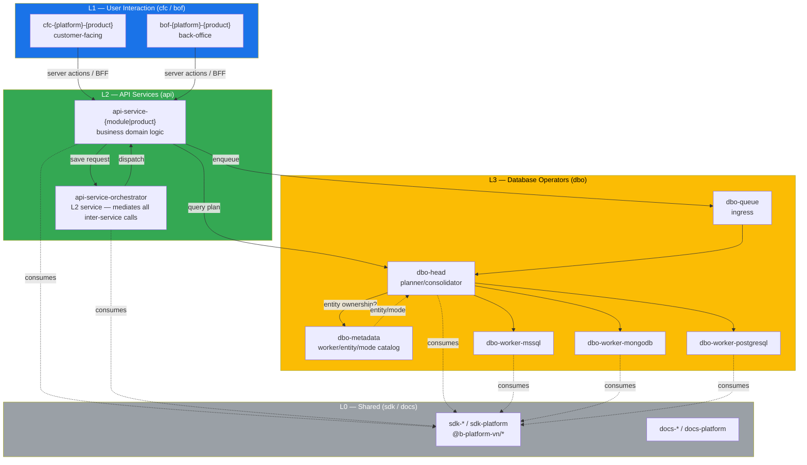

# Code Bases

> Living mirror of every repository in the `github.com/bplatform-vn` organization.
> The remote default branch (`main`) is the **single source of truth**. This index
> summarizes each repo's purpose, layer, and key dependencies. Per-repo detail lives
> in `code_bases/<repo>.md`.

Last synced: 2026-08-09

## Architecture layers

The B-Platform ecosystem follows the
[Super App kernel architecture](../products/bplatform-general/architecture/super-app.md).
Repos follow the **v3 naming convention** (see
[ADR: repo-naming-convention](../../#) — stored in `/memories/repo/repo-naming-convention.md`):

```
{layer}-{x}
```

`layer` determines what `{x}` means and which axes are allowed:

| Token | Layer | Name | Audience axis | Form axis |
|---|---|---|---|---|
| `cfc` | L1 | Customer-Facing | ✅ | ✅ |
| `bof` | L1 | Back-Office | ✅ | ✅ |
| `api` | L2 | API Services | ❌ | ❌ |
| `dbo` | L3 | Database Operators | ❌ | ❌ |
| `docs` | L0 | Documentation only | ❌ | ❌ |
| `sdk` | — | Shared package across all layers | ❌ | ❌ |

### `{x}` per layer

| Layer | `{x}` format | Examples |
|---|---|---|
| `cfc` / `bof` (L1) | `{platform}-{product}` | `cfc-web-mdfoods`, `bof-web-bplatform`, `cfc-min-mdfoods-zalo` |
| `api` (L2) | `service-{module\|product}` | `api-service-ecom`, `api-service-organization`, `api-service-identity` |
| `dbo` (L3) | `{role}(?-{stack})` | `dbo-queue`, `dbo-head`, `dbo-metadata`, `dbo-worker-mssql`, `dbo-worker-mongodb` |

> **DBO implementation plan**: [`technical-requirements/dbo-implementation-plan.md`](../technical-requirements/dbo-implementation-plan.md) — 13 tasks (T0–T12) with per-repo work breakdown, acceptance criteria, and a shared docker-compose E2E integration env. Assign T0 → DevOps, T1–T12 → Engineer.
| `docs` / `sdk` (L0) | `platform` (shared) | `sdk-platform`, `docs-platform` |

**L1 `platform` values:** `mob` (Mobile), `des` (Desktop), `web` (Website), `min` (MiniApp).
**Product slugs** are normalized against `products/`: `bplatform`, `unigate`, `mdfoods`, `lfarm`, `asfoods`, `di5`, `mcm`, `crm`, `sale`, `content`, `product`, `zalo`, `facebook`, `whatsapp`, `odeli`.



**Dependency direction (strict, one-way):** L1 → L2 → L3. L2 may not call L1; L3 may not call L2. **L2 services never call each other directly** — they save requests to the **Service Orchestrator**, which dispatches to the target service. L2 calls `dbo-head` synchronously (request/response) for all datastore access, or enqueues to `dbo-queue` for async bulk ops — **never** touches `dbo-worker-*` directly. L0 (`sdk-*`/`docs-*`) is consumed by all layers but depends on nothing upstream.

### Response delivery from the orchestrator

When an L2 service sends a request to the orchestrator (targeting another L2 service), there are **3 ways** to receive the response:

| Pattern | How it works | When to use |
|---|---|---|
| **Synchronous** | Final result is sent back in the current connection. | Local development (server cannot call back to a local service); extremely fast operations (<1s) like service-authentication checks. |
| **Short polling** | Orchestrator responds immediately with a short-polling URL. Client calls that URL at intervals to check status and gets the result when done. | Short-living tasks (1s–15s). |
| **Long polling** | Orchestrator responds immediately with a long-polling URL. Client calls that URL at intervals to check status and gets the result when done. | Long-living tasks (15s+). |

## Repository index (v3 convention)

> **Single source of truth = remote `github.com/b-platform-vn/*` default branches.** As of 2026-08-09, **no v3-named repos exist on the remote yet** — all 38 repos still use their original names. The v3 convention is the recorded target; renames are opportunistic.
>
> **Status legend:**
> - `active` — repo exists on remote under this name today.
> - `planned (rename of <old>)` — v3 name decided; remote still uses the old name until renamed.
> - `planned (new)` — v3 name decided; repo does not exist yet.
> - `retire` — to be deleted/archived, not renamed.
>
> Old-name per-repo pages are preserved in [`deprecated/`](./deprecated/) for history; each v3 page links to its predecessor where applicable.

### L1 — User Interaction (`cfc-*` / `bof-*`)

| v3 repo | Status | Purpose | Detail |
|---|---|---|---|
| [`cfc-web-mdfoods`](./cfc-web-mdfoods.md) | planned (rename of `web-b2b-mdfoods`) | Customer MDFoods B2B storefront (Next.js + Server Actions) | [→](./cfc-web-mdfoods.md) |
| [`cfc-web-asfoods`](./cfc-web-asfoods.md) | planned (rename of `web-b2c-asfoods`) | AS Foods public storefront (Next.js, i18n vi/en) | [→](./cfc-web-asfoods.md) |
| [`cfc-web-di5`](./cfc-web-di5.md) | planned (rename of `web-b2c-di5`) | Di5 Kitchen public storefront (Next.js App Router) | [→](./cfc-web-di5.md) |
| [`cfc-web-lfarm`](./cfc-web-lfarm.md) | planned (rename of `web-b2c-lfarm`) | LFarm public storefront (Next.js + Tailwind) | [→](./cfc-web-lfarm.md) |
| [`cfc-web-mcm`](./cfc-web-mcm.md) | planned (rename of `web-mcm-messenger`) | MCM customer-messaging web (Next.js + RxDB offline-first) | [→](./cfc-web-mcm.md) |
| [`bof-web-bplatform`](./bof-web-bplatform.md) | planned (rename of `web-admin-portal`) | B-Platform Super App backoffice web (Next.js) | [→](./bof-web-bplatform.md) |

### L2 — API Services (`api-service-*`) — domain-driven

Business logic is grouped by domain, not by product or channel. Each domain service owns the functions listed; see the v3 page for the legacy→domain fold map.

| v3 repo | Status | Domain | Functions | Detail |
|---|---|---|---|---|
| [`api-service-ecom`](./api-service-ecom.md) | planned (fold of `api-ecom-universal` + `api-b2cstore` + `api-product` + `api-b2b-mdfoods` B2C parts) | e-commerce (B2C) | Customer, Products, Product Categories, Order, Delivery | [→](./api-service-ecom.md) |
| [`api-service-organization`](./api-service-organization.md) | planned (fold of `api-b2b-mdfoods` B2B parts + `api-backoffice-quotes` + `api-sale`) | organization (B2B) | Employee, Company, Member/Permission, Quote, Sales pipeline | [→](./api-service-organization.md) |
| [`api-service-social`](./api-service-social.md) | planned (new) | social | Articles, Posts, Comments | [→](./api-service-social.md) |
| [`api-service-integration`](./api-service-integration.md) | planned (fold of `api-mcm-connector-zalo` + FB/WA integrations) | integrations | 3rd-party connectors (Zalo, Facebook, WhatsApp) | [→](./api-service-integration.md) |
| [`api-service-crm`](./api-service-crm.md) | planned (new; absorbs `api-service-mcm`) | crm | Customer relationship management, communication (MCM omni-channel router, DLQ/retry) | [→](./api-service-crm.md) |
| [`api-service-content`](./api-service-content.md) | planned (rename of `api-b2c-content`; absorbs `api-service-file`) | content | Storefront content (Strapi), media/file management | [→](./api-service-content.md) |
| [`api-service-orchestrator`](./api-service-orchestrator.md) | planned (new) | orchestration | Cross-service request routing, response delivery (sync / short-poll / long-poll), DLQ | [→](./api-service-orchestrator.md) |

**Domain boundary rules:**

- `api-service-ecom` (B2C) ↔ `api-service-organization` (B2B): quote-to-order handoff goes B2B→B2C — routed through the orchestrator, not a direct call.
- `api-service-crm` → `api-service-integration`: CRM requests outbound sends (Email, Zalo, FB, WhatsApp, ZNS) via the orchestrator; integration persists inbound messages to the DB and CRM reads them back via `dbo-head`. DLQ/retry stays with CRM.
- `api-service-identity` is cross-cutting — consumed by all business domains (via orchestrator).
- `api-service-content` absorbs file/media management — media files are content, not a separate cross-cutting domain. Consumed by all business domains for content/media (via orchestrator).
- MCM is a communication sub-domain of CRM, not a separate service.
- **The orchestrator is itself an L2 service** ([`api-service-orchestrator`](./api-service-orchestrator.md)) — same layer as the domains it mediates. It owns routing + response-pattern negotiation + DLQ, not business logic.
- **No L2 service calls another L2 service directly** — all inter-service requests go through the Service Orchestrator.

### L3 — Database Operators (`dbo-*`)

| v3 repo | Status | Purpose | Detail |
|---|---|---|---|
| [`dbo-queue`](./dbo-queue.md) | planned (new) | Async ingress — bulk/background ops only (sync path bypasses it) | [→](./dbo-queue.md) |
| [`dbo-head`](./dbo-head.md) | planned (new) | Planner + fan-out + result consolidator — L2 calls this directly (sync) | [→](./dbo-head.md) |
| [`dbo-metadata`](./dbo-metadata.md) | planned (new) | Worker/entity/mode catalog | [→](./dbo-metadata.md) |
| [`dbo-worker-mssql`](./dbo-worker-mssql.md) | planned (new) | MSSQL adapter (migrates ~46k TSQL from `api-ecom-universal`) | [→](./dbo-worker-mssql.md) |
| [`dbo-worker-mongodb`](./dbo-worker-mongodb.md) | planned (new) | MongoDB adapter (MCM collections) | [→](./dbo-worker-mongodb.md) |
| [`dbo-worker-postgresql`](./dbo-worker-postgresql.md) | planned (new) | PostgreSQL adapter | [→](./dbo-worker-postgresql.md) |

### L0 — Shared packages & docs (`sdk-*` / `docs-*`)

| v3 repo | Status | Purpose | Detail |
|---|---|---|---|
| [`sdk-platform`](./sdk-platform.md) | planned (fold of all `sdk-*` repos) | Single shared package — design system, MCM DTOs/schemas/streams/broker, offline DB, system design | [→](./sdk-platform.md) |
| [`docs-platform`](./docs-platform.md) | planned (rename of `platform-ecosystem-docs`) | This Docsify docs site + all cross-cutting shared documentation (absorbs `docs-design-system`, `afw-kb-all`) | [→](./docs-platform.md) |

**L0 folding rules:**

- All `sdk-*` repos fold into `sdk-platform` as subpath exports (e.g. `@b-platform-vn/sdk-platform/mcm-streams`). Internal module boundaries preserved; each former SDK's public API stays intact as a subpath.
- All shared docs fold into `docs-platform` (this repo). Domain docs (`docs-design-system`, `afw-kb-all`) become sections within `docs-platform`, not separate repos.
- Retire `@bplatform/` and `@bplatform-store/` scopes — everything publishes under `@b-platform-vn/*`.

### Platform infra (DevOps-owned, outside the layer convention)

| v3 repo | Status | Purpose | Detail |
|---|---|---|---|
| [`platform-fluxcd`](./platform-fluxcd.md) | active | FluxCD GitOps for `k8s-dpsrv` / `k8s-dpsrv-prd` / `k8s-local` | [→](./platform-fluxcd.md) |
| [`platform-workflows`](./platform-workflows.md) | active | Reusable GitHub Actions (Docker build & push to ghcr.io) | [→](./platform-workflows.md) |

### Special cases

| v3 repo | Status | Purpose | Detail |
|---|---|---|---|
| [`deprecated`](./deprecated/deprecated.md) | retire | Legacy monorepo (old DongPhat, LFarm, OnWork, B-Platform, C# APIs) | [→](./deprecated/deprecated.md) |
| [`aa`](./deprecated/aa.md) | retire | Empty placeholder repo | [→](./deprecated/aa.md) |
| [`api-agent-ui`](./deprecated/api-agent-ui.md) | retire | Empty placeholder repo | [→](./deprecated/api-agent-ui.md) |
| [`app-mcm`](./deprecated/app-mcm.md) | retire after extraction | Nx monorepo; packages map to `cfc-web-mcm` + `api-service-crm` (communication) + `api-service-integration` + `sdk-platform/mcm-schemas` | [→](./deprecated/app-mcm.md) |
| [`web-static-files`](./deprecated/web-static-files.md) | retire | Nginx static hosting for Zalo verification — replaced by DNS-based verification | [→](./deprecated/web-static-files.md) |
| [`mcm-dlq-consumer`](./deprecated/mcm-dlq-consumer.md) | retire | MCM dead-letter queue consumer — MCM solution to be reworked; DBO reliability designed with new MCM architecture | [→](./deprecated/mcm-dlq-consumer.md) |
| [`mcm-retry-scheduler`](./deprecated/mcm-retry-scheduler.md) | retire | MCM retry scheduler — MCM solution to be reworked; DBO reliability designed with new MCM architecture | [→](./deprecated/mcm-retry-scheduler.md) |
| [`design-mdfoods-landing`](./deprecated/design-mdfoods-landing.md) | retire | Figma Make reference bundle — removed from code_bases topology | [→](./deprecated/design-mdfoods-landing.md) |
| [`platform-endpoints`](./deprecated/platform-endpoints.md) | retire | Nginx routing config — removed from code_bases topology | [→](./deprecated/platform-endpoints.md) |
| [`platform-agents`](./deprecated/platform-agents.md) | retire | Copilot skills tooling — removed from code_bases topology | [→](./deprecated/platform-agents.md) |

## Conventions (v3 — approved 2026-08-09)

> Full ADR: `/memories/repo/repo-naming-convention.md`.

### Naming format

```
{layer}-{x}
```

`layer` is one of: `cfc` (L1 customer-facing), `bof` (L1 back-office), `api` (L2 API services), `dbo` (L3 database operators), `docs` (L0 documentation only), `sdk` (shared package across all layers).

### `{x}` per layer

- **L1 (`cfc` / `bof`)** → `{platform}-{product}`.
  - `platform` ∈ {`mob` Mobile, `des` Desktop, `web` Website, `min` MiniApp}.
  - `product` = normalized product slug (see `products/`).
  - Optional variant suffix for MiniApp platform: `-zalo`, `-momo`.
  - Example: `cfc-web-mdfoods`, `bof-web-bplatform`, `cfc-min-mdfoods-zalo`.
- **L2 (`api`)** → `service-{module|product}`. Always the literal `service-` prefix. No audience, no form.
  - Example: `api-service-ecom`, `api-service-organization`, `api-service-identity`.
- **L3 (`dbo`)** → `{role}(?-{stack})`.
  - `dbo-queue` (no stack), `dbo-head` (no stack), `dbo-metadata` (no stack).
  - `dbo-worker-{stack}` where `stack` ∈ {`mssql`, `postgresql`, `mongodb`}.
- **L0 (`docs` / `sdk`)** → `platform` for the cross-cutting shared package/doc, or `<domain>` for domain-specific ones.
  - `sdk-platform`, `docs-platform`.

### Dependency direction (strict, one-way)

L1 → L2 → L3. Reverse edges are an architecture violation. **L2 services never call each other directly** — they save requests to the Service Orchestrator, which dispatches to the target. The orchestrator offers 3 response patterns: synchronous (<1s, e.g. auth checks), short polling (1s–15s), and long polling (15s+). L2 calls `dbo-head` synchronously (request/response) for all datastore access, or enqueues to `dbo-queue` for async bulk ops — **never** touches `dbo-worker-*` directly. L0 (`sdk-*`/`docs-*`) is consumed by all layers and depends on nothing upstream.

### Shared package consumption

Internal packages are scoped `@b-platform-vn/*` and published via GitHub Package Registry — consuming repos use `.npmrc` + `NODE_AUTH_TOKEN`. Retire the legacy scopes `@bplatform/` and `@bplatform-store/`.

### Status

Each per-repo page carries a `Status` field (`active` / `planned (rename of ...)` / `planned (new)` / `retire`).

### Migration stance

- v3 applies to **all new repos** starting 2026-08-09.
- Existing repos are **renamed opportunistically** when a breaking change is already due — no in-place mass rename.
- `deprecated`, `aa`, `api-agent-ui` (empty) → retire.
- `app-mcm` → retire after its packages are extracted into per-layer v3 repos.

## Deprecated (old-name) per-repo pages

All 38 pre-v3 per-repo pages are preserved in [`deprecated/`](./deprecated/) for history. Each carries a `v3 target` row pointing to its successor.
