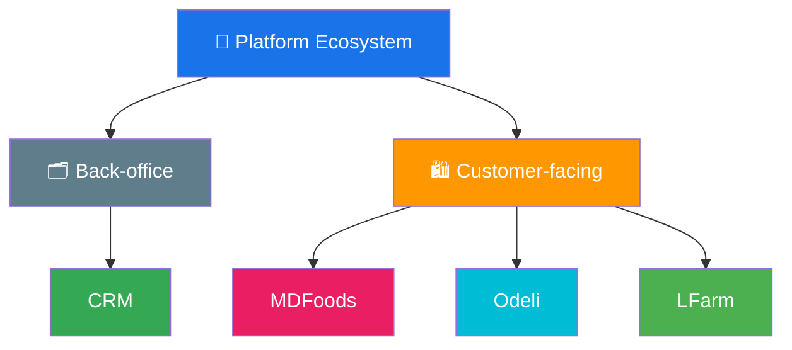

# Product Overview

> A comprehensive map of all products and business units in the platform ecosystem, grouped by category.

## Product Categories

Products are organized into two groups based on who they serve:

- **Back-office** — Support operations and customer support. Mainly for in-house teams, contractors, or management.
- **Customer-facing** — Serve the end-user (customer) directly.

## Ecosystem at a Glance



## Back-office

> Support operation and customer support. Mainly for in-house, contractor, or management.

| Product / Business Unit | Domain | Key Responsibility |
|---|---|---|
| [Customer Relationship Management (CRM)](/products/crm/) | Customer Management, Communication & Support | Unified platform for managing customers, communicating across all channels, and handling customer support. |

## Customer-facing

> Serve the end-user (customer) directly.

| Product / Business Unit | Domain | Key Responsibility |
|---|---|---|
| [MDFoods](/products/mdfoods/) | B2B Food Supplement | Online B2B food supplement platform serving business buyers. |
| [Odeli](/products/odeli/) | D2C Food Retail | Direct-to-consumer online foods store. |
| [LFarm](/products/lfarm/) | Organic Farming | Organic farm producing and supplying organic goods. |

> 💡 **Tip**: Click a product name to see its tools, apps, and platforms.

## How This Documentation Is Organized

```
products/
├── README.md                      ← You are here (Overview)
├── crm/                           ← Back-office: CRM detail hub
│   ├── README.md
│   └── features/
├── mdfoods/                       ← Customer-facing: MDFoods
│   ├── README.md
│   └── features/
├── odeli/                         ← Customer-facing: Odeli
│   ├── README.md
│   └── features/
└── lfarm/                         ← Customer-facing: LFarm
    ├── README.md
    └── features/
```
