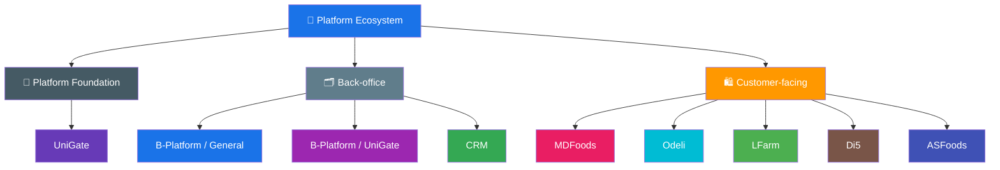

# Product Overview

> A comprehensive map of all products and business units in the platform ecosystem, grouped by category.

## Product Categories

Products are organized into three groups based on who they serve and the shared capabilities they provide:

- **Platform Foundation** — Shared authentication, authorization, identity, and access capabilities used across ecosystem products.
- **Back-office** — Support operations and customer support. Mainly for in-house teams, contractors, or management.
- **Customer-facing** — Serve the end-user (customer) directly.

## Ecosystem at a Glance



## Platform Foundation

> Shared capabilities used by both customer-facing products and the internal B-Platform ecosystem.

| Product / Business Unit | Domain | Key Responsibility |
|---|---|---|
| [UniGate](/products/unigate/) | Customer Identity, Authentication & Authorization | Central customer sign-up/sign-in, cross-product SSO, customer account lifecycle, and per-product access control. |

## Back-office

> Support operation and customer support. Mainly for in-house, contractor, or management.

| Product / Business Unit | Domain | Key Responsibility |
|---|---|---|
| [B-Platform / General](/products/bplatform-general/) | Global UX, Shared Navigation & Platform Functions | Shared global navigation, global search, app shell behavior, and reusable cross-product UX requirements. |
| [B-Platform / UniGate](/products/bplatform-unigate/) | UniGate Administration, Identity & Authorization | Management side of UniGate for applications, users, roles, permissions, customer accounts, product access, and audit workflows. |
| [Customer Relationship Management (CRM)](/products/crm/) | Customer Management, Communication & Support | Unified platform for managing customers, communicating across all channels, and handling customer support. |

## Customer-facing

> Serve the end-user (customer) directly.

| Product / Business Unit | Domain | Key Responsibility |
|---|---|---|
| [MDFoods](/products/mdfoods/) | B2B Food Supplement | Online B2B food supplement platform serving business buyers. |
| [Odeli](/products/odeli/) | D2C Food Retail | Direct-to-consumer online foods store. |
| [LFarm](/products/lfarm/) | Organic Farming | Organic farm producing and supplying organic goods. |
| Di5 | Customer-facing product | Connected customer-facing product; detailed product documentation is TBD. |
| ASFoods | Customer-facing product | Connected customer-facing product; detailed product documentation is TBD. |

> 💡 **Tip**: Click a product name to see its tools, apps, and platforms.

## How This Documentation Is Organized

```
products/
├── README.md                      ← You are here (Overview)
├── unigate/                       ← Platform Foundation: Customer identity, SSO, and product access
│   ├── README.md
│   └── features/
├── bplatform-general/             ← Back-office / Platform Foundation: Global functions and shared UX
│   └── README.md
├── bplatform-unigate/             ← Back-office / Platform Foundation: UniGate management side
│   └── README.md
├── crm/                           ← Back-office: CRM detail hub
│   ├── README.md
│   └── features/
├── mdfoods/                       ← Customer-facing: MDFoods
│   ├── README.md
│   └── features/
├── odeli/                         ← Customer-facing: Odeli
│   ├── README.md
│   └── features/
└── lfarm/                         ← Customer-facing: LFarm
    ├── README.md
    └── features/
```
