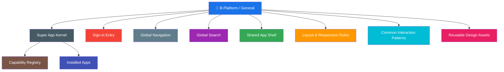
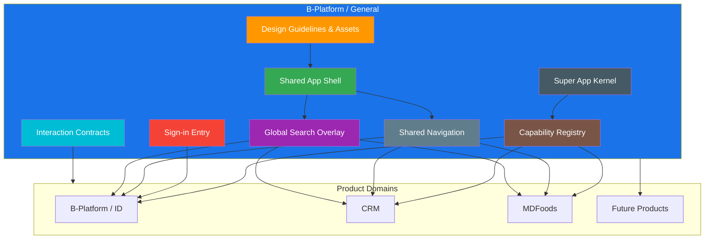

# B-Platform / General

> B-Platform Super App: the internal platform shell that provides authentication, global navigation, global search, and installed-app composition for the B-Platform ecosystem.

**Category:** Back-office / Platform Foundation

## Mission

B-Platform / General is the **B-Platform Super App**. It defines the common runtime and user experience that internal B-Platform applications plug into so users experience the ecosystem as one coherent platform instead of a set of disconnected applications. It owns the Super App shell, internal sign-in, global navigation, global search, installed-app bootstrap, capability registry, shared shell behavior, common interaction patterns, and reusable platform-wide UX requirements.

## Role & Responsibility

| Area | Description |
|---|---|
| Category | Back-office / Platform Foundation |
| Domain | Super App, global UX, shared navigation, discovery, shell behavior, installed-app runtime, common platform functions |
| Form Factor | Next.js Super App, shared web UI components, design assets, interaction contracts, server-side API gateway/BFF |
| Users | Internal operators, product teams, developers, designers, and users moving across ecosystem applications |
| Key Outcome | Consistent cross-product navigation and discovery with reusable platform-level UX patterns |

## What B-Platform / General Does

- Defines global functions shared across B-Platform products.
- Provides the B-Platform Super App runtime where internal apps can be installed.
- Bootstraps installed applications and registers their permissions, functions, dependencies, navigation entries, routes, and search providers.
- Provides a kernel/capability registry for cross-app feature calls.
- Defines shared internal sign-in and first-run root-user initialization behavior across B-Platform internal applications.
- Provides the shared application shell expectations for navigation, layout, and cross-module interactions.
- Defines global navigation behavior across modules and functions.
- Defines global search behavior for cross-module and cross-function discovery.
- Provides reusable UX patterns that product-specific teams should use instead of rebuilding one-off equivalents.
- Separates platform-level shared assets from product-specific screens such as `B-Platform / ID`.
- Documents shared interaction contracts so implementation and Figma designs stay aligned.

## Core Global Functions

### 1. Super App Kernel

The Super App kernel is the runtime that loads installed applications and coordinates cross-app features.

Requirements:

- Use Next.js as the Super App front-end framework and server-side BFF/API gateway.
- Keep secrets and internal API communication on the Next.js server side.
- Bootstrap all installed applications during startup.
- Let each installed app inject supported permissions, functions, dependencies, navigation entries, routes, and search providers.
- Maintain a capability registry for function lookup and dispatch.
- When an app requests a function, look up the provider in the registry and ask the provider app to execute it.
- Forward successful results to the requester.
- Return a safe `cannot be handled` response when no installed app supports the requested function.

Architecture details: [B-Platform Super App Architecture](/products/bplatform-general/architecture/super-app.md)

### 2. Sign-in Entry

Sign-in entry is the shared internal authentication entry used by internal applications such as B-Platform ID, B-Platform CRM, B-Platform Product, B-Platform Sale, and future internal B-Platform applications.

Requirements:

- Provide a consistent internal `Sign in` entry pattern across B-Platform internal applications.
- Detect first-run system state when no users exist.
- Show an initialization flow for creating the first root user only when no users exist.
- Disable account creation from the sign-in screen after initialization.
- Require all future account creation through `B-Platform ID / Users`.
- Preserve the user's original internal application, module, function, and safe return URL before authentication.
- Distinguish uninitialized, unauthenticated, authenticated-but-unauthorized, and session-expired states to avoid broken setup flows and login loops.

Feature details: [Sign-in](/products/bplatform-general/features/sign-in.md)

### 3. Global Navigation

Global navigation is the shared entry point for moving between B-Platform modules and functions.

Requirements:

- Provide a shared left navigation/sidebar pattern for platform administration surfaces.
- Support module/function grouping so users can understand where they are in the ecosystem.
- Show the active module/function state clearly.
- Keep navigation size and behavior consistent across screens.
- Use shared navigation components rather than rebuilding per product screen.
- Include a global search trigger in the navigation area.
- Support collapsed and expanded navigation states when the product shell requires it.
- Use Lucide icons for new global navigation iconography.

### 4. Global Search

Global search provides cross-module and cross-function discovery across B-Platform.

Requirements:

- Use global search from the shared navigation, not table-local search/filter/sort controls by default.
- Trigger search through a navigation search control and keyboard shortcuts:
  - `Cmd + K` on macOS.
  - `Ctrl + K` on Windows/Linux.
- Display search as a reusable overlay above the current page.
- Keep the search overlay as a shared `/ General` asset, not embedded permanently inside product-specific list pages.
- Center the modal/card over the current page with a subtle scrim.
- Focus the search input first when the overlay opens.
- Show matching results directly below the input while typing.
- Group results by `Module · Function`.
- Show results from the current function first and label them as current-context results.
- Each result row should show:
  - primary title,
  - secondary `Module / Function` metadata,
  - optional keyboard/action hint.
- Keep result rows compact, bordered or subtly separated, and keyboard-navigable.
- Support keyboard navigation hints such as `↑↓ Navigate`, `↵ Open`, and `Esc Close`.

Command-palette visual pattern:

- Use a compact floating command-palette modal rather than a full management page layout.
- Preferred modal width: `640px–720px`.
- Height should hug results up to a comfortable maximum height.
- Use a top search row with a `20px` Lucide search icon, `16px–18px` query text, and right-aligned keyboard hints.
- Separate search input and results with a `1px` neutral divider.
- Include a short helper/status row such as `Search across B-Platform` and `Current function first`.
- Use muted group labels and compact rows.
- Highlight the active/current result row with a subtle surface and selected-state accent marker.
- Avoid heavy cards around every result; use one modal container and subtle row hover/active states.

### 5. Shared App Shell

The shared app shell defines consistent high-level layout behavior across internal admin products.

Requirements:

- Use a fixed root artboard/page frame for desktop admin screens when designing in Figma.
- Use a horizontal app-shell layout: global navigation on the left and page content filling the remaining width.
- Keep left sidebars, right sidebars/panels, and main content areas using fill-container height.
- Avoid per-screen navigation resizing; update shared navigation components instead.
- Use explicit page headers with title/subtitle and action cluster where applicable.
- Keep dense admin spacing rhythm consistent across modules.

### 6. Common Interaction Patterns

B-Platform / General owns common interaction guidance that applies across products.

Requirements:

- Use shared modal behavior for overlays, confirmations, and global command surfaces.
- Use shared selected states and keyboard accessibility patterns.
- Use compact table/list density unless a product-specific workflow requires more spacious layouts.
- Prefer global search for cross-product discovery and table-local search only when a specific table workflow requires it.
- Use the square check-toggle pattern for compact boolean controls in Platform ID-style admin screens.
- Keep Lucide icons as the standard for new platform-level iconography.

## Boundaries

B-Platform / General owns shared platform-level behavior. Product-specific business workflows remain in their product documents.

| Product | Boundary |
|---|---|
| [B-Platform / ID](/products/bplatform-id/) | Owns user records, application/client management, roles, permissions, authorization features, and identity capabilities consumed by the Super App. |
| [CRM](/products/crm/) | Owns customer management, communication, support, and sales handoff workflows. |
| [MDFoods](/products/mdfoods/) | Owns B2B storefront, quote, order, and customer-facing purchasing flows. |
| B-Platform / General | Owns the Super App runtime, app bootstrap, capability registry, global navigation, global search, shared shell, shared UX patterns, and reusable platform functions. |

## Architecture Overview

## Tools, Apps & Platforms

| Tool / App / Platform | Type | Purpose | Feature Details |
|---|---|---|---|
| Super App Kernel | Runtime Architecture | Loads installed apps, maintains capability registry, dispatches cross-app function calls, and coordinates dependencies. | [Architecture](/products/bplatform-general/architecture/super-app.md) |
| Sign-in Entry | UX Contract | Defines shared internal sign-in, first-run root-user initialization, post-initialization account creation restrictions, and return-target handling. | [Sign-in](/products/bplatform-general/features/sign-in.md) |
| Shared Navigation | Design/UI Asset | Provides consistent module/function navigation across platform admin screens. | _To be documented_ |
| Global Search Overlay | Design/UI Asset | Provides cross-module and cross-function search through a reusable command-palette overlay. | _To be documented_ |
| Platform Design Guidelines | Documentation | Defines shared visual, layout, icon, interaction, and validation rules. | _To be documented_ |
| Shared App Shell | UI Pattern | Defines how navigation, content, headers, overlays, and panels compose across admin surfaces. | _To be documented_ |

## Dependencies

| Depends On | Category | What It Provides to B-Platform / General |
|---|---|---|
| Platform design guidelines | Design system | Visual language, tokens, icon rules, layout rules, and validation expectations. |
| Product domains | Ecosystem products | Module/function metadata and target destinations for global navigation and search. |
| Installed apps | Platform apps | Permissions, functions, dependencies, routes, navigation entries, search providers, and internal API capabilities. |
| B-Platform / ID | Platform Foundation | User records, root-user initialization, authentication capabilities, authorization features, roles, and permissions consumed through the Super App registry. |

## Key Contacts

| Role | Name | Team |
|---|---|---|
| Product Owner | _TBD_ | _TBD_ |
| Tech Lead | _TBD_ | _TBD_ |
| Engineering Manager | _TBD_ | _TBD_ |
