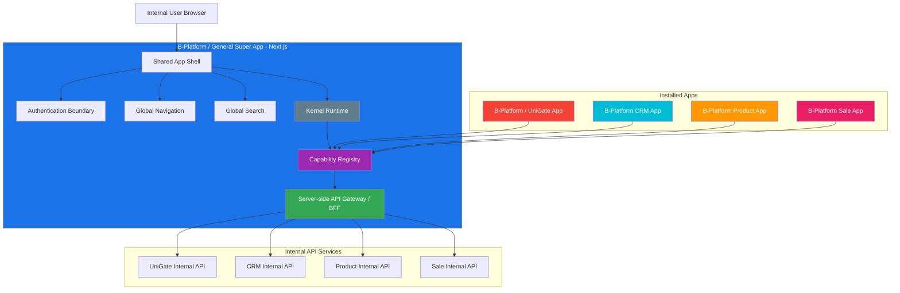
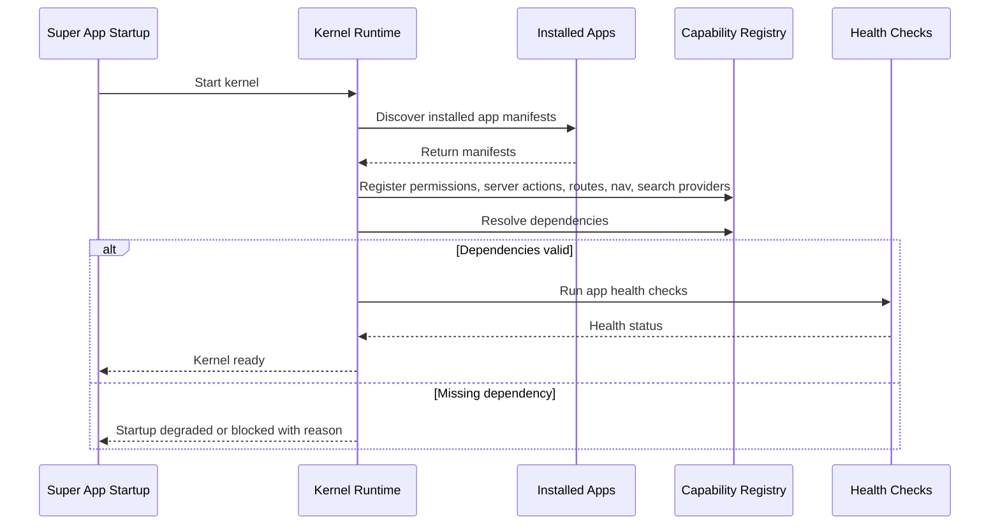
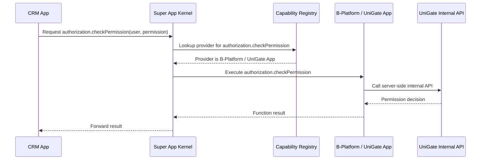

# B-Platform Super App Architecture

| | |
|---|---|
| **Author** | tvlong |
| **Updated** | 2026.07.24 |
| **Product** | [B-Platform / General](/products/bplatform-general/README.md) |
| **Status** | Draft |
| **Priority** | P0 |

---

## Overview

`B-Platform / General` is the **B-Platform Super App**. It is the internal platform shell where internal users sign in, navigate, search, and use installed applications such as **B-Platform / UniGate**, **B-Platform CRM**, **B-Platform Product**, **B-Platform Sale**, and future apps.

The Super App provides the shared runtime and user experience. Installed apps contribute components into the Super App at bootstrap time. Those components include server actions, navigation entries, routes, search providers, permissions, dependencies, and service endpoints.

## Goals

- Build `B-Platform / General` as the internal Super App.
- Allow internal apps to be installed into the Super App.
- Bootstrap all installed apps when the Super App starts.
- Let installed apps declare supported components: server actions, navigation items, routes, search providers, permissions, and dependencies.
- Provide global authentication, navigation, and search through the Super App shell.
- Allow the Super App to use features from installed apps.
- Allow installed apps to request features from other installed apps through the Super App registry.
- Keep secrets on the server side by using Next.js server runtime as the internal API gateway/BFF.

## Non-goals

- Public/customer-facing storefront composition.
- Direct browser-to-internal-service calls.
- Allowing installed apps to bypass the Super App registry for cross-app feature calls.
- Runtime execution of untrusted third-party code.
- User self-registration through the Super App after first-run initialization.

## Front-end Framework

The Super App uses **Next.js**.

Reasons:

- The server runtime can hold secrets and communicate with internal API services.
- Browser clients do not need direct access to internal API credentials.
- Server components, route handlers, and server actions can mediate access to installed app APIs.
- The Super App can act as a BFF/API gateway for internal UI workflows.
- It supports shared layout, nested routes, streaming, and app-level composition.

## Architecture Style

The Super App follows an **OSGi / Kernel Architecture** pattern.

Concepts:

| Concept | Meaning |
|---|---|
| Kernel | Super App runtime that boots installed apps and owns shared services. |
| Installed App | A B-Platform app package/module installed into the Super App runtime. |
| Manifest | Declarative metadata exported by an installed app. |
| Registry | Runtime index of all app capabilities, functions, permissions, routes, and dependencies. |
| Service Contract | Typed interface for a function that an app provides or consumes. |
| Capability | A feature/function exposed by an app and callable through the kernel. |
| Dependency | A required app/capability that must exist before an app can start. |

## High-level Architecture



## Installed App Manifest

Each installed app must expose a manifest that the Super App can load during bootstrap.

Example fields:

| Field | Description |
|---|---|
| `appId` | Stable app identifier, e.g. `id`, `crm`, `product`, `sale`. |
| `name` | Human-readable app name. |
| `version` | App package/API contract version. |
| `permissions` | Permission definitions and permission-expression templates the app contributes. |
| `serverActions` | Server-side actions that interact with databases or internal APIs. |
| `functions` | Callable functions/capabilities the app provides. Kept for generic cross-app capabilities; server actions should use `serverActions`. |
| `dependencies` | Required app IDs or capability contracts. |
| `navigation` | Global navigation modules/functions contributed by the app. |
| `searchProviders` | Search providers contributed to global search. |
| `routes` | UI routes/pages contributed to the Super App. |
| `apiClients` | Server-side API clients/endpoints used by the app. |
| `healthCheck` | Optional startup/runtime health check. |

> Note: `B-Platform / UniGate` is the management-side product name. Existing examples may keep `id.*` capability keys as stable technical contracts unless an explicit API migration renames those keys.

Example manifest shape:

```ts
export interface BPlatformAppManifest {
  appId: string;
  name: string;
  version: string;
  permissions: PermissionDefinition[];
    serverActions: ServerActionDefinition[];
  functions: FunctionDefinition[];
  dependencies: DependencyDefinition[];
  navigation: NavigationDefinition[];
  searchProviders: SearchProviderDefinition[];
  routes: RouteDefinition[];
  apiClients: ApiClientDefinition[];
  healthCheck?: HealthCheckDefinition;
}
```

## Installed App Components

Every installed app can provide one or more component types to the Super App.

| Component | Purpose | Runtime location | Permission requirement |
|---|---|---|---|
| Server Actions | Server-side actions that interact with a database through Prisma or call an internal API service. | Next.js server runtime / Super App kernel. | Required for every action. |
| Navigations | Navigation items shown as part of global navigation. | Super App shell. | Required for every navigation item. |
| Routes | UI routes/pages supported by the app. | Super App routing layer. | Required for every route. |
| Search | Search providers that enrich global search results. | Super App kernel/search aggregator. | Required for every search provider/result domain. |

Component requirements:

- [P0] Every component must declare a permission expression.
- [P0] Components without permission definitions must not be registered as available to users.
- [P0] Server actions must execute only on the server side.
- [P0] Server actions may interact with a database via Prisma or call internal API services, but browser code must never call internal services directly.
- [P0] Navigation items must be hidden or disabled when the current user does not satisfy the declared permission.
- [P0] Routes must validate permission before rendering protected content.
- [P0] Search providers must only return results the current user is allowed to see.

Example component manifest shape:

```ts
export interface ServerActionDefinition {
    key: string;
    permission: PermissionExpression;
    inputSchema: unknown;
    outputSchema: unknown;
    execute: ServerActionHandler;
}

export interface NavigationDefinition {
    key: string;
    label: string;
    route: string;
    icon?: string;
    permission: PermissionExpression;
}

export interface RouteDefinition {
    path: string;
    component: string;
    permission: PermissionExpression;
}

export interface SearchProviderDefinition {
    key: string;
    domains: string[];
    permission: PermissionExpression;
    search: SearchProviderHandler;
}
```

## Permission Expression Convention

Permissions are expressed as stable names with optional scoped parameters. A permission may target one or more specific objects by declaring `param:value` pairs.

General shape:

```text
app.module.action(param:value1,value2).sub_action(param:value)
```

Examples:

```text
crm.communication.list_conversations(division:odl,mdf)
id.apps(app_id:bplatform).edit_user(email:*@dongphat.vn)
id.apps(app_id:bplatform).edit_user(username:!root)
```

Parameter convention:

| Pattern | Meaning | Example |
|---|---|---|
| `param:value` | Permission applies to one specific value. | `app_id:bplatform` |
| `param:value1,value2` | Permission applies to any listed value. | `division:odl,mdf` |
| `param:*` | Permission applies to any value for the parameter. | `email:*` |
| `param:*@domain.com` | Permission applies to values matching the wildcard pattern. | `email:*@dongphat.vn` |
| `param:!value` | Permission applies to all values except the negated value. | `username:!root` |

Permission matching requirements:

- [P0] Permission names must be stable and namespaced by app/domain.
- [P0] Parameter names must be explicit and documented by the app that defines the permission.
- [P0] Multiple values in one parameter mean logical `OR` for that parameter.
- [P0] Multiple parameters in one permission expression mean logical `AND` across parameters.
- [P0] `*` may be used only as a simple wildcard within a single parameter value.
- [P0] `!value` may be used only as a simple negation for one parameter value.
- [P0] Permission evaluation must be server-side and must not rely on client-only checks.
- [P0] If a permission expression cannot be parsed, the Super App must deny access by default.
- [P0] Apps must not invent ad-hoc permission syntax outside this convention without updating this architecture contract.

### Authorization engine

The Portal server enforces this convention using [`accesscontrol`](https://github.com/onury/accesscontrol) v3. The permission-expression syntax (`app.module.action(param:value)`) is the human-readable contract; `accesscontrol` is the evaluation engine underneath. See the [accesscontrol ADR](./decisions/accesscontrol-authorization.md) for the full mapping.

Mapping:

| Convention concept | `accesscontrol` concept |
|---|---|
| `app.module.action` | Custom action `.action(action, resource)` / `.do(action, resource)`. |
| `app` / `module` | Group/category (`crm/communication`) with bounded bulk grants. |
| `param:value` scoped parameters | `.where()` conditions over request context; scoped values are condition context, not separate roles. |
| `param:*` wildcard | Condition omitting that parameter. |
| `param:!value` negation | `.where('$.param != "value"')` or `.deny()` carve-out. |
| Multiple values = OR | `$.param in ["a","b"]`. |
| Multiple parameters = AND | Logical `and` in one `.where()`. |
| Deny always wins | `accesscontrol` deny-overrides. |
| `own` vs `any` | Enforced possession with a configured ownership resolver. |
| Response field stripping | `perm.filter(record)` with glob attribute grants. |

Authorization requirements:

- [P0] Every server action and route handler must call `tryCan` before executing. A thrown error must never become an accidental allow.
- [P0] Roles represent job functions (root, admin, operator, viewer); scoped parameters are ABAC conditions evaluated at check time, not separate roles.
- [P0] `own` possession must be enforced with a real ownership resolver against the resource record, not just attribute-set selection.
- [P0] Handlers must call `perm.filter()` on read results so only granted fields are returned.
- [P0] Grants must be serializable to MSSQL rows via `getGrantsList()` and reloadable via `new AccessControl(rows)`; `snapshot()`/`restore()` round-trips the whole model.
- [P0] The `access` event stream must feed the bounded audit records defined in the Portal A2UI runtime.
- [P0] Gates (`.require()`) enforce cross-cutting restrictions (production-only, MFA-gated, network-zone); they only restrict.
- [P0] Custom async conditions (`defineCondition`) support business checks (IP allowlist, tenant membership) that resolve against MSSQL.

### Permission definition examples

```ts
const crmConversationNavigation: NavigationDefinition = {
    key: "crm.communication.conversations",
    label: "Conversations",
    route: "/crm/communication/conversations",
    icon: "messages-square",
    permission: "crm.communication.list_conversations(division:odl,mdf)",
};

const editDongPhatUser: ServerActionDefinition = {
    key: "id.users.edit",
    permission: "id.apps(app_id:bplatform).edit_user(email:*@dongphat.vn)",
    inputSchema: {},
    outputSchema: {},
    execute: async () => {},
};
```

## Bootstrap Lifecycle

When the Super App starts, the kernel loads every installed application and builds the runtime registry.



Bootstrap requirements:

- [P0] The Super App must discover all installed app manifests during startup.
- [P0] The Super App must register installed-app permissions, server actions, functions, navigation entries, routes, dependencies, and search providers.
- [P0] The Super App must validate dependency declarations before exposing app functions.
- [P0] If a required dependency is missing, the dependent app must not be marked fully available.
- [P0] The Super App must expose a startup/degraded-state diagnostic for failed apps.
- [P0] The registry must be available to server-side handlers before user requests execute installed-app functions.

## Capability Registry

The registry is the kernel-owned lookup table for all installed app features.

It answers questions such as:

- Which app supports `id.apps.{app_id}.initialized`?
- Which app supports `id.users.{app_id}.authenticate`?
- Which app supports `authorization.checkPermission`?
- Which app can search `customers`?
- Which app owns the route `/crm/customers`?
- Which permissions are required to use `sale.quote.create`?

Registry entries should include:

| Entry | Purpose |
|---|---|
| Function key | Stable callable capability name, e.g. `id.users.{app_id}.authenticate` or `authorization.checkPermission`. |
| Component type | Registered component category: server action, navigation, route, search provider, or generic function. |
| Provider app | App that owns and executes the function. |
| Required permissions | Permission expressions needed by callers/users. |
| Permission parameters | Runtime parameter values used to evaluate scoped permissions. |
| Input schema | Validation contract for function arguments. |
| Output schema | Validation contract for function result. |
| Execution mode | Server-only, UI action, background job, search provider, etc. |
| Dependency list | Other capabilities required by this function. |

## Function Call Flow

Installed apps do not directly call other apps. They raise a request to the Super App kernel. The kernel resolves the provider app through the registry, asks that app to execute the function, and forwards the result to the requester.



Function call requirements:

- [P0] Apps must request cross-app features through the Super App kernel.
- [P0] The kernel must look up the provider app/function in the registry.
- [P0] The kernel must validate caller authorization before executing a function when required.
- [P0] The provider app must execute the function or return a typed failure.
- [P0] The kernel must forward successful results to the requester.
- [P0] If no provider supports the requested function, the kernel must return a safe `cannot be handled` response.
- [P0] The kernel must not expose internal service secrets to the browser or requester app.
- [P0] Cross-app function calls must be auditable.

## Shared Super App Features

### Authentication

The Super App provides the shared internal sign-in and initialization UX, but it does not own user storage or credential verification. It requests those capabilities from `B-Platform / UniGate` through the kernel `execute(...)` function contract.

The Super App identifies itself with `app_id: "b-platform"` when requesting authentication-related UniGate capabilities.

#### Initialization check

Before rendering the normal sign-in form, the Super App checks whether the platform has already been initialized:

```ts
const initialized = await execute("id.apps.{app_id}.initialized", {
    app_id: "b-platform",
});
```

Expected behavior:

- If `initialized === false`, the Super App must show the first-run initialization flow.
- If `initialized === true`, the Super App must show the normal internal sign-in flow.
- If the function cannot be handled, the Super App must show a safe unavailable/degraded state instead of assuming initialization is allowed.

#### Root-user initialization

When initialization is required, the Super App requests root-user creation through a UniGate-provided capability. The exact payload can evolve with the B-Platform / UniGate app contract, but it must be executed through the kernel registry.

```ts
const result = await execute("id.users.{app_id}.initializeRoot", {
    app_id: "b-platform",
    fullName: "Root User",
    username: "root@example.com",
    password: "••••••••",
});
```

Expected behavior:

- B-Platform / UniGate must verify again that the app is not initialized before creating the root user.
- B-Platform / UniGate must atomically create the first root user to prevent duplicate initialization.
- After success, the Super App continues into the authenticated internal experience.
- If another process initialized the app first, the Super App must switch to normal sign-in.

#### User authentication

When the app is initialized, the Super App requests authentication through B-Platform / UniGate:

```ts
const session = await execute("id.users.{app_id}.authenticate", {
    app_id: "b-platform",
    username: "x",
    password: "y",
});
```

Expected behavior:

- B-Platform / UniGate validates the credentials for the `b-platform` internal app context.
- B-Platform / UniGate returns an authenticated session result or a typed authentication failure.
- The Super App must not expose password values in logs, URLs, browser storage, or client-visible errors.
- Authentication failures must use safe wording and avoid account enumeration.

#### Session and sign-out

The Super App should also use B-Platform / UniGate-provided capabilities for session inspection and sign-out:

```ts
const session = await execute("id.users.{app_id}.session", {
    app_id: "b-platform",
});

await execute("id.users.{app_id}.signOut", {
    app_id: "b-platform",
});
```

Authentication capability requirements:

- [P0] Authentication-related Super App calls must go through `execute(...)`.
- [P0] The `app_id` for the Super App must be `b-platform`.
- [P0] B-Platform / UniGate must own initialization state, root-user creation, credential verification, session lookup, and sign-out execution.
- [P0] The Super App must own the user-facing sign-in and initialization UX.
- [P0] The Super App must treat unhandled authentication functions as degraded/unavailable states.
- [P0] The Super App must never log plaintext passwords.

### Authorization

Authorization capabilities come from `B-Platform / UniGate` and are consumed through the Super App registry.

Examples:

- CRM requests `authorization.checkPermission` from B-Platform / UniGate before rendering restricted customer functions.
- Product requests `authorization.listUserPermissions` from B-Platform / UniGate to conditionally show management actions.
- Sale requests role/permission checks from B-Platform / UniGate before quote approval.

### Global Navigation

Installed apps contribute navigation modules and functions. The Super App builds the final global navigation tree from the registry and the current user's permissions.

Navigation requirements:

- [P0] Installed apps must declare navigation entries in their manifest.
- [P0] Navigation entries must declare required permissions.
- [P0] The Super App must hide or disable navigation entries that the current user cannot access.
- [P0] The Super App must preserve active app/module/function state.

### Global Search

Installed apps contribute search providers. The Super App aggregates search results across installed apps and ranks current app/function results first.

Search requirements:

- [P0] Installed apps must register searchable domains and search functions.
- [P0] The Super App must call search providers through the kernel, not directly from the browser.
- [P0] Search results must include app, module, function, title, metadata, and target route.
- [P0] Results must respect the current user's permissions.

## Cross-app Feature Examples

| Requester | Required feature | Provider | Example |
|---|---|---|---|
| Super App | Sign-in / initialization | B-Platform / UniGate | Create first root user and verify sessions. |
| CRM | Authorization | B-Platform / UniGate | Check whether a user can view or edit customer records. |
| CRM | Product data | B-Platform Product | Attach product information to a customer opportunity. |
| CRM | Sales data | B-Platform Sale | Convert a customer conversation into a quote or order. |
| Sale | Product catalog | B-Platform Product | Add products to a quote. |
| Product | Authorization | B-Platform / UniGate | Restrict product configuration functions by permission. |

## Next.js Runtime Responsibilities

The Next.js Super App server is responsible for:

- Holding server-only secrets.
- Calling internal API services.
- Validating session and authorization context.
- Running kernel function dispatch.
- Loading and validating installed app manifests.
- Serving route handlers/server actions for browser requests.
- Preventing direct browser access to internal service credentials.
- Normalizing errors into safe UI responses.

Browser-side code is responsible for:

- Rendering UI.
- Calling Super App route handlers/server actions.
- Raising user actions to the Super App.
- Never storing internal service secrets.
- Never calling internal API services directly.

## Server-authoritative Declarative UI

The Super App may render server-produced declarative surfaces with json-render concepts and the official **A2UI v0.9.1** production protocol. A2UI is a portal-wide kernel/runtime capability for every adopting feature and installed app; login and first-run initialization are the first vertical slice, not a separate authentication runtime. This extends the existing kernel/server-action boundary; it does not move installed-app business logic into the browser.

The normative Redis, session, catalog, widget-state, action, routing, and reconnect contracts are defined in [`technical-requirements/portal-a2ui-runtime.md`](../../../technical-requirements/portal-a2ui-runtime.md). Feature plans add cohesive widgets, typed actions, capabilities, permissions, and product tests without redefining the runtime.

**Server-directed routing.** Navigation changes are server-directed, not browser-composed. The Portal kernel signals the client to enter a route — e.g. the stored return target after sign-in — the client applies the route change and posts a **route-change acknowledgement action**, and a server-owned **route surface resolver** creates the surface for that route. The browser never invents, selects, or deletes/recreates routes itself. Authenticated transitions use this **redirect / re-route signal** rather than a same-stream `deleteSurface` + `createSurface` pair; the return target lives only in server-owned session state, never in the bootstrap JSON, URLs, or client-readable bodies.

Protocol requirements:

- [P0] A2UI v0.9.1 is the production baseline. A2UI v1.0 remains candidate-only until an approved ADR changes the baseline.
- [P0] json-render's native SpecStream (JSONL RFC 6902 patches for the json-render spec) must not be described as A2UI. An A2UI implementation must validate official A2UI messages and catalog contracts through an explicit adapter/renderer.
- [P0] The Portal kernel must provide one shared A2UI session, surface, reducer, action-ingress, SSE, and isolation runtime for all adopting features. Feature packages must not create parallel protocols or session stores.
- [P0] On first bootstrap, the Portal must create an opaque Redis-backed A2UI conversation/session and store its identifier only in an `HttpOnly`, `Secure`, SameSite cookie. The A2UI session is distinct from the authenticated Portal session.
- [P0] The server streams validated `createSurface`, `updateComponents`, `updateDataModel`, and `deleteSurface` messages over ordered, resumable SSE.
- [P0] Navigation changes are server-directed. The kernel signals the client to enter a route (stored return target or post-auth default) via a **redirect / re-route signal**, the client applies the route change and posts a **route-change acknowledgement action**, and a server-owned **route surface resolver** creates the surface for that route. The browser never invents, selects, or deletes/recreates routes, and no same-stream `deleteSurface` + `createSurface` pair is used for the authenticated transition.
- [P0] The return target is captured by the server at bootstrap into A2UI session context and resolved server-side after authentication; the browser cannot choose a return URL, and the target never appears in the bootstrap JSON, URLs, or client-readable bodies.
- [P0] Reconnect must load the cookie-bound conversation from Redis and use `Last-Event-ID` only as a surface-scoped cursor; it must resume contiguous retained events or replace state with a credential-free authoritative snapshot.
- [P0] The browser sends validated A2UI `action` or `error` messages to a same-origin Super App route handler/server action; the browser never calls an internal API service directly.
- [P0] A generated surface may use only versioned cohesive workflow widgets, props, bindings, actions, and functions mapped to reviewed native implementations. Atomic controls such as inputs, buttons, typography, and layout primitives remain `shared-ui` implementation details and are not independently generatable catalog entries.
- [P0] Catalog widget implementations must be controlled, context-free views: no inner component state, React context, A2UI/json-render hooks, domain fetches, persistence, or business handlers. The renderer host injects validated values and typed callbacks.
- [P0] Generated UI data must never contain executable JavaScript/JSX, arbitrary imports, raw scripts, event-handler source, arbitrary API URLs, or unreviewed HTML/CSS execution paths.

Action execution requirements:

- [P0] Local browser behavior is limited to rendering, renderer-owned input/presentation state, and UX validation. Server surface state, local presentation state, and local secret state must be separate typed stores with explicit serialization barriers. Authentication, authorization, integrity validation, business rules, persistence, and side effects execute on the server.
- [P0] Secret input state is never written to Redis, A2UI data models, SSE, snapshots, browser storage, logs, traces, metrics, audit details, queues, or idempotency records. Password-bearing actions are explicit and are never automatically replayed.
- [P0] Every domain action name resolves through an allowlisted server action registry and the kernel's approved server-side service boundary. A UI payload must never select an import, handler, provider, or endpoint URL.
- [P0] The server treats action context and synchronized data models as untrusted input, validates them against the action schema, re-fetches authoritative domain state, recomputes permissions/transitions, and denies by default.
- [P0] UI visibility, disabled state, and client-side permission checks are UX only and must never authorize an action.
- [P0] Side-effecting actions require idempotency/replay protection and audit metadata including tenant, principal, surface, source component, action, target capability, correlation ID, and outcome.

Surface isolation requirements:

- [P0] The server binds each `surfaceId` to its tenant/principal, cookie-bound A2UI session, owning agent/domain, catalog version, and current revision in Redis.
- [P0] Actions and errors route only to the authoritative owner of their surface; the client must not choose or override the owner.
- [P0] Surfaces whose authorization scope changed after a server-directed route change are deleted or revalidated as a consequence of the route change; the browser never triggers a `deleteSurface`/`createSurface` pair to navigate, and a route-change acknowledgement carries no target choice, role, credentials, or return URL.
- [P0] Before context/data is forwarded to another agent/domain, the server strips every data model and metadata entry belonging to surfaces that target does not own.
- [P0] The client validates messages before applying them, rejects stale/duplicate revisions, and safely handles unknown catalog content.
- [P0] Stream reconnect must resume from a known event/revision or replace client state with a fresh authoritative surface snapshot.
- [P0] Redis outage must fail closed with a safe unavailable experience; process-local state is test-only and cannot become production authority.

## Failure Handling

| Scenario | Expected behavior |
|---|---|
| App manifest invalid | App is not registered; startup diagnostics show the reason. |
| Required dependency missing | Dependent app is disabled or marked degraded. |
| Function provider missing | Kernel returns `cannot be handled`. |
| Function provider fails | Kernel returns a typed safe error to requester. |
| Internal API unavailable | Provider returns degraded/temporary failure. |
| User lacks permission | Kernel/provider returns authorization failure; UI shows access denied. |
| Search provider timeout | Super App returns available results and marks the timed-out provider. |

## Security Requirements

- [P0] Internal API credentials must be server-only.
- [P0] Browser clients must never call internal APIs directly.
- [P0] Installed apps must declare permissions for functions, routes, and navigation entries.
- [P0] Kernel dispatch must enforce session and authorization context.
- [P0] Cross-app calls must be logged with requester, provider, function key, outcome, and correlation ID.
- [P0] App manifests must be trusted and versioned.
- [P0] The Super App must not execute untrusted app code without an approved packaging/runtime model.

## Open Questions

- Should installed app manifests be loaded from source packages, database configuration, or both?
- Should cross-app capability calls be strictly typed at build time, runtime, or both?
- Should app UI routes be compiled into the Super App build or loaded as separately deployed remote modules?
- How should app dependency version conflicts be resolved?
- What is the minimum health-check contract for an installed app?
