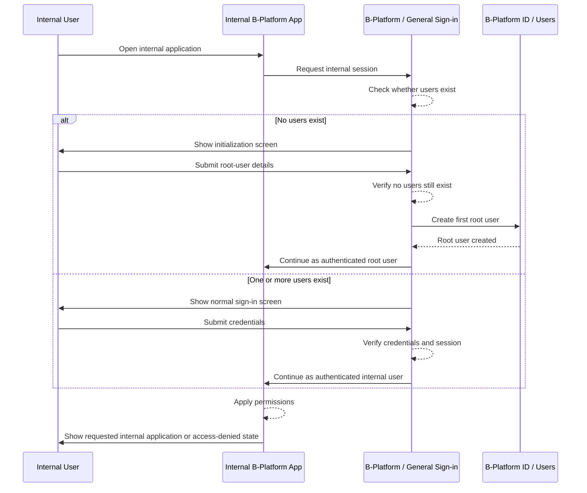

# Sign-in

| | |
|---|---|
| **Author** | tvlong |
| **Updated** | 2026.07.24 |
| **Product** | [B-Platform / General](/products/bplatform-general/README.md) |
| **Priority** | P0 |
| **Figma** | [Design](https://www.figma.com/design/uIeicyHJ4gCqCe0SdRTaby/B-Platform-Designs?node-id=99-5674&t=iJnLOB71NoIQYyFq-4) |
| **Tracklogs** | _TBD_ |

---

## The Problem

Internal B-Platform users need one consistent sign-in experience to access internal applications such as **B-Platform ID**, **B-Platform CRM**, **B-Platform Product**, **B-Platform Sale**, and future internal products. The platform also needs a safe first-run initialization process because a fresh system has no users yet.

Without a shared General Sign-in feature:

- Internal users may see inconsistent sign-in behavior across internal products.
- Internal apps may duplicate sign-in screens and session checks.
- A fresh system may be unusable because no root user exists yet.
- Account creation may happen through uncontrolled sign-up paths after the system is initialized.
- Products may confuse General internal-platform sign-in with `B-Platform / ID` user-management features.

## Proposed Solution

A shared **General Sign-in** feature that allows internal users to sign in once and access internal B-Platform applications according to their permissions. If the system has no users, the sign-in screen switches to a controlled initialization process that creates the first **root user**. After the first root user is created, public/self-service account creation is disabled forever; all new accounts must be created through **B-Platform ID / Users**.

### Goals

- Provide one shared sign-in entry for internal B-Platform applications.
- Allow internal users to access multiple internal applications after successful sign-in, subject to permissions.
- Detect first-run system state when no users exist.
- Allow creation of exactly one initial root user during first-run initialization.
- Prevent any account creation from the sign-in screen after initialization.
- Direct all future account creation to `B-Platform ID / Users`.

### Out-of-scope

- Customer-facing sign-in for public products such as storefronts.
- Self-service registration after system initialization.
- User, role, and permission management screens; those belong to [B-Platform / ID](/products/bplatform-id/README.md).
- Password recovery and MFA details unless explicitly added as separate features.
- Product-specific post-login workflows beyond routing the user to the requested internal application.

### Measurable Outcomes

- Internal sign-in success rate.
- Failed sign-in rate.
- Initialization completion rate for fresh deployments.
- Number of attempted account creations after initialization blocked by the system.
- Number of login-loop incidents between internal products.
- Sign-in related support tickets.

## Requirements

### 1. Internal user opens an internal application

- [P0] If an internal user opens a protected internal application without an authenticated internal session, the application must show or redirect to the shared General Sign-in screen.
- [P0] Internal applications include, but are not limited to:
  - B-Platform ID,
  - B-Platform CRM,
  - B-Platform Product,
  - B-Platform Sale,
  - future internal B-Platform applications.
- [P0] The original target application and URL must be preserved before sign-in.
- [P0] The protected application must not render sensitive data before authentication is confirmed.
- [P0] The sign-in screen must clearly identify itself as internal B-Platform access.

### 2. System checks whether users exist

- [P0] Before showing normal sign-in, the system must check whether at least one user account exists.
- [P0] If one or more users exist, the system must show the normal sign-in flow.
- [P0] If no users exist, the system must show the initialization flow instead of normal sign-in.
- [P0] The no-user check must be performed server-side or through a trusted internal API; the client must not decide initialization eligibility alone.
- [P0] The system must avoid race conditions where two users can create two root users at the same time.

### 3. No users exist: initialization flow is shown

- [P0] If the system has no users, the screen must explain that this is the first-time setup for B-Platform.
- [P0] The initialization flow must allow creation of the first root user.
- [P0] The initialization form must collect the minimum required root-user information:
  - full name,
  - email or username,
  - password,
  - password confirmation.
- [P0] The password must satisfy the platform password policy.
- [P0] The root user must receive the highest initial administrative permission required to configure the platform.
- [P0] The initialization flow must create only one root user.
- [P0] After root-user creation succeeds, initialization mode must be disabled.
- [P0] After initialization completes, the system must continue into the authenticated internal application experience.

### 4. Users exist: normal sign-in is shown

- [P0] If at least one user exists, the sign-in screen must show normal credential sign-in only.
- [P0] The normal sign-in screen must not show account registration, create account, or root-user setup actions.
- [P0] Internal users must be able to submit their account identifier and password.
- [P0] If credentials are correct, the system must create or reuse the internal authenticated session.
- [P0] If credentials are wrong, the system must show a general error and must not reveal whether the account identifier exists.
- [P0] The sign-in screen must stay simple and focused on internal platform access.

### 5. New account creation after initialization

- [P0] After initialization, no one can create a new account from the General Sign-in screen.
- [P0] After initialization, no public/self-service account creation endpoint should be available for internal users.
- [P0] New internal user accounts must be created only through `B-Platform ID / Users`.
- [P0] The `B-Platform ID / Users` function must enforce authorization before allowing account creation.
- [P0] If a user tries to access an initialization or create-root-user path after initialization, the system must reject the request.
- [P0] Rejected initialization attempts must not reveal sensitive user-count or root-user details beyond a safe message.

### 6. User completes sign-in successfully

- [P0] After successful sign-in, the system must redirect the user to the originally requested internal application and URL when safe.
- [P0] If the original target is missing, invalid, expired, or unauthorized, the system must redirect the user to the default internal landing page.
- [P0] The target application must initialize global navigation, global search context, and user profile/session display after sign-in.
- [P0] The target application must apply the user's permissions before rendering protected functions.
- [P0] Tokens or sensitive session artifacts must not be exposed in the browser URL after redirect completion.

### 7. Authenticated but unauthorized user

- [P0] If a user signs in successfully but does not have permission for the requested internal application or function, the system must show an access-denied state.
- [P0] The system must not redirect the user back to sign-in for authorization failures.
- [P0] The access-denied state should explain that the user is signed in but does not have access.
- [P1] The access-denied state may provide a way to return to the default internal landing page.

### 8. Sign-out behavior

- [P0] Internal users must be able to sign out from internal applications.
- [P0] Signing out must end the internal authenticated session according to platform session policy.
- [P0] After sign-out, protected internal applications must require sign-in again.
- [P1] If multiple internal applications are open, sign-out behavior should be consistent across them.

### 9. Design requirements

- [P0] Use shared B-Platform visual language for both normal sign-in and initialization screens.
- [P0] Keep the normal sign-in screen simple: platform identity, account identifier, password, primary sign-in action, and supported help links.
- [P0] Keep the initialization screen clearly different from normal sign-in so users understand they are creating the first root user.
- [P0] Initialization copy must communicate that setup is available only because no users exist.
- [P0] Do not show global navigation, app tables, management pages, or product chrome before authentication.
- [P0] Do not show `Create account` on normal sign-in after initialization.
- [P0] Do not mix external customer-facing product sign-in content into the internal General Sign-in screen.

### 10. Security and audit requirements

- [P0] Initialization eligibility must be verified by the server at submission time.
- [P0] Root-user creation must be atomic to prevent duplicate root users.
- [P0] Passwords must never be stored or logged in plaintext.
- [P0] Sign-in errors must avoid account enumeration.
- [P0] Return URLs must be validated to prevent open redirect vulnerabilities.
- [P0] The system must audit successful sign-in, failed sign-in, sign-out, initialization start, initialization success, and rejected initialization attempts.
- [P0] The system must distinguish unauthenticated, authenticated-but-unauthorized, and uninitialized states.

## Interaction Flow

## Appendix

### Ownership split

| Area | Owner |
|---|---|
| Internal sign-in UX, initialization UX, return-target behavior | B-Platform / General |
| User records, role assignment, permission model, post-initialization account creation | B-Platform / ID |
| Product-specific protected functions and authorization checks | Target internal application |

### Internal application examples

| Application | Purpose |
|---|---|
| B-Platform ID | Manage applications, users, roles, and permissions. |
| B-Platform CRM | Manage customer relationship, communication, and support operations. |
| B-Platform Product | Manage products, catalogs, attributes, and product-related configuration. |
| B-Platform Sale | Manage sales operations, quotes, orders, and sales workflows. |

### Initialization state rules

| State | Expected behavior |
|---|---|
| No users exist | Show initialization flow and allow creating the first root user. |
| Root user creation in progress | Prevent concurrent duplicate root-user creation. |
| One or more users exist | Show normal sign-in only; hide all account creation/setup actions. |
| Initialization URL opened after setup | Reject the request and show a safe message. |

### Recommended return target payload

| Field | Description |
|---|---|
| `application` | Internal application requesting sign-in. |
| `module` | High-level module where sign-in started. |
| `function` | Specific function/screen where sign-in started. |
| `url` | Safe relative URL or allowlisted absolute URL. |
| `createdAt` | Time the return target was created, used to expire stale targets. |

### Safe fallback behavior

- If return target validation fails, redirect to the default internal landing page.
- If sign-in succeeds but authorization fails, show access denied and do not restart sign-in automatically.
- If initialization fails because another root user was created first, switch to normal sign-in.
