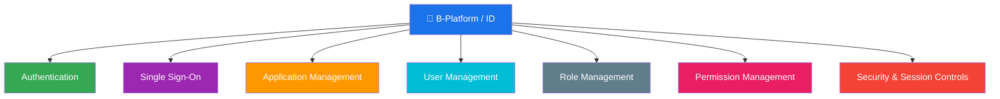
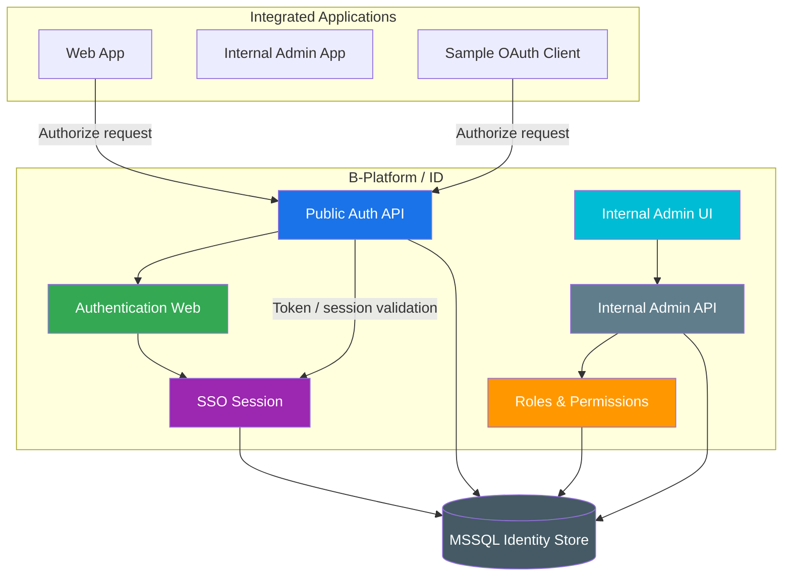

# B-Platform / ID

> Central authentication, authorization, and identity management service for the B-Platform ecosystem.

**Category:** Back-office / Platform Foundation

## Mission

B-Platform / ID provides a shared identity layer that allows B-Platform applications to authenticate users through one trusted service. Once a user is authenticated with any integrated application, other integrated applications can rely on the same authentication service so the user does not need to sign in again unnecessarily.

## Role & Responsibility

| Area | Description |
|---|---|
| Category | Back-office / Platform Foundation |
| Domain | Identity, Authentication & Authorization |
| Form Factor | Web authentication experience, internal admin UI, public/internal APIs |
| Users | End users, internal operators, developers, integrated applications |
| Key Outcome | Secure single sign-on across ecosystem applications with centralized user, application, role, and permission management |

## What B-Platform / ID Does

- Provides centralized authentication for ecosystem applications.
- Enables Single Sign-On (SSO) across applications integrated with the authentication service.
- Issues OAuth/OIDC-style authorization codes and tokens for client applications.
- Maintains a secure server-side SSO session so users can return without logging in again during the configured session window.
- Manages registered applications, redirect URIs, scopes, and client configuration.
- Manages users, roles, and permissions for Platform ID administration.
- Provides internal back-office screens for identity and access management operations.

## Core Capabilities

### 1. Authentication

- Login experience for users accessing integrated applications.
- Credential validation and user session creation.
- Password recovery and account lifecycle support where required.

### 2. Single Sign-On

- Central SSO session shared by integrated applications through the authentication service.
- Users authenticated through one integrated app can access another integrated app without repeating login, subject to session validity and authorization policy.
- Session expiry follows an idle-window model so inactive users are required to authenticate again after the configured period.

### 3. Application Management

- Register and manage OAuth/OIDC client applications.
- Configure client identifiers, redirect URIs, allowed scopes, and application status.
- Support sample/demo clients for validating the full authentication flow.

### 4. User, Role & Permission Management

- Manage user records and account status.
- Define roles for operational access patterns.
- Define permissions and attach them to roles.
- Support internal administration screens for Applications, Users, Roles, and Permissions.

## Architecture Overview

## Tools, Apps & Platforms

| Tool / App / Platform | Type | Purpose | Feature Details |
|---|---|---|---|
| Public Auth API | API | Handles OAuth/OIDC-style authorization, token, session, JWKS, introspection, and revoke flows. | _To be documented_ |
| Authentication Web | Web App | User-facing login and authorization experience for integrated applications. | _To be documented_ |
| Internal Admin API | API | Back-office API for managing applications, users, roles, and permissions. | _To be documented_ |
| Internal Admin UI | Web App | Platform ID management console for internal operators. | _To be documented_ |
| Sample OAuth Client | Web App | Demonstrates and validates the full authentication flow for client applications. | _To be documented_ |

## Dependencies

| Depends On | Category | What It Provides to B-Platform / ID |
|---|---|---|
| MSSQL | Infrastructure | Persistent identity store for users, applications, sessions, roles, and permissions. |
| Integrated applications | Ecosystem apps | OAuth/OIDC client requests and redirect targets. |

## Key Contacts

| Role | Name | Team |
|---|---|---|
| Product Owner | _TBD_ | _TBD_ |
| Tech Lead | _TBD_ | _TBD_ |
| Engineering Manager | _TBD_ | _TBD_ |
