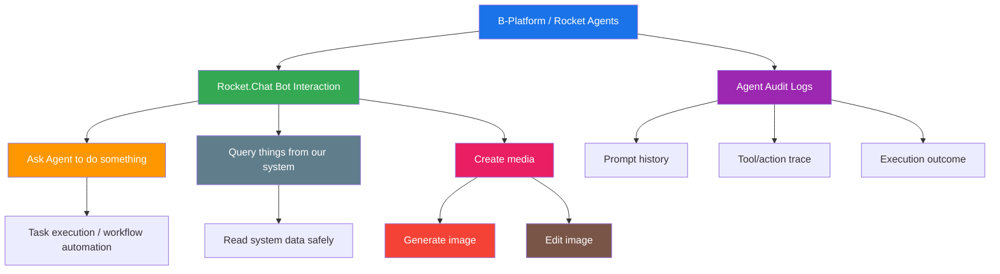
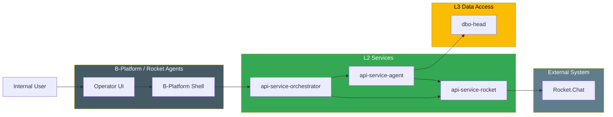

# B-Platform / Rocket Agents

> Internal back-office AI assistant workspace for asking the platform to do work, querying system data, and creating media assets through controlled agent workflows.

**Category:** Back-office

## Mission

Provide an internal operator experience where authorized users can interact with B-Platform through a Rocket.Chat bot, ask an AI agent to perform tasks, retrieve information from B-Platform systems, and generate or edit media such as images — with full audit logging.

## Role & Responsibility

| Area | Description |
|---|---|
| Category | Back-office |
| Domain | AI assistant operations, system query, and media generation |
| Users | Internal operators, product teams, support, and management |
| Key Outcome | Faster operational work through safe, auditable AI-assisted actions |

## Core Capabilities

## Product Surfaces

### 1. Rocket.Chat Bot Interaction

Authorized users interact with B-Platform through a Rocket.Chat bot UI to:

- ask the agent to do things,
- query internal systems,
- trigger approved workflows,
- receive responses directly in Rocket.Chat,
- continue conversational follow-ups in-channel.

### 2. Agent Audit Logs

Every agent action must be auditable, including:

- who triggered the request,
- when the request happened,
- what prompt or command was sent,
- which tools/actions were executed,
- what result was returned,
- whether the action succeeded or failed.

### 3. Media Creation

Authorized users can request media creation and editing such as:

- generate images,
- edit existing images,
- create variations,
- prepare media for back-office communication or documentation.

Feature details: [Customer Pool Generating](features/01-customer-pool-generating.md)

## Architecture Boundary

## Tools, Apps & Platforms

| Tool / App / Platform | Type | Purpose | Feature Details |
|---|---|---|---|
| B-Platform / Rocket Agents | Internal back-office app | Operator workspace for Rocket.Chat bot interactions, AI tasks, and audit visibility. | This document |
| B-Platform / General | Super App shell | Provides shared navigation, shell, and installed-app runtime. | _Architecture details TBD_ |
| Rocket.Chat Bot | External UI surface | Lets internal users interact with the agent inside Rocket.Chat. | _Architecture details TBD_ |
| B-Platform / Rocket Agents API | Back-office UI/API | Routes operator requests to AI, Rocket.Chat, and audit-log capabilities. | _Architecture details TBD_ |
| `api-service-agent` | L2 API service | AI assistant, orchestration, task execution, and media workflow coordination. | _Architecture details TBD_ |
| `api-service-rocket` | L2 API service | Rocket.Chat message delivery, bots, and webhooks. | _Architecture details TBD_ |

## Dependencies

| Depends On | Category | What It Provides to Rocket Agents |
|---|---|---|
| B-Platform / General | Back-office / Platform Foundation | Shared shell, global navigation, installed-app runtime, and secure server-side dispatch |
| `api-service-agent` | L2 API Services | AI reasoning, task execution, system-query orchestration, and media generation workflows |
| `api-service-rocket` | L2 API Services | Rocket.Chat sending, bot actions, and webhook delivery |
| `api-service-orchestrator` | L2 API Services | Cross-service request routing and response delivery |
| `dbo-head` | L3 Database Operators | Persistent storage access, audit, and operational records |
| Rocket.Chat | External collaboration platform | Channels, bots, and internal notifications |

## Success Measures

- Task completion rate for agent-assisted work.
- Time saved on repeat operator workflows.
- Query accuracy and response usefulness.
- Media generation acceptance rate.
- Message delivery success to Rocket.Chat channels.
- Audit completeness and traceability.

## Open Questions

- Which exact operator roles may use the product?
- Which data sources can the agent query in v1?
- Which media capabilities are allowed in v1: generate only, edit only, or both?
- Which audit fields are mandatory for every bot/agent action?
- What retention rules apply to prompts, outputs, and generated media?

## Key Contacts

| Role | Name | Team |
|---|---|---|
| Product Owner | _TBD_ | _TBD_ |
| Tech Lead | _TBD_ | _TBD_ |
| Engineering Manager | _TBD_ | _TBD_ |
