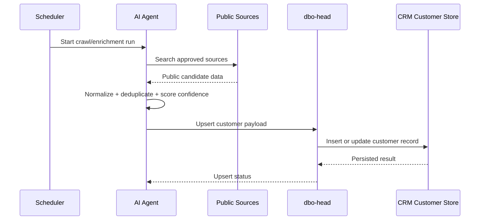

# Customer Pool Generating - Technical Solution

| | |
|---|---|
| **Author** | tvlong |
| **Updated** | 2026.09.02 |
| **Product** | [B-Platform / Rocket Agents](/products/bplatform-rocket-agents/README.md) |
| **Related Feature** | [Customer Pool Generating](./01-customer-pool-generating.md) |

---

## Purpose

Define the technical solution for the Customer Pool Generating feature. The solution uses AI agents to discover customer candidates from approved public sources, enrich them with tax and identity information, and upsert the normalized result into CRM storage through `dbo-head`.

## Technical Solution Overview

### 1. Source discovery with AI agents

The system must use AI agents to search approved sources such as:

- Google Maps business listings
- Facebook Pages / public business profiles
- Public tax detail sources such as `masothue.com`

The agent must:

- identify candidate companies or contacts,
- collect publicly available information,
- infer whether multiple source records refer to the same customer,
- produce a normalized customer candidate payload.

### 2. Customer enrichment

The agent must combine information from multiple sources into one normalized customer record, including as much of the following as is available:

- customer name
- phone
- email
- tax code / tax name
- address
- source references
- connected channels
- match confidence
- status (`Crawled`, `Out-dated`, `Verified`, etc.)

### 3. Database upsert through `dbo-head`

The agent must not write directly to the database.

Instead, it must send a typed persistence request to `dbo-head` to:

- find an existing customer by strong identifiers,
- insert a new customer when no match exists,
- update the existing customer when the match is strong enough,
- append source and audit metadata.

### 4. Matching rules

Customer matching must use ordered confidence signals:

1. tax code / tax name
2. phone number
3. email
4. Facebook page / profile reference
5. Google Maps business reference
6. address similarity

When confidence is low, the system must keep the record as a new candidate or mark it for manual review.

## Functional Requirements

### 1. Search approved sources

- [P0] The system must allow an AI agent run to search approved public sources.
- [P0] The system must support Google Maps, Facebook Pages, and public tax-detail sources.
- [P0] The system must collect public customer information from those sources.

### 2. Enrich customer candidates

- [P0] The system must merge multiple source records into one normalized candidate payload.
- [P0] The system must carry source references for imported fields.
- [P0] The system must assign a match confidence value.
- [P0] The system must support status values such as Crawled, Out-dated, and Verified.

### 3. Upsert customer data

- [P0] The system must upsert customer information through `dbo-head`.
- [P0] The system must insert when no existing match is found.
- [P0] The system must update when an existing customer matches with sufficient confidence.
- [P0] The system must avoid direct datastore access from the agent.

### 4. Preserve auditability

- [P0] The system must record source attribution for each imported candidate.
- [P0] The system must record every upsert action.
- [P0] The system must preserve enough metadata to explain the merge decision.

## Technical Flow

## Data Contract

Each customer candidate should include:

- `source_type`
- `source_id`
- `display_name`
- `customer_name`
- `phone_numbers[]`
- `emails[]`
- `tax_code`
- `tax_name`
- `address`
- `connected_channels[]`
- `match_confidence`
- `status`
- `last_seen_at`
- `audit_ref`

## Acceptance Criteria

- AI agents can search approved sources and gather customer candidates.
- Multiple public records can be merged into one normalized customer candidate.
- Customer records are persisted only through `dbo-head`.
- Duplicate or weak matches are not blindly overwritten.
- Every upsert is auditable and traceable back to the source.

## Guardrails

- Only approved sources may be queried.
- Respect source terms and policy constraints.
- Store source attribution for every imported field.
- Never overwrite a stronger identifier with weaker evidence.
- Keep an audit trail for every upsert.
