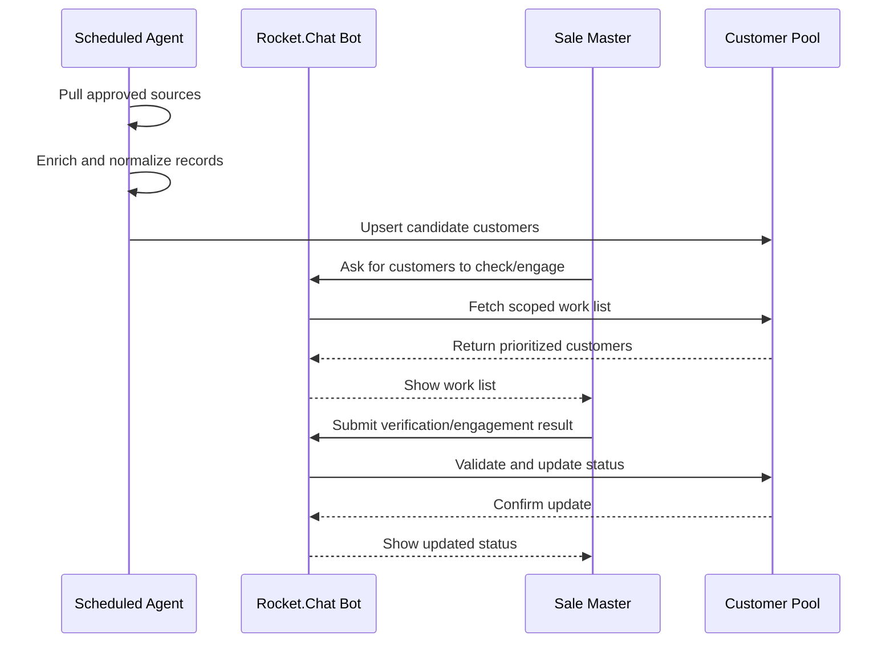

# Customer Pool Generating

| | |
|---|---|
| **Author** | tvlong |
| **Updated** | 2026.09.02 |
| **Product** | [B-Platform / Rocket Agents](/products/bplatform-rocket-agents/README.md) |
| **Priority** | P1 |

---

## The Problem

Sale Master needs a repeatable way to discover, enrich, verify, and engage potential customers from multiple external sources such as Facebook, Google Maps, and public tax-check websites. Today, this work is manual, inconsistent, and hard to audit.

This is a **sourcing feature**: it generates new customer candidates so Sale Master can reach out instead of sourcing prospects manually.

Without an agent-assisted customer pool process:

- new customer leads are scattered across sources,
- source data is not normalized into one pool,
- status changes are handled manually and inconsistently,
- follow-up and verification progress is hard to track,
- Sale Master cannot easily ask for the next customers to verify or engage,
- verification and engagement outcomes are not captured in a uniform flow.

## Proposed Solution

A **Customer Pool Generating** agent feature that continuously gathers customer candidates from approved sources, enriches them into a shared customer pool, and lets Sale Master work the pool through Rocket.Chat bot commands.

It is upstream of CRM customer management: it feeds new or enriched customers into the CRM customer list for review, outreach, and maintenance.

The feature should support a daily or scheduled agent run that:

1. pulls candidate customers from approved external sources,
2. enriches each customer with available public information,
3. normalizes the record into the customer pool,
4. assigns or updates a customer status,
5. exposes a work queue to Sale Master through Rocket.Chat,
6. accepts verification/engagement feedback back into the pool.

### Goals

- Build a reusable customer pool from approved lead sources.
- Enrich customer records automatically on a daily schedule.
- Let Sale Master ask the bot for a list of customers to verify or engage.
- Let Sale Master update customer status through Rocket.Chat DM.
- Keep status progression auditable and consistent.

### Out-of-scope

- Unapproved scraping or collection from sources not explicitly permitted.
- Automatic outreach without user review unless separately approved.
- Customer-facing contact center workflows.
- Full CRM replacement or sales pipeline management.

### Measurable Outcomes

- Number of customer candidates discovered per source.
- Enrichment completeness rate.
- Verification completion rate.
- Engagement completion rate.
- Status transition accuracy.
- Time saved compared with manual prospecting.

## Requirements

### 1. Agent runs on a schedule

- [P0] The system must support a recurring agent run that discovers and refreshes customer candidates.
- [P0] The run must be able to pull from approved sources such as Facebook, Google Maps, and public tax-check websites.
- [P0] The run must enrich candidate records with available public or approved information.
- [P0] The run must update the shared customer pool with normalized records.
- [P0] The run must avoid creating duplicate records for the same customer when matching confidence is sufficient.

### 2. Customer pool status lifecycle

- [P0] Each customer record must carry a workflow status.
- [P0] Initial statuses may include Crawled and Out-dated.
- [P0] Sale Master can move a customer through statuses such as Verified, Touched, and Engaged.
- [P0] Status transitions must be tracked with actor, timestamp, and reason.
- [P0] The system must keep the previous status history for audit and reporting.

### 3. Sale Master asks the bot for work

- [P0] Sale Master can ask the Rocket.Chat bot for a list of customers to check or engage.
- [P0] The bot must return a prioritized work list or a safe empty state.
- [P0] The bot response should include enough context to start verification or outreach safely.
- [P0] The bot must respect the requester’s permissions and scope.

### 4. Sale Master reports results through the bot

- [P0] Sale Master can report verification or engagement results in Rocket.Chat DM with the bot.
- [P0] The bot must accept status updates such as Verified, Out-dated, Touched, and Engaged.
- [P0] The bot must record the result as an auditable action.
- [P0] The bot must update the customer pool after validating the request.
- [P0] The bot must reject malformed or unauthorized status updates.

### 5. Audit and traceability

- [P0] Every generated customer candidate must be traceable to its source.
- [P0] Every status change must store who changed it, when, and from where.
- [P0] Every bot request and response involved in the workflow must be auditable.
- [P0] The system must preserve enough history to explain how a customer moved from Crawled to later states.

## Cross-links

- CRM destination: [CRM / Customers](/products/crm/features/01-customers.md)

## Interaction Flow

## Appendix

### Suggested status model

| Status | Meaning |
|---|---|
| Crawled | Discovered from an approved source. |
| Out-dated | Existing record needs refresh or re-check. |
| Verified | Customer data has been checked and confirmed. |
| Touched | Contact attempt or first interaction completed. |
| Engaged | Customer has responded or entered active follow-up. |

### Ownership split

| Area | Owner |
|---|---|
| Scheduled discovery and enrichment | `api-service-agent` |
| Rocket.Chat bot interaction | `api-service-rocket` |
| Cross-service routing | `api-service-orchestrator` |
| Customer pool persistence and audit | L3 storage via `dbo-head` |
| Sales verification and engagement actions | Sale Master |
