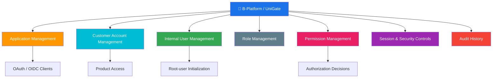
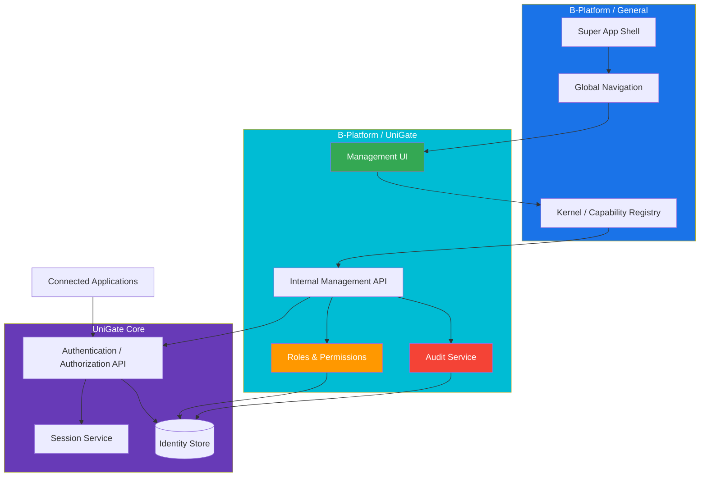

# B-Platform / UniGate

> Management side of UniGate inside the B-Platform ecosystem.

**Category:** Back-office / Platform Foundation

## Mission

B-Platform / UniGate is the internal management surface for UniGate. It gives authorized B-Platform administrators one controlled place to manage UniGate applications, customer accounts, internal access policies, roles, permissions, sessions, and audit evidence used by connected ecosystem applications.

UniGate owns the shared authentication and authorization platform. B-Platform / UniGate is the back-office side that exposes those capabilities safely through the B-Platform Super App.

## Role & Responsibility

| Area | Description |
|---|---|
| Category | Back-office / Platform Foundation |
| Domain | UniGate administration, application/client management, user management, roles, permissions, authorization, sessions, and audit |
| Form Factor | Installed B-Platform Super App module, internal admin APIs, and management workflows |
| Users | Authorized internal administrators, platform operators, security operators, developers, and integrated applications |
| Key Outcome | Centralized management of UniGate identities, connected applications, access policies, roles, permissions, and security controls |

## What B-Platform / UniGate Does

- Provides internal administration for UniGate capabilities.
- Manages registered applications, redirect URIs, scopes, client configuration, and application status.
- Manages UniGate customer accounts, lifecycle states, product access, and account audit history.
- Manages internal users, roles, permissions, and authorization policies required to operate the B-Platform ecosystem.
- Provides capabilities consumed by the B-Platform Super App for first-run initialization, internal sign-in, session inspection, sign-out, and authorization checks.
- Exposes permission-protected management screens through the B-Platform Super App.
- Audits sensitive identity, application, role, permission, lifecycle, and access changes.

## Relationship to UniGate

| Surface | Responsibility |
|---|---|
| [UniGate](/products/unigate/README.md) | Overall customer authentication and authorization platform: customer sign-up/sign-in, cross-product SSO, sessions, product-access decisions, and core identity services. |
| B-Platform / UniGate | Management side of UniGate: admin UI, application/client configuration, customer account administration, internal users, roles, permissions, authorization policies, and audit workflows. |
| [B-Platform / General](/products/bplatform-general/README.md) | Super App runtime, installed-app shell, global navigation/search, and capability dispatch used to host B-Platform / UniGate management screens. |

## Core Capabilities

### 1. Application Management

- Register and manage connected applications and clients.
- Configure client identifiers, redirect URIs, allowed scopes, product status, and integration metadata.
- Support sample/demo clients for validating the full authentication flow.

Feature details: [Application Management](features/01-application-management.md)

### 2. Customer Account Management

- Manage customer identities registered in UniGate.
- View account details, lifecycle status, product access, registration source, and audit history.
- Deactivate, reactivate, soft-delete, restore, and restrict customer access according to policy.

Feature details: [Customer Account Administration](/products/unigate/features/02-customer-account-administration.md)

### 3. Internal User, Role & Permission Management

- Manage internal operator accounts used to access the B-Platform Super App.
- Define roles for operational access patterns.
- Define permissions and attach them to roles.
- Provide authorization capabilities consumed by installed B-Platform applications.

Feature details: [User Management](features/02-user-management.md)

### 4. Authentication and Authorization Capabilities

- Own root-user initialization and credential verification capabilities consumed by B-Platform / General.
- Provide internal session lookup and sign-out capabilities through the Super App registry.
- Provide authorization checks and permission listing for installed internal applications.

## Architecture Overview

## Tools, Apps & Platforms

| Tool / App / Platform | Type | Purpose | Feature Details |
|---|---|---|---|
| B-Platform / UniGate Management UI | B-Platform installed app | Management console for applications, users, roles, permissions, customer accounts, product access, and audit history. | [Application Management](features/01-application-management.md), [User Management](features/02-user-management.md) |
| UniGate Internal Management API | API | Back-office API for identity, application, role, permission, lifecycle, and audit operations. | _To be documented_ |
| UniGate Authentication Web | Public web app | Customer-facing sign-up, sign-in, recovery, and authentication states. | [Customer Authentication & SSO](/products/unigate/features/01-customer-authentication-sso.md) |
| UniGate Authentication / Authorization API | Public and service API | Authorization requests, token exchange, session validation, revocation, and product-access decisions. | [Customer Authentication & SSO](/products/unigate/features/01-customer-authentication-sso.md) |

## Dependencies

| Depends On | Category | What It Provides to B-Platform / UniGate |
|---|---|---|
| [B-Platform / General](/products/bplatform-general/) | Platform Foundation | Super App runtime, global navigation, route hosting, capability registry, and server-side BFF for management screens. |
| [UniGate](/products/unigate/) | Platform Foundation | Core customer identity, authentication, SSO, product-access, session, and audit capabilities. |
| MSSQL | Infrastructure | Persistent identity store for users, applications, sessions, roles, permissions, and audit records. |
| Connected applications | Ecosystem apps | Client registration needs, redirect targets, authorization checks, and product-access integration points. |

## Key Contacts

| Role | Name | Team |
|---|---|---|
| Product Owner | _TBD_ | _TBD_ |
| Tech Lead | _TBD_ | _TBD_ |
| Security Owner | _TBD_ | _TBD_ |
| Engineering Manager | _TBD_ | _TBD_ |