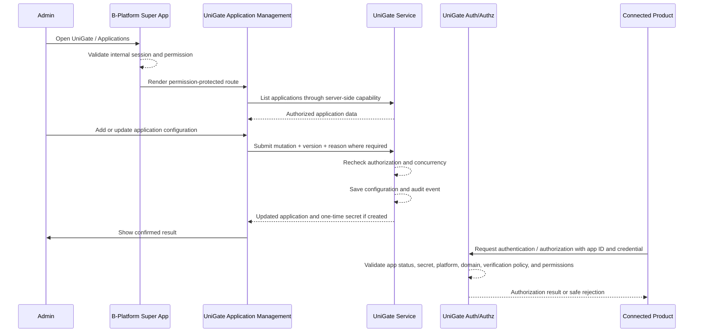

# Application Management

| | |
|---|---|
| **Author** | tvlong |
| **Updated** | 2026.08.07 |
| **Product** | [B-Platform / UniGate](/products/bplatform-unigate/README.md) |
| **Priority** | P0 |
| **Tracklogs** | _TBD_ |

---

## The Problem

Connected customer-facing applications such as MDFoods, Odeli, LFarm, and future approved products need a controlled way to use UniGate as their authentication and authorization gateway. Without centralized application management, application IDs, secrets, supported-platform mappings, allowed domains, sign-up policy, verification methods, and allowed permissions can drift across products or remain unmanaged outside the security boundary.

- Administrators need one place to list every application that can request UniGate authentication or authorization.
- New connected applications need stable credentials before they can integrate with UniGate.
- Application secrets must be created, protected, and rotated without exposing reusable credentials unnecessarily.
- Public sign-up, sign-up/sign-in verification methods, allowed domains, and allowed permissions must be explicit per application.
- Disabling an application must immediately prevent new authentication and authorization requests for that application.
- Application configuration changes must be auditable because they affect ecosystem access.

## Proposed Solution

A **B-Platform / UniGate Application Management** module installed in the [B-Platform Super App](/products/bplatform-general/architecture/super-app.md). Authorized administrators use it to register connected applications, generate application credentials, update supported application settings, disable applications, and list all configured applications.

Each application receives a stable **application ID**, a protected **application secret**, exactly one **supported platform** (`Web`, `Mobile`, or `Desktop`), and an allowlist of **domains** that may initiate UniGate flows. Connected products use those values when initiating UniGate authentication and authorization flows.

### Goals

- Register connected applications that can use UniGate as an authentication and authorization gateway.
- Generate and protect application IDs and secrets.
- Capture the application ID, application name, logo, supported platform, and domains used by integration flows.
- Configure whether public sign-up is enabled for the application.
- Configure which sign-up/sign-in verification methods are allowed for the application authentication experience.
- Configure allowed permissions/scopes the application may request.
- Disable applications so they cannot start new authentication or authorization flows.
- Provide a searchable, filterable list of all available applications.
- Audit every sensitive application-management action.

### Out-of-scope

- Customer account administration; this is defined in [Customer Account Administration](/products/unigate/features/02-customer-account-administration.md).
- Customer-facing sign-up, sign-in, callback, SSO, and product-access behavior; this is defined in [Customer Authentication & SSO](/products/unigate/features/01-customer-authentication-sso.md).
- Product-specific onboarding, profiles, companies, memberships, subscriptions, orders, or business permissions after a UniGate callback.
- Defining the global role and permission catalog for B-Platform administrators; Application Management consumes the Super App authorization contract.
- Native mobile redirect mechanics until native app platform rules are separately specified.
- Permanent hard deletion of application records outside an approved retention and security process.

### Measurable Outcomes

- Application creation success and validation-failure rates.
- Application list and detail-view success rates.
- Application update success and validation-failure rates.
- Application disable success rate and propagation time.
- Invalid, disabled, or over-permissioned authentication requests blocked.
- Secret exposure incidents and secret rotation completion rate.
- Unauthorized application-management attempts blocked.
- Application-management support tickets and security incidents.

## Requirements

### 1.1 Administrator accesses Application Management

- [P0] B-Platform / UniGate Application Management is installed as an app/module in the B-Platform Super App.
- [P0] Its manifest declares navigation, routes, search providers, server actions, dependencies, and permission expressions according to the [Super App architecture](/products/bplatform-general/architecture/super-app.md).
- [P0] Only an authenticated internal administrator with the required permission can access each Application Management function.
- [P0] The Super App and UniGate service enforce authorization server-side for every read and mutation.
- [P0] Navigation visibility or hidden controls must not be treated as authorization enforcement.
- [P0] If the UniGate service is unavailable, the module shows a degraded state and does not display stale application configuration as current.

### 1.2 Administrator lists available applications

- [P0] An authorized administrator can view a paginated list of all applications registered in UniGate.
- [P0] The Applications List table columns are `Application`, `Application ID`, `Domains`, `Allowed Permissions`, `Status`, and `Actions`.
- [P0] The `Application` column shows the application logo or fallback initial, application name, and supported platform summary where space allows.
- [P0] The `Application ID` column shows the stable public/client identifier and never shows any secret value.
- [P0] The `Domains` column shows the allowed domain summary, truncated when needed.
- [P0] The `Allowed Permissions` column shows the allowed-permission/scope summary, truncated when needed.
- [P0] The `Status` column shows whether the application is active or disabled.
- [P0] The `Actions` column exposes only the actions permitted for the administrator, such as view, edit, or disable.
- [P0] Administrators can search by application ID, name, supported platform, or domain.
- [P0] Administrators can filter by lifecycle status, supported platform, public sign-up state, verification method, and permission/scope where supported.
- [P0] Disabled applications remain visible to authorized administrators by default so integration issues can be diagnosed.
- [P0] Application secrets are never displayed in the list.
- [P0] If no applications match, the system shows a clear empty state and offers the permitted next action.
- [P0] If the list cannot be loaded, the system shows a safe error and allows the administrator to retry.

### 1.3 Administrator adds a new application

- [P0] An authorized administrator can add a new application for approved connected products such as MDFoods, Odeli, LFarm, Di5, ASFoods, and future approved products.
- [P0] The create form collects at minimum application ID, name, logo, supported platform, domains, public sign-up setting, sign-up/sign-in verification methods, and allowed permissions/scopes.
- [P0] The application ID is a stable identifier that must be unique across UniGate.
- [P0] The system generates a high-entropy application secret when the application is created.
- [P0] The generated application secret is shown only immediately after creation or through an approved rotation flow.
- [P0] The system stores only a protected representation of the secret and never stores or displays plaintext reusable secrets after the initial reveal.
- [P0] Exactly one supported platform is selected for each application: `Web`, `Mobile`, or `Desktop`.
- [P0] Domains are required for Web applications and must be validated as allowed hostnames before saving.
- [P0] The system validates required fields, application-ID format and uniqueness, name length, logo file policy, supported-platform selection, domain format, verification-method selections, permission selections, and policy constraints before saving.
- [P0] If creation succeeds, the module shows the saved application ID and one-time secret reveal with copy guidance.
- [P0] If creation fails, no partial application credential is usable and the administrator can retry safely.
- [P0] Application creation is audited with actor, application, selected settings, timestamp, correlation ID, and outcome.

### 1.4 Administrator views application information

- [P0] An authorized administrator can open an application detail view.
- [P0] The detail view shows application ID, name, logo, supported platform, domains, lifecycle status, public sign-up setting, sign-up/sign-in verification methods, allowed permissions/scopes, created/updated metadata, and recent audit summary where permitted.
- [P0] The detail view distinguishes stable public identifiers from protected credentials.
- [P0] Application secrets, secret hashes, signing keys, reusable tokens, authorization codes, and session credentials are never displayed.
- [P0] The detail view shows whether the application is currently allowed to start new authentication or authorization requests.
- [P0] If the application no longer exists or is outside the administrator's scope, the system shows a safe unavailable or access-denied state.

### 1.5 Administrator updates application information

- [P0] An authorized administrator can update application name, logo, supported platform, domains, public sign-up setting, sign-up/sign-in verification methods, and allowed permissions/scopes.
- [P0] Application ID remains stable and cannot be edited after creation.
- [P0] Application secret cannot be edited directly; secret replacement must use an approved rotation/regeneration flow.
- [P0] Supported platform can be changed only when policy allows and when doing so does not break active connected-product integration.
- [P0] Domains can be changed only after format validation and policy checks pass.
- [P0] The system validates required fields, supported-platform selection, domain format, verification-method selections, permission selections, and policy constraints before saving.
- [P0] Reducing allowed permissions prevents future authorization grants beyond the new allowed set.
- [P0] Updating public sign-up or verification methods affects only future authentication flows unless a separate session-revocation policy is triggered.
- [P0] If saving succeeds, the detail view displays the latest saved values with a success message.
- [P0] If saving fails, the previous application configuration remains authoritative and the administrator can retry.
- [P0] Every successful and rejected update is audited with actor, application, changed fields, before/after metadata, timestamp, correlation ID, and outcome.
- [P1] If the administrator navigates away with unsaved changes, the interface warns before discarding them.

### 1.6 Administrator configures public sign-up

- [P0] Each application has an explicit public sign-up setting.
- [P0] When public sign-up is enabled, eligible unauthenticated customers may start the UniGate sign-up flow from that application, subject to global sign-up policy and product access rules.
- [P0] When public sign-up is disabled, the application cannot initiate new customer self-service sign-up flows.
- [P0] Disabling public sign-up does not delete existing customer accounts and does not automatically revoke active sessions unless policy requires it.
- [P0] The authentication service enforces the public sign-up setting server-side for every applicable request.
- [P0] Public sign-up changes are audited.

### 1.7 Administrator configures verification methods

- [P0] Each application has an explicit sign-up/sign-in verification-method setting aligned with the approved UniGate authentication policy.
- [P0] The supported methods distinguish at minimum whether `OTP - Email` and/or `OTP - Zalo` may be used for the application authentication experience.
- [P0] When multiple verification methods are allowed, UniGate uses one approved method for the relevant sign-up or sign-in flow according to policy and customer context.
- [P0] The verification flow must not reveal whether an account identifier exists.
- [P0] The authentication service enforces the effective verification-method policy server-side.
- [P0] Verification-method configuration changes are audited.
- [P1] Future policy may add conditional verification states such as risk-based, administrator-only, or transaction-sensitive enforcement.

### 1.8 Administrator configures allowed permissions

- [P0] Each application has an explicit allowed-permission or allowed-scope set.
- [P0] The allowed-permission set defines the maximum permissions/scopes the application can request during authentication and authorization.
- [P0] The application cannot receive permissions/scopes that are not allowlisted on its configuration.
- [P0] Permission selection uses the approved UniGate/B-Platform permission catalog and must not accept arbitrary free-text permission grants unless separately approved.
- [P0] At least one allowed permission/scope is required for an active application when policy requires permission-scoped authorization.
- [P0] Removing a permission prevents future grants for that permission and may trigger revocation according to the approved token/session policy.
- [P0] Permission changes are enforced server-side and audited with before/after permission sets.

### 1.9 Administrator disables an application

- [P0] An authorized administrator can disable an active application.
- [P0] Disabling an application requires confirmation and an administrative reason.
- [P0] A disabled application cannot start new authentication, sign-up, SSO reuse, token exchange, permission grant, or authorization validation flows.
- [P0] UniGate rejects requests from disabled applications with a safe error that does not expose secrets or internal policy details.
- [P0] Disabling an application does not delete its application ID, historical configuration, or audit evidence.
- [P0] Disabling an application initiates session, code, or token revocation according to the approved propagation target.
- [P0] Disabled state, reason, actor, timestamp, and propagation status are visible to authorized administrators.
- [P0] If disabling fails, the previous application state remains authoritative and the interface allows retry.
- [P0] Disable actions are audited with actor, application, reason, timestamp, correlation ID, and outcome.
- [P1] An authorized administrator can reactivate a disabled application when policy allows and required security checks pass.

### 1.10 Application credentials are protected

- [P0] Application secrets must have sufficient entropy for service-to-service authentication.
- [P0] Plaintext application secrets must never appear in URLs, logs, analytics, browser storage, audit records, or client-visible error details.
- [P0] The UI must clearly communicate that the generated secret is shown once and must be stored securely by the connected product team.
- [P0] Administrators cannot retrieve an existing plaintext secret after the initial reveal.
- [P0] Secret copy actions should be user-initiated and should not auto-copy secrets without clear intent.
- [P0] Secret rotation/regeneration invalidates or stages replacement according to the approved connected-product rollout policy.
- [P0] Secret validation and request authentication occur server-side.

### 1.11 UniGate enforces application configuration during authentication and authorization

- [P0] Every authentication or authorization request must identify the requesting application by application ID or approved client identifier.
- [P0] UniGate validates the application ID, credential, supported platform, status, allowed domain or return target, public sign-up setting, verification-method policy, and requested permissions/scopes before issuing an authorization result.
- [P0] Unknown, disabled, invalid-secret, invalid-platform, invalid-domain, invalid-callback, and over-permissioned requests are rejected safely.
- [P0] Disabled or invalid applications must not receive redirects to untrusted targets.
- [P0] Successful and rejected application-authentication checks are auditable with correlation IDs.
- [P0] Connected products must not bypass UniGate server-side validation by relying only on hidden UI controls or client-side configuration.

### 1.12 System handles concurrent administration

- [P0] Application updates use optimistic concurrency, version checks, or an equivalent control to prevent one administrator from unknowingly overwriting another administrator's changes.
- [P0] If an application changes after the administrator loaded it, the system rejects or reconciles the stale update and prompts the administrator to review the latest state.
- [P0] Disable and secret-rotation operations are idempotent or protected against duplicate submission.
- [P0] The interface disables repeated submission while an operation is in progress without relying on that control for server-side protection.

### 1.13 Audit, security, and privacy

- [P0] UniGate audits application list/detail reads where required by policy and all create, update, disable, reactivate, permission, public-sign-up, verification-method, and secret lifecycle actions.
- [P0] Audit records include internal actor, action, target application, timestamp, outcome, correlation ID, and approved before/after metadata.
- [P0] Audit records do not contain plaintext secrets, secret hashes, raw cookies, reusable tokens, authorization codes, signing keys, or unnecessary customer data.
- [P0] Audit records are tamper-resistant and retained according to approved policy.
- [P0] The module follows least privilege and separates list, view, create, edit, disable, secret, permission, and audit permissions where practical.
- [P0] Sensitive actions such as secret generation, permission reduction, or application disable may require recent reauthentication or step-up authentication according to internal security policy.

## Interaction Flow

## Appendix

### Application lifecycle states

| State | Authentication / authorization | Standard admin actions |
|---|---|---|
| Active | New authentication, sign-up where enabled, SSO reuse, token exchange, and permission grants are allowed when all policy checks pass. | View, edit, disable, rotate secret where permitted. |
| Disabled | New authentication, sign-up, SSO reuse, token exchange, and permission grants are blocked. | View, audit, reactivate where permitted. |

### Recommended application fields

| Field | Description | Editable |
|---|---|---|
| Application ID | Stable unique public/client identifier used by connected products when calling UniGate, e.g. `mdfoods-vn`. | No after creation |
| Name | Human-readable application name, e.g. `MDFoods`, `Odeli`, `LFarm`. | Yes |
| Logo | Application logo used in management UI and customer-facing authorization context where approved. | Yes |
| Supported Platform | Exactly one supported platform selected from `Web`, `Mobile`, or `Desktop`. | Policy-controlled |
| Domains | Allowed domain list for applications that initiate UniGate flows, e.g. `mdfoods.vn`, `www.mdfoods.vn`. | Yes |
| Enable Public Sign-up | Whether the application can initiate customer self-service sign-up. | Yes |
| Verification Methods | Allowed sign-up/sign-in verification methods, e.g. `OTP - Email`, `OTP - Zalo`. UniGate uses one approved method per flow according to policy. | Yes |
| Application Secret | High-entropy credential used by the connected product to authenticate requests. Plaintext is shown only on creation or rotation. | Rotation only |
| Allowed Permissions / Scopes | Maximum permissions/scopes the application may request. | Yes |
| Status | Active or Disabled. | Disable/reactivate action |
| Created / Updated Metadata | Actor, timestamp, and versioning metadata. | System-owned |
| Disable Reason | Administrative reason captured when an application is disabled. | Action-owned |

### Applications List table columns

| Column | Content |
|---|---|
| Application | Application logo or fallback initial, application name, and supported platform summary where space allows. |
| Application ID | Stable public/client identifier, never the application secret. |
| Domains | Allowed domain summary, truncated with full value available in detail view where permitted. |
| Allowed Permissions | Allowed permission/scope summary, truncated with full value available in detail view where permitted. |
| Status | Active or Disabled application lifecycle state. |
| Actions | Permission-controlled actions such as view, edit, disable, or reactivate where policy allows. |

### Registered Permission List

Registered Permission List is all available permissions which B-Platform / UniGate > Applications provides to the Super App.

| Permission | Description | Parameters | Dependency |
|---|---|---|---|
| `unigate.applications.manage` | Highest permission. Can do everything about Applications. | _None_ | _None_ |
| `unigate.applications.list` | Can view summary of all applications but cannot see detail, edit, add, or disable any applications. | `application_ids`: If not provided, user can list all applications in the system. Otherwise, user can only see summary of specified applications. List application IDs are separated by `,`. | _None_ |
| `unigate.applications.read` | Can see detail of a single application. | _None_ | Requires `unigate.applications.list` to be activated. |
| `unigate.applications.edit` | Can edit detail of a single application. | `fields`: If not provided, user can edit all possible fields. Otherwise, only specified fields can be edited. List field_ids are separated by `,` | Requires `unigate.applications.read` to be activated. |
| `unigate.applications.deactivate` | Can deactivate a single application. | _None_ | Requires `unigate.applications.edit` to be activated. |

### Data ownership boundary

| Data | Owner |
|---|---|
| Application ID, protected secret, supported platform, domains, status, sign-up policy, verification-method policy, allowed permissions/scopes | UniGate |
| Internal administrator identity and permission to use Application Management | B-Platform internal identity/authorization boundary |
| Product callback handling, local product session, product profile, company membership, onboarding, and business permissions | Individual connected product |
