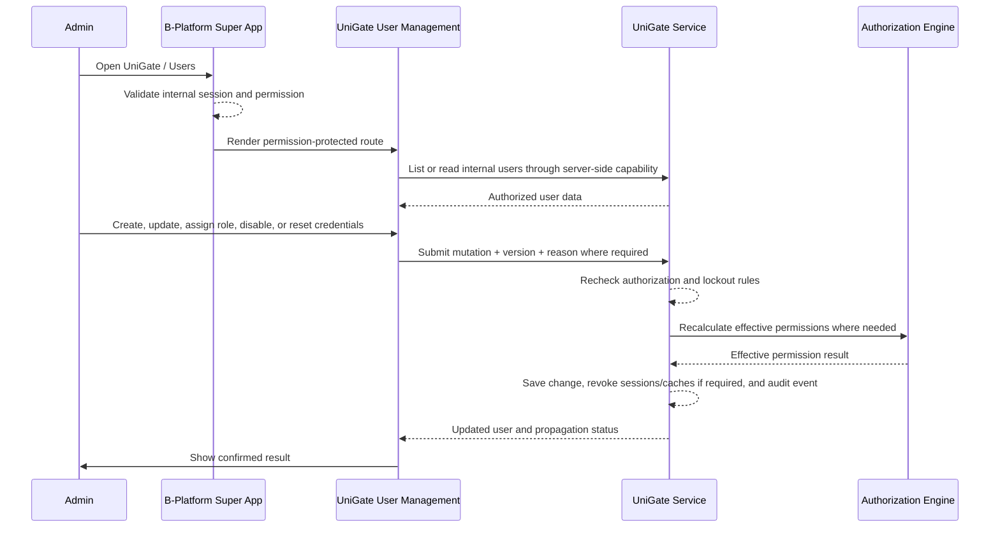

# User Management

| | |
|---|---|
| **Author** | tvlong |
| **Updated** | 2026.08.08 |
| **Product** | [B-Platform / UniGate](/products/bplatform-unigate/README.md) |
| **Priority** | P0 |
| **Tracklogs** | _TBD_ |

---

## The Problem

B-Platform internal applications need a controlled way to create and manage the internal users who can access the B-Platform Super App. After the first root user is created through the [General Sign-in initialization flow](/products/bplatform-general/features/sign-in.md), all additional internal accounts must be created and governed through B-Platform / UniGate.

Without centralized internal user management:

- New internal accounts may be created outside the approved authorization boundary.
- User lifecycle state may drift across installed B-Platform applications.
- Role assignments and effective permissions may become difficult to audit.
- Operators may keep access after leaving a team or changing responsibilities.
- Sensitive actions such as disabling an administrator or resetting credentials may be performed without enough guardrails.

## Proposed Solution

A **B-Platform / UniGate User Management** module installed in the [B-Platform Super App](/products/bplatform-general/architecture/super-app.md). Authorized administrators use it to create internal user accounts, view and update supported account attributes, assign approved roles, disable or reactivate users, trigger credential reset flows, and inspect user access history.

The module owns internal workforce accounts used to operate the B-Platform ecosystem. It is separate from customer-facing UniGate account administration, which is defined in [Customer Account Administration](/products/unigate/features/02-customer-account-administration.md).

### Goals

- Provide a searchable, filterable directory of internal B-Platform users.
- Create internal user accounts after first-run initialization.
- Maintain user profile, sign-in identifier, status, and role assignments.
- Show effective permission summaries without exposing credential secrets.
- Disable or reactivate users with safe guardrails and audit evidence.
- Protect root and high-privilege administrator accounts from accidental lockout.
- Support credential reset initiation without revealing passwords or reusable secrets.
- Audit every sensitive user-management action.

### Out-of-scope

- Customer account lifecycle and product access; see [Customer Account Administration](/products/unigate/features/02-customer-account-administration.md).
- Defining role records and permission catalog records from scratch; this should be covered by dedicated Role Management and Permission Management features.
- Product-specific employee profiles, HR records, payroll data, schedules, or support-team assignments outside UniGate.
- Self-service public registration for internal users after initialization.
- Direct password reveal, password export, password hash display, session-cookie display, or reusable-token display.
- Permanent hard deletion outside an approved security, legal, and retention process.

### Measurable Outcomes

- Internal user list and detail-view success rates.
- Internal user creation success and validation-failure rates.
- User update, disable, reactivate, and credential-reset initiation success rates.
- Unauthorized user-management attempts blocked.
- Time from role change to effective permission update.
- Number of prevented last-admin or self-lockout attempts.
- User-management support tickets and security incidents.

## Requirements

### 2.1 Administrator accesses User Management

- [P0] B-Platform / UniGate User Management is installed as an app/module in the B-Platform Super App.
- [P0] Its manifest declares navigation, routes, search providers, server actions, dependencies, and permission expressions according to the [Super App architecture](/products/bplatform-general/architecture/super-app.md).
- [P0] Only an authenticated internal administrator with the required permission can access each User Management function.
- [P0] The Super App and UniGate service enforce authorization server-side for every read and mutation.
- [P0] Navigation visibility, disabled controls, or hidden buttons must not be treated as authorization enforcement.
- [P0] If the UniGate service is unavailable, the module shows a degraded state and does not display stale user access data as current.

### 2.2 Administrator lists internal users

- [P0] An authorized administrator can view a paginated list of internal B-Platform users.
- [P0] The Users List table columns are `User`, `Username / Email`, `Roles`, `Effective Permissions`, `Status`, `Last Sign-in`, and `Actions`.
- [P0] The `User` column shows avatar or fallback initial, full name, and account type where space allows.
- [P0] The `Username / Email` column shows the supported sign-in identifier and applies masking when policy requires it.
- [P0] The `Roles` column shows assigned role names, truncated when needed.
- [P0] The `Effective Permissions` column shows a summary of permissions derived from assigned roles and direct grants where direct grants are supported.
- [P0] The `Status` column shows whether the user is active, disabled, pending invitation, or locked by policy.
- [P0] The `Last Sign-in` column shows the last successful internal sign-in timestamp or a clear never-signed-in state.
- [P0] The `Actions` column exposes only actions permitted for the current administrator, such as view, edit, disable, reactivate, or reset credentials.
- [P0] Administrators can search by full name, username, email, role, permission, or stable user reference.
- [P0] Administrators can filter by status, role, permission domain, account type, and last sign-in recency where supported.
- [P0] Disabled, pending, and locked users remain visible to authorized administrators by default so access issues can be diagnosed.
- [P0] Passwords, password hashes, session cookies, refresh tokens, recovery secrets, and reusable credentials are never displayed in the list.
- [P0] If no users match, the system shows a clear empty state and offers the permitted next action.
- [P0] If the list cannot be loaded, the system shows a safe error and allows retry.

### 2.3 Administrator adds a new internal user

- [P0] An authorized administrator can create a new internal B-Platform user after first-run initialization is complete.
- [P0] The create form collects at minimum full name, username or email, account type, assigned roles, status or invitation mode, and optional note/reason where policy requires it.
- [P0] Username/email must be unique within the internal identity boundary.
- [P0] The system validates required fields, identifier format, uniqueness, role selection, account-type constraints, and policy constraints before saving.
- [P0] New users cannot be created with arbitrary permissions outside the approved role and permission catalog.
- [P0] If invitation mode is used, the system sends a controlled invitation or credential setup flow through an approved delivery channel.
- [P0] If direct password setup is supported for emergency bootstrap cases, the password must satisfy policy and must never be logged or stored in plaintext.
- [P0] Creating a high-privilege user may require recent reauthentication or step-up authentication according to internal security policy.
- [P0] If creation succeeds, the module shows the created user and next setup state without revealing any secret.
- [P0] If creation fails, no partial account can authenticate and the administrator can retry safely.
- [P0] User creation is audited with actor, target user, assigned roles, status, timestamp, correlation ID, and outcome.

### 2.4 Administrator views user information

- [P0] An authorized administrator can open an internal user detail view.
- [P0] The detail view shows full name, username/email, avatar, account type, lifecycle status, assigned roles, effective permission summary, created/updated metadata, last sign-in metadata, and recent administrative activity where permitted.
- [P0] The detail view distinguishes assigned roles from effective permissions calculated by the authorization engine.
- [P0] The detail view identifies protected accounts such as root users or last active high-privilege administrators.
- [P0] Passwords, password hashes, session cookies, refresh tokens, recovery secrets, API keys, and reusable credentials are never displayed.
- [P0] Personal information is masked when the current administrator lacks permission to view the full value.
- [P0] If the user no longer exists or is outside the administrator's scope, the system shows a safe unavailable or access-denied state.

### 2.5 Administrator updates user information

- [P0] An authorized administrator can update approved editable fields such as full name, avatar, account type where policy allows, and contact/sign-in identifier where policy allows.
- [P0] Stable user reference remains immutable after creation.
- [P0] The system validates required fields, identifier format, normalization, uniqueness, and policy constraints before saving.
- [P0] Updating a sign-in identifier applies the approved reverification, notification, and session-risk policy.
- [P0] User updates must not silently change role assignments unless the administrator explicitly changes roles in the access section.
- [P0] If saving succeeds, the detail view displays the latest saved values with a success message.
- [P0] If saving fails, the previous user record remains authoritative and the administrator can retry.
- [P0] Every successful and rejected update is audited with actor, target user, changed fields, before/after metadata, timestamp, correlation ID, and outcome.
- [P1] If the administrator navigates away with unsaved changes, the interface warns before discarding them.

### 2.6 Administrator assigns roles to a user

- [P0] An authorized administrator can view assigned roles for a user.
- [P0] An authorized administrator can assign or remove roles from a user when policy allows.
- [P0] Role selection uses the approved B-Platform / UniGate role catalog and must not accept arbitrary free-text role grants.
- [P0] The interface shows an effective permission preview before saving role changes where feasible.
- [P0] The system prevents role changes that would remove the last active root or equivalent platform administrator.
- [P0] The system prevents an administrator from accidentally removing their own ability to manage users when they are the only remaining administrator with that capability.
- [P0] Role changes are enforced server-side and take effect according to the approved session and authorization-cache policy.
- [P0] Reducing roles or permissions prevents future access beyond the new effective permission set and may trigger session or authorization-cache revocation according to policy.
- [P0] Role assignment changes are audited with actor, target user, before/after role sets, effective-permission impact where available, timestamp, correlation ID, and outcome.

### 2.7 Administrator disables or reactivates a user

- [P0] An authorized administrator can disable an active internal user.
- [P0] Disabling a user requires confirmation and an administrative reason.
- [P0] A disabled user cannot sign in, reuse an internal session, call protected Super App capabilities, or access installed B-Platform applications.
- [P0] Disabling a user revokes or invalidates active internal sessions according to the approved propagation target.
- [P0] The system prevents disabling the last active root or equivalent platform administrator.
- [P0] The system prevents self-disable when it would lock the administrator out of User Management.
- [P0] Disabled state, reason, actor, timestamp, and propagation status are visible to authorized administrators.
- [P0] An authorized administrator can reactivate a disabled user when policy allows and required checks pass.
- [P0] Reactivation does not recreate expired sessions and does not bypass required credential setup or verification.
- [P0] If disabling or reactivation fails, the previous user state remains authoritative and the interface allows retry.
- [P0] Disable and reactivate actions are audited with actor, target user, reason, timestamp, correlation ID, and outcome.

### 2.8 Administrator initiates credential reset

- [P0] An authorized administrator can initiate a credential reset or invitation resend for a user when policy allows.
- [P0] Credential reset initiation never reveals the user's current password or credential secret.
- [P0] Reset links, setup links, OTPs, temporary secrets, and recovery tokens must be short-lived, single-use where applicable, and delivered only through approved channels.
- [P0] Reset flows must not expose secrets in URLs, logs, analytics, or client-visible error details beyond the intended one-time delivery token.
- [P0] High-risk reset actions may require recent reauthentication or step-up authentication.
- [P0] Credential reset initiation is audited with actor, target user, delivery channel metadata, timestamp, correlation ID, and outcome without storing secret material.

### 2.9 System handles root-user and high-privilege protections

- [P0] The first root user created during initialization remains protected by platform lockout rules.
- [P0] The system must always preserve at least one active user with the highest required administration capability.
- [P0] The system blocks updates, role removals, disable actions, or credential actions that would leave the platform without a usable administrator.
- [P0] Protected-account warnings clearly explain why the action is blocked without exposing sensitive internal policy details.
- [P0] Any attempted protected-account action is audited.

### 2.10 System handles concurrent administration

- [P0] User updates use optimistic concurrency, version checks, or an equivalent control to prevent one administrator from unknowingly overwriting another administrator's changes.
- [P0] If a user changes after the administrator loaded it, the system rejects or reconciles the stale update and prompts the administrator to review the latest state.
- [P0] Disable, reactivate, role assignment, and credential-reset operations are idempotent or protected against duplicate submission.
- [P0] The interface disables repeated submission while an operation is in progress without relying on that control for server-side protection.

### 2.11 Audit, security, and privacy

- [P0] UniGate audits internal user list/detail reads where required by policy and all create, update, role assignment, disable, reactivate, credential reset, invitation, and protected-account actions.
- [P0] Audit records include internal actor, action, target user, timestamp, outcome, correlation ID, and approved before/after metadata.
- [P0] Audit records do not contain passwords, password hashes, raw cookies, reusable tokens, recovery secrets, OTP values, or unnecessary personal data.
- [P0] Audit records are tamper-resistant and retained according to approved policy.
- [P0] The module follows least privilege and separates list, view, create, edit, role assignment, lifecycle, credential reset, and audit permissions where practical.
- [P0] Bulk export of internal user data is unavailable unless separately specified, authorized, and audited.

## Interaction Flow

## Appendix

### Internal user lifecycle states

| State | Authentication | Standard admin actions |
|---|---|---|
| Pending invitation | Cannot sign in until invitation or credential setup is completed. | View, edit, resend invitation, disable. |
| Active | Can sign in and access permitted B-Platform functions. | View, edit, assign roles, reset credentials, disable. |
| Disabled | Cannot sign in or reuse internal sessions. | View, reactivate where permitted, audit. |
| Locked | Temporarily blocked by security policy such as too many failed attempts. | View, unlock/reset credentials where permitted. |

### Recommended internal user fields

| Field | Description | Editable |
|---|---|---|
| User Reference | Stable system-owned user reference. | No |
| Full Name | Human-readable internal user name. | Yes |
| Username / Email | Supported sign-in identifier for internal Super App access. | Policy-controlled |
| Avatar | Optional profile image or fallback initial used in management UI. | Yes |
| Account Type | Classification such as Root, Administrator, Operator, Support, Developer, or Auditor. | Policy-controlled |
| Assigned Roles | Roles granted to the user from the approved role catalog. | Yes, permission-controlled |
| Effective Permissions | Calculated permission summary derived from assigned roles and policy. | System-owned |
| Status | Pending invitation, Active, Disabled, or Locked. | Lifecycle action |
| Last Sign-in | Last successful internal sign-in timestamp and source metadata where permitted. | System-owned |
| Created / Updated Metadata | Actor, timestamp, and versioning metadata. | System-owned |
| Disable Reason | Administrative reason captured when a user is disabled. | Action-owned |

### Users List table columns

| Column | Content |
|---|---|
| User | Avatar or fallback initial, full name, and account type summary where space allows. |
| Username / Email | Supported internal sign-in identifier with masking when required. |
| Roles | Assigned role summary, truncated with full value available in detail view where permitted. |
| Effective Permissions | Effective permission summary, truncated with full value available in detail view where permitted. |
| Status | Pending invitation, Active, Disabled, or Locked lifecycle state. |
| Last Sign-in | Last successful sign-in timestamp or never-signed-in state. |
| Actions | Permission-controlled actions such as view, edit, disable, reactivate, reset credentials, or resend invitation. |

### Registered Permission List

Registered Permission List is all available permissions which B-Platform / UniGate > Users provides to the Super App.

| Permission | Description | Parameters | Dependency |
|---|---|---|---|
| `unigate.users.manage` | Highest permission. Can do everything about internal users. | _None_ | _None_ |
| `unigate.users.list` | Can view summary of internal users but cannot see detail, edit, create, disable, or reset credentials. | `user_ids`: If not provided, user can list all users in the system. Otherwise, user can only see summaries of specified users. List user IDs are separated by `,`. | _None_ |
| `unigate.users.read` | Can see detail of a single internal user. | `fields`: If not provided, user can view all non-secret visible fields. Otherwise, only specified field IDs can be viewed. List field IDs are separated by `,`. | Requires `unigate.users.list` to be activated. |
| `unigate.users.create` | Can create a new internal user. | `account_types`: If not provided, user can create all policy-allowed account types. Otherwise, only specified account types can be created. List account types are separated by `,`. | Requires `unigate.users.list` to be activated. |
| `unigate.users.edit` | Can edit internal user profile fields. | `fields`: If not provided, user can edit all policy-allowed fields. Otherwise, only specified field IDs can be edited. List field IDs are separated by `,`. | Requires `unigate.users.read` to be activated. |
| `unigate.users.assign_roles` | Can assign or remove roles from an internal user. | `role_ids`: If not provided, user can assign all policy-allowed roles. Otherwise, only specified role IDs can be assigned. List role IDs are separated by `,`. | Requires `unigate.users.read` to be activated. |
| `unigate.users.deactivate` | Can disable or reactivate an internal user. | _None_ | Requires `unigate.users.edit` to be activated. |
| `unigate.users.reset_credentials` | Can initiate credential reset, invitation resend, or setup-link workflows. | _None_ | Requires `unigate.users.read` to be activated. |
| `unigate.users.audit` | Can view user-management audit summary where policy allows. | _None_ | Requires `unigate.users.read` to be activated. |

### Data ownership boundary

| Data | Owner |
|---|---|
| Internal user identity, credential state, assigned roles, effective permissions, lifecycle status, internal sessions, and user-management audit records | UniGate |
| Super App shell, navigation visibility, route hosting, global search presentation, and server-side capability dispatch | B-Platform / General |
| Product-specific employee/team metadata, operational assignments, and non-identity profile details | Individual internal B-Platform products |