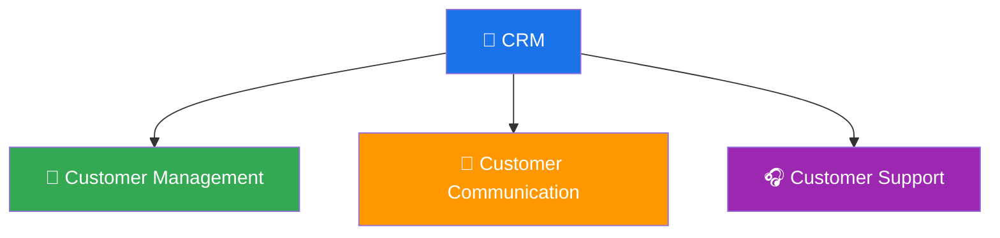
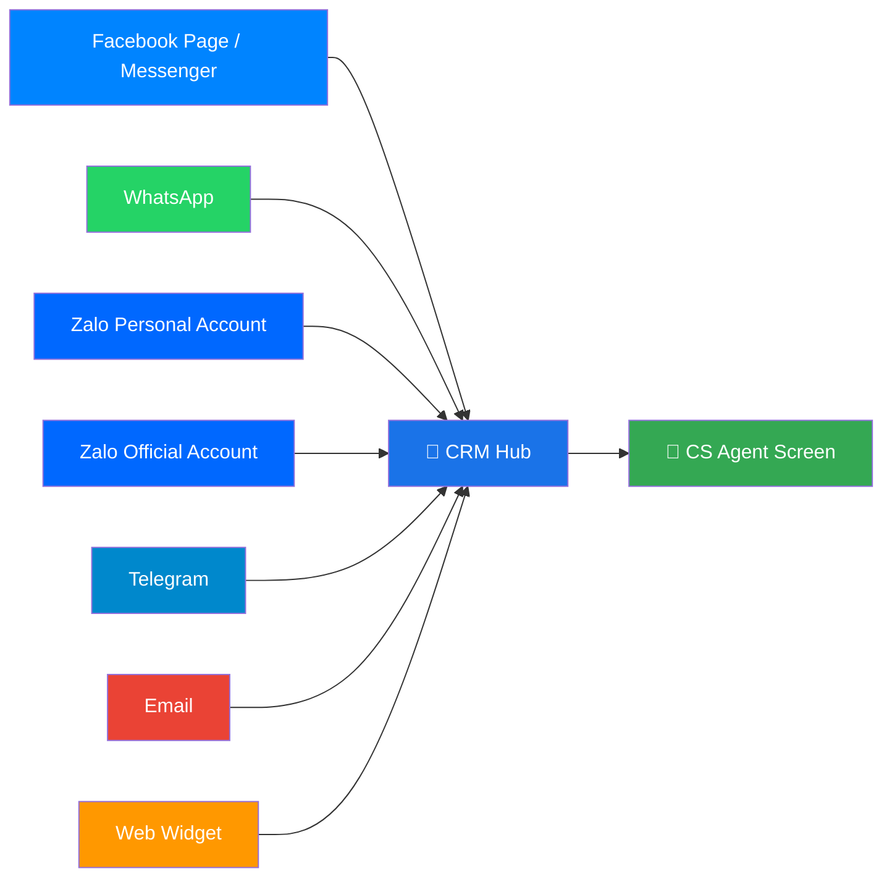
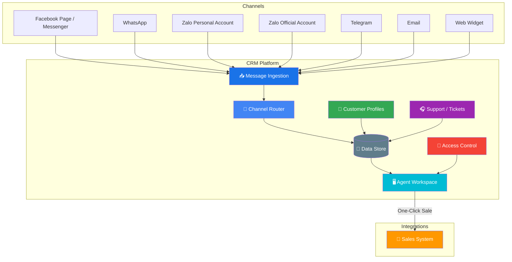

# Customer Relationship Management (CRM)

> The central platform for everything about the customer: **Customer Management**, **Customer Communication**, and **Customer Support**. It unifies customer data and every conversation — regardless of channel — into one workspace for In-house Customer Service and Freelancer (contractor) Customer Service teams.

**Category:** Back-office

## Mission

Provide a single, powerful workspace that centralizes customer records, conversations, and support activities. It enables Customer Service teams (both in-house and freelancer contractors) to know their customers, respond faster across every channel, resolve issues efficiently, and convert conversations into sales.

## Role & Responsibility

| Area | Description |
|---|---|
| Category | Back-office (supports operation & customer support) |
| Domain | Customer Management, Communication & Support |
| Users | In-house CS Agents, Freelancer (Contractor) CS Agents, Management |
| Key Outcome | Unified customer view with omni-channel communication, support, and seamless sales conversion |

## Pillars

CRM covers three core pillars:

### 1. Customers

Sale Master can manage the customer master list and a single customer record. This is the CRM destination for sourced/enriched customers generated by Rocket Agents.

- View all available customers with key fields such as name, status, and connected channels (Zalo, Email, Phone, Facebook, etc.)
- Edit a single customer record (name, phone, email, status, tax information, and other allowed attributes)
- Remove a single customer record when permitted

### 2. Communications

Sale Master can manage customer conversations across connected channels.

- Send a message to any connected customer via any connected channel
- View all conversation histories for a single customer across channels

### 3. Customer Management

- Centralized customer profiles (identity, contact details, history, tags, segments)
- Unified customer record consolidated across all channels and touchpoints
- Customer lifecycle and relationship tracking
- Segmentation for targeting and personalization

### 4. Customer Communication

Unified, multi-channel messaging that brings every conversation into one screen.

Collect customer messages from multiple social and messaging platforms:

- Facebook Page / Messenger
- WhatsApp
- Zalo Personal Account
- Zalo Official Account
- Telegram
- Email
- Web Widget (Live Chat)

**Centralized communication view** — all conversations in one screen with clear distinction of:

- **Channel origin** — Which platform the message came from (Facebook, WhatsApp, Zalo, etc.)
- **Sender identity** — Who sent the message (customer name, agent name, bot)
- **Conversation threading** — Grouped by customer across channels

**Unified communication protocol** — a standardized way for CS agents to communicate in both:

- **Proactive mode** — Agents initiate outbound messages (campaigns, follow-ups, notifications)
- **Reactive mode** — Agents respond to incoming customer inquiries

### 5. Customer Support

- Ticket / case management for tracking customer issues to resolution
- Assignment and routing of support requests to the right agent
- SLA tracking and escalation
- Support history tied to the unified customer profile

## Feature Pages

- [Customers](features/01-customers.md)
- [Communications](features/02-communications.md)

## Cross-Cutting Capabilities

### Secure Access Control

- Role-based permissions controlling which agents can see which customers / conversations
- Freelancer (contractor) agents have scoped access — only see conversations assigned to them
- In-house agents can have broader or full visibility based on team configuration
- Audit trail for all customer data and message access

### One-Click Sales Conversion

- Turn any customer conversation into a sales order in other products with a single click
- Seamless handoff from communication context to the sales/retail system
- Preserve conversation and customer context so the sales team has full history

## Architecture Overview

## Tools, Apps & Platforms

| Tool / App / Platform | Type | Purpose | Feature Details |
|---|---|---|---|
| _To be documented_ | — | — | — |

> As tools and apps are identified, add them here and create corresponding feature pages under `features/`.

## Key Contacts

| Role | Name | Team |
|---|---|---|
| Product Owner | _TBD_ | _TBD_ |
| Tech Lead | _TBD_ | _TBD_ |
| Engineering Manager | _TBD_ | _TBD_ |
