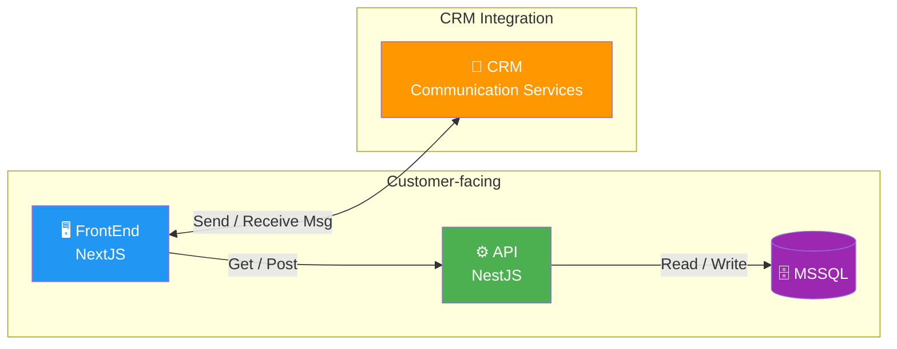

# LFarm — Stack / Tools

> Technical architecture and integrations for the LFarm public website.

## Architecture Overview



## Stack Breakdown

### 1. Customer-facing Stack

The core request/response flow serving the end user.

```
[MSSQL] <-- Read/Write --> [API - NestJS] <-- Get/Post --> [FrontEnd - NextJS]
```

| Component | Technology | Role                                                                    |
| --------- | ---------- | ----------------------------------------------------------------------- |
| Database  | **MSSQL**  | Persistent storage for website content, articles/news                   |
| API       | **NestJS** | Backend — business logic, REST endpoints, content delivery              |
| FrontEnd  | **NextJS** | Customer-facing web app — SSR, routing, localized content pages, and UI |

### 2. CRM Integration

Communication between the LFarm website and the CRM messaging services.

```
[CRM - Communication Services] <-- Send/Receive Msg --> [FrontEnd - NextJS]
```

| Component | Technology                     | Role                                                                             |
| --------- | ------------------------------ | -------------------------------------------------------------------------------- |
| CRM       | **CRM Communication Services** | Handles customer/partner messaging, contact follow-up, and communication history |
| FrontEnd  | **NextJS**                     | Displays contact entry points and sends/receives messages when supported         |


## Tech Stack Summary

| Layer        | Technology                 | Purpose                                        |
| ------------ | -------------------------- | ---------------------------------------------- |
| Frontend     | NextJS                     | Server-side rendered public website            |
| Backend API  | NestJS                     | REST API, business logic, and content delivery |
| Database     | MSSQL                      | Relational data store                          |
| Messaging    | CRM Communication Services | Customer/partner messaging integration         |
