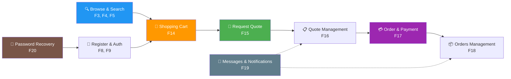

# MDFoods — Features

> Complete feature catalog for the MDFoods web platform. Each feature is documented as its own PRD following the standard template: **The Problem → Landscape → Proposed Solution → Requirements → Appendix**.

## Feature Index

| # | Feature | Priority | Summary |
|---|---|---|---|
| 1 | [Master Layout](/products/mdfoods/features/01-master-layout.md) | P0 | Header, Footer, Internal Links |
| 2 | [Landing Page](/products/mdfoods/features/02-landing-page.md) | P0 | Home Page |
| 3 | [Product List by Category](/products/mdfoods/features/03-product-list-by-category.md) | P0 | Browse products grouped by category |
| 4 | [Product Detail](/products/mdfoods/features/04-product-detail.md) | P0 | Single product view with full details |
| 5 | [Product Search](/products/mdfoods/features/05-product-search.md) | P0 | Search products across categories |
| 6 | [Static Pages](/products/mdfoods/features/06-static-pages.md) | P0 | Informational and policy pages (13 sub-pages) |
| 7 | [Activities](/products/mdfoods/features/07-activities.md) | P1 | Promotions and event content |
| 8 | [Registration](/products/mdfoods/features/08-registration.md) | P0 | New customer sign-up |
| 9 | [Authentication](/products/mdfoods/features/09-authentication.md) | P0 | Login / logout / session management |
| 10 | [Profile Management](/products/mdfoods/features/10-profile-management.md) | P1 | Edit personal profile |
| 11 | [Addresses Management](/products/mdfoods/features/11-addresses-management.md) | P0 | Manage shipping/billing addresses |
| 12 | [Company Information Management](/products/mdfoods/features/12-company-information-management.md) | P0 | Business entity details |
| 13 | [Company Member/Permission Management](/products/mdfoods/features/13-company-member-permission-management.md) | P1 | Team roles and access |
| 14 | [Shopping Cart](/products/mdfoods/features/14-shopping-cart.md) | P0 | Cart management before checkout |
| 15 | [Request Quote Process](/products/mdfoods/features/15-request-quote-process.md) | P0 | Request volume-based pricing |
| 16 | [Quote Management](/products/mdfoods/features/16-quote-management.md) | P0 | View and manage received quotes |
| 17 | [Order & Payment](/products/mdfoods/features/17-order-and-payment.md) | P0 | Place order and pay |
| 18 | [Orders Management](/products/mdfoods/features/18-orders-management.md) | P0 | View and track order history |
| 19 | [In-App Messages and Notification](/products/mdfoods/features/19-in-app-messages-notification.md) | P1 | Real-time messaging via CRM |
| 20 | [Password Recovery](/products/mdfoods/features/20-password-recovery.md) | P0 | Recover account access and reset passwords securely |

## Feature Journey

## PRD Template

Each feature page follows this structure:

- **The Problem** — What problem is being solved and for whom (with data points and target use cases).
- **Landscape** *(optional)* — Context: competitors, trends, constraints.
- **Proposed Solution** — Summary plus **Goals**, **Out-of-scope**, and **Measurable Outcomes**.
- **Requirements** — Organized by use case with priority legend:
  - **[P0]** = MVP for a GA release
  - **[P1]** = Important for delightful experience
  - **[P2]** = Nice-to-have
- **Appendix** *(optional)* — Decisions, alternatives, rationale.
