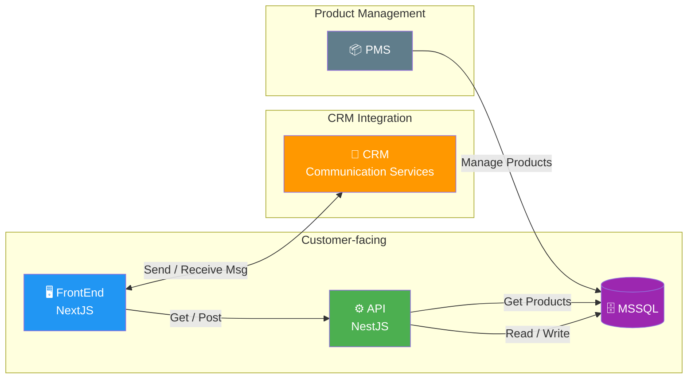

# MDFoods — Stack / Tools

> Technical architecture and integrations for the MDFoods platform.

## Architecture Overview



## Stack Breakdown

### 1. Customer-facing Stack

The core request/response flow serving the end user.

```
[MSSQL] <-- Read/Write --> [API - NestJS] <-- Get/Post --> [FrontEnd - NextJS]
```

| Component | Technology | Role |
|---|---|---|
| Database | **MSSQL** | Persistent storage for products, orders, quotes, users |
| API | **NestJS** | Backend — business logic, REST endpoints, auth |
| FrontEnd | **NextJS** | Customer-facing web app — SSR, routing, UI |

### 2. CRM Integration

Communication between the MDFoods web app and the CRM messaging services.

```
[CRM - Communication Services] <-- Send/Receive Msg --> [FrontEnd - NextJS]
```

| Component | Technology | Role |
|---|---|---|
| CRM | **CRM Communication Services** | Handles customer messaging (chat, notifications) |
| FrontEnd | **NextJS** | Displays messages, sends/receives in real-time |

### 3. Product Management System (PMS)

Manages product data that MDFoods reads for its catalog.

```
[PMS] -- Manage Products --> [MSSQL] <-- Get Products -- [API - NestJS]
```

| Component | Technology | Role |
|---|---|---|
| PMS | **Product Management System** | Creates and manages product metadata (name, SKU, description, price) |
| Database | **MSSQL** | Shared data store — PMS writes, API reads |
| API | **NestJS** | Reads product data from DB and serves to FrontEnd |

## Tech Stack Summary

| Layer | Technology | Purpose |
|---|---|---|
| Frontend | NextJS | Server-side rendered web app |
| Backend API | NestJS | REST API, business logic |
| Database | MSSQL | Relational data store |
| Messaging | CRM Communication Services | Customer messaging integration |
| Product Data | PMS | Product catalog management |
