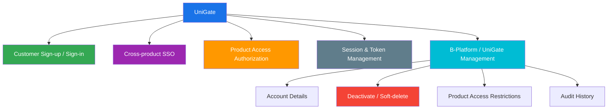
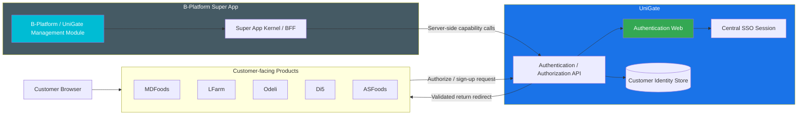

# UniGate

> Centralized customer authentication, Single Sign-On, and product-access authorization for the B-Platform customer ecosystem.

**Category:** Platform Foundation

## Mission

UniGate gives customers one secure account and one authentication experience across connected customer-facing products. Customers sign up or sign in through UniGate and return to the product and page where they started. After authenticating through one connected product, they can access other authorized connected products without an explicit sign-in action while the UniGate SSO session remains valid.

The management side of UniGate is **[B-Platform / UniGate](/products/bplatform-unigate/README.md)**, an installed module in the [B-Platform Super App](/products/bplatform-general/architecture/super-app.md). Authorized internal administrators use it to manage customer accounts, application/client configuration, roles, permissions, audit history, and which customer-facing products each account can access.

## Role & Responsibility

| Area | Description |
|---|---|
| Category | Platform Foundation |
| Domain | Customer identity, Authentication, SSO & product-access authorization |
| Form Factor | Customer-facing authentication web experience, authentication/authorization APIs, and B-Platform / UniGate management modules installed in the B-Platform Super App |
| Users | Customers, authorized internal administrators, connected customer-facing products, and product developers |
| Key Outcome | One customer identity across connected products with centralized account lifecycle and per-product access control |

## Product Surfaces

### 1. Customer Authentication

When a customer selects **Sign up** or **Sign in** from a connected customer-facing product, that product redirects the customer to UniGate. UniGate completes authentication and redirects the customer back to the validated originating product and URL.

Connected products include:

- MDFoods
- LFarm
- Odeli
- Di5
- ASFoods
- future approved customer-facing products

A customer who already has a valid UniGate SSO session can enter another authorized connected product without performing an explicit sign-in action again. Each connected product must still establish and validate its own product session through the approved UniGate protocol.

Feature details: [Customer Authentication & SSO](features/01-customer-authentication-sso.md)

### 2. B-Platform / UniGate Management

B-Platform / UniGate provides the management side of UniGate inside the B-Platform Super App. Authorized administrators can:

- View and search all customer accounts registered in UniGate.
- View the details and status of an account.
- Edit supported customer identity information.
- Deactivate and reactivate an account.
- Soft-delete and restore an account according to retention policy.
- Restrict an account to one or more connected customer-facing products.
- Manage connected applications, redirect URIs, scopes, roles, permissions, and internal access policies.
- Review security-relevant account and access changes through audit history.

Feature details: [Customer Account Administration](features/02-customer-account-administration.md)

Management-side application/client registration is defined in [B-Platform / UniGate Application Management](/products/bplatform-unigate/features/01-application-management.md).

## Core Capabilities

## Architecture Boundary

### Session model

UniGate owns the central SSO session. Connected products must not depend on reading a broad shared authentication cookie directly. The preferred model is:

1. UniGate stores an `HttpOnly`, `Secure` SSO cookie on the UniGate authentication domain.
2. A connected product redirects to UniGate when it needs authentication.
3. If the SSO cookie is valid, UniGate completes authorization without asking for credentials again.
4. UniGate returns a short-lived, single-use authorization result to the allowlisted product callback.
5. The product validates the result server-side and establishes its own first-party product session.

This delivers shared sign-in across products while limiting cookie exposure. A parent-domain cookie may be considered only if all connected products use trusted subdomains of one registrable domain and a security review approves the wider blast radius.

## Product-access Model

Authentication answers **who the customer is**. Product-access authorization answers **which connected products the customer may enter**.

- By default, an active customer account may access all active customer-facing products connected to UniGate.
- An authorized administrator can restrict an account to an explicit set of one or more products.
- Every connected product must check its own access decision during authentication and on security-sensitive session refreshes.
- Successful UniGate authentication does not bypass product-specific onboarding, company approval, membership, subscription, or business permissions.
- Removing product access revokes or invalidates that product's active sessions according to the agreed revocation policy.

## Boundary with Existing Products

| Product | Responsibility |
|---|---|
| UniGate | Customer accounts, customer sign-up/sign-in, customer SSO, customer sessions, and customer-facing product access decisions |
| [B-Platform / General](/products/bplatform-general/README.md) | Internal Super App shell, installed-app runtime, navigation, search, and server-side capability dispatch |
| [B-Platform / UniGate](/products/bplatform-unigate/README.md) | Management side of UniGate: application/client management, customer account administration, internal users, roles, permissions, authorization policies, sessions, and audit workflows |
| Customer-facing products | Product-specific customer profiles, onboarding, business memberships, business permissions, data, and post-authentication return experience |

## Tools, Apps & Platforms

| Tool / App / Platform | Type | Purpose | Feature Details |
|---|---|---|---|
| UniGate Authentication Web | Public web app | Presents centralized customer sign-up, sign-in, recovery, and authentication states. | [Customer Authentication & SSO](features/01-customer-authentication-sso.md) |
| UniGate Authentication / Authorization API | Public and service API | Handles authorization requests, token exchange, session validation, sign-out, revocation, and product-access decisions. | [Customer Authentication & SSO](features/01-customer-authentication-sso.md) |
| B-Platform / UniGate Management | B-Platform installed app | Lets authorized administrators manage customer accounts, product access, connected applications, internal users, roles, permissions, and audit workflows. | [Application Management](/products/bplatform-unigate/features/01-application-management.md), [Customer Account Administration](features/02-customer-account-administration.md), [User Management](/products/bplatform-unigate/features/02-user-management.md) |
| UniGate Identity Store | Platform data service | Stores customer identity, credential, session, lifecycle, product-access, and audit data. | _Architecture details TBD_ |

## Dependencies

| Depends On | Category | What It Provides to UniGate |
|---|---|---|
| [B-Platform / General](/products/bplatform-general/) | Platform Foundation | Super App runtime, navigation, route registration, permission enforcement boundary, and server-side BFF for B-Platform / UniGate management modules |
| Connected customer-facing products | Ecosystem products | Registered clients, allowlisted return URLs, product branding/context, callback handling, and local session establishment |
| Email/SMS delivery provider | Infrastructure | Verification, recovery, and security notification delivery; provider selection is TBD |
| Identity data store and key management | Infrastructure | Protected identity persistence, signing keys, encryption, rotation, backup, and recovery |

## Success Measures

- Customer sign-up completion rate.
- Customer sign-in success rate.
- Percentage of eligible cross-product visits completed without credential re-entry.
- Authentication return success rate by connected product.
- Product-access denial accuracy and revocation propagation time.
- Account administration success and failure rates.
- Authentication-, account-, and access-related support tickets.
- Security incidents involving sessions, redirects, credentials, or unauthorized product access.

## Open Questions

- Which domain will host UniGate, and do all connected products share a registrable parent domain?
- Which identity protocol and token profile will be adopted: OAuth 2.1/OpenID Connect or an equivalent reviewed standard?
- Which customer identifiers are mandatory and globally unique: email, phone, or both?
- Does customer self-service sign-up require email/phone verification before returning to the originating product?
- What session idle timeout, absolute lifetime, remembered-session policy, and reauthentication rules apply?
- What is the maximum propagation time for product-access removal and global account deactivation?
- What retention period and anonymization process apply to soft-deleted accounts?
- Which B-Platform permissions authorize administrators to view, edit, deactivate, delete, restore, or change product access?
- Which B-Platform / UniGate management features should be delivered first beyond customer account administration: application management, internal users, roles, permissions, audit, or session controls?

## Key Contacts

| Role | Name | Team |
|---|---|---|
| Product Owner | _TBD_ | _TBD_ |
| Tech Lead | _TBD_ | _TBD_ |
| Security Owner | _TBD_ | _TBD_ |
| Engineering Manager | _TBD_ | _TBD_ |
