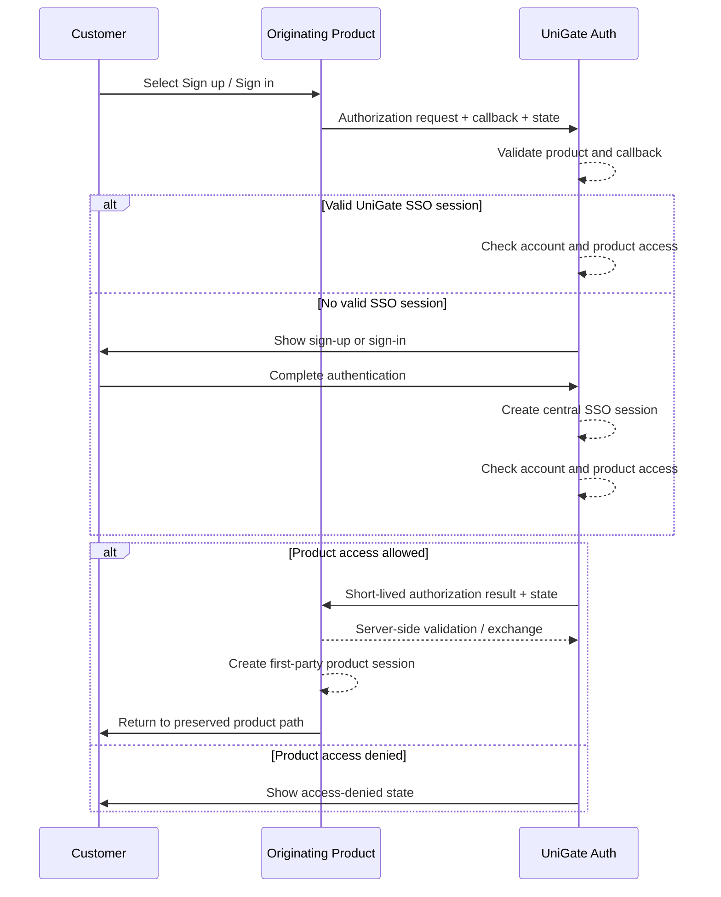

# Customer Authentication & SSO

| | |
|---|---|
| **Author** | tvlong |
| **Updated** | 2026.08.06 |
| **Product** | [UniGate](/products/unigate/README.md) |
| **Priority** | P0 |
| **Tracklogs** | _TBD_ |

---

## The Problem

Customers currently encounter separate authentication entry points across MDFoods, LFarm, Odeli, Di5, ASFoods, and future customer-facing products. Repeated registration and sign-in create friction, fragment customer identity, and make session security and account lifecycle difficult to manage consistently.

- A customer should not need a different account for every connected product.
- A customer should return to the exact product context where authentication started.
- A customer already authenticated with UniGate should not need to explicitly sign in again when entering another authorized product.
- Connected products must not implement incompatible credential, session, redirect, or account-status rules.
- Cross-product convenience must not weaken cookie isolation, redirect security, token handling, or product-access enforcement.

## Proposed Solution

A centralized **UniGate Customer Authentication** experience used by every connected customer-facing product. Products redirect customers to UniGate for sign-up or sign-in, UniGate establishes or reuses the central SSO session, and the customer returns to an allowlisted callback for the originating product. The target product validates the authorization result server-side and creates its own first-party session.

### Goals

- Give each customer one UniGate account across connected customer-facing products.
- Provide consistent customer sign-up and sign-in screens.
- Return customers to the validated product and page where authentication started.
- Enable SSO across authorized products without repeated credential entry.
- Enforce account lifecycle and product-access decisions centrally.
- Use secure cookies and standard authorization protections.

### Out-of-scope

- Product-specific customer onboarding after identity creation.
- Product-specific profiles, company records, memberships, subscriptions, roles, or business permissions.
- Internal B-Platform employee/operator sign-in.
- User Management administration; this is defined in [Customer Account Administration](02-customer-account-administration.md).
- Social identity providers, passkeys, and enterprise federation until separately approved.
- Native mobile-app authentication until mobile clients and redirect mechanisms are defined.

### Measurable Outcomes

- Sign-up completion rate.
- Sign-in success and failure rates.
- Authentication callback success rate by product.
- Cross-product SSO completion rate without credential re-entry.
- Authentication abandonment rate by step.
- Invalid return-target and replay attempts blocked.
- Authentication-related support tickets and security incidents.

## Requirements

### 1.1 Connected product starts authentication

- [P0] MDFoods, LFarm, Odeli, Di5, ASFoods, and future approved customer-facing products can register as UniGate client applications.
- [P0] Each client has a stable product identifier and one or more allowlisted callback URLs.
- [P0] When a customer selects **Sign up** or **Sign in**, the product redirects to UniGate rather than collecting UniGate credentials itself.
- [P0] The authorization request identifies the originating product, requested callback, intended action, and opaque transaction state.
- [P0] The product preserves its desired return path in protected transaction state; UniGate must not accept an arbitrary unvalidated return URL.
- [P0] Products must not place passwords, tokens, personal data, or sensitive business state in the authorization URL.
- [P0] If the product identifier or callback is unknown, inactive, or not allowlisted, UniGate rejects the request and does not redirect to the untrusted target.

### 1.2 Customer signs up

- [P0] If the customer does not have an account, UniGate provides a customer-facing sign-up flow.
- [P0] Sign-up collects only the globally required identity and credential information defined by UniGate policy.
- [P0] UniGate validates required fields, identifier format and uniqueness, password policy, and required consent before creating an account.
- [P0] If the email or phone already belongs to an account, UniGate does not create a duplicate account and offers a safe sign-in or recovery path without exposing unnecessary account details.
- [P0] Successful sign-up creates one UniGate customer identity that can be used by all connected products, subject to product-access policy.
- [P0] Successful sign-up establishes a central UniGate SSO session.
- [P0] UniGate records the originating product as the registration source for analytics and audit purposes.
- [P0] After sign-up, UniGate continues the same authorization transaction and returns the customer to the originating product.
- [P0] Product-specific onboarding may continue after return, but it must not create another UniGate identity.
- [P0] If sign-up is abandoned or expires, UniGate does not issue an authorization result and the originating product retains its own recoverable workflow state where applicable.

### 1.3 Customer signs in

- [P0] UniGate allows a customer to submit the supported account identifier and credential.
- [P0] UniGate uses generic failure wording that does not reveal whether an account identifier exists.
- [P0] UniGate applies rate limiting, automated abuse protection, and account lockout or risk controls according to the approved security policy.
- [P0] A deactivated or soft-deleted account cannot complete sign-in.
- [P0] Successful sign-in creates or rotates the central UniGate SSO session and continues the originating authorization transaction.
- [P0] Passwords and other credential secrets must never appear in URLs, logs, analytics, browser storage, or client-visible error details.

### 1.4 Customer returns to the originating product

- [P0] After successful sign-up, sign-in, or SSO reuse, UniGate returns the customer only to the callback registered for the originating product.
- [P0] The authorization response includes the original opaque state so the product can bind the response to the initiating browser transaction.
- [P0] Any authorization code is short-lived, single-use, and bound to the requesting product and callback.
- [P0] The connected product validates and exchanges the authorization result from its server-side runtime.
- [P0] Sensitive tokens must not remain in browser history or the final product URL.
- [P0] After validation succeeds, the product creates its own secure first-party session and redirects the customer to the preserved safe return path.
- [P0] If the original product path is missing, invalid, expired, or unsafe, the product redirects to its default authenticated landing page.
- [P0] If the callback fails or expires, the product shows a recoverable authentication error without creating a partial authenticated session.

### 1.5 Existing SSO session avoids explicit sign-in

- [P0] UniGate stores its central SSO session in an `HttpOnly`, `Secure` cookie with an appropriate `SameSite` policy on the UniGate authentication domain.
- [P0] Connected products must not read the UniGate SSO cookie directly.
- [P0] When an unauthenticated product session needs authentication, the product starts a UniGate authorization request.
- [P0] If the UniGate SSO session is valid and the customer is authorized for the requesting product, UniGate completes the request without showing the credential form.
- [P0] The customer returns to the requesting product, which establishes its own first-party session.
- [P0] A customer with no valid UniGate SSO session must complete sign-in before authorization continues.
- [P0] UniGate may require reauthentication for high-risk, expired, or policy-controlled requests even when an SSO session exists.
- [P0] A central SSO session must not be treated as proof that a product-specific session is currently valid.

### 1.6 UniGate checks product access

- [P0] Before issuing an authorization result, UniGate confirms that the requesting product is active and the customer account is allowed to access it.
- [P0] By default, an active customer account can access all active connected customer-facing products unless an administrator applies a product-access restriction.
- [P0] If an account is restricted, UniGate authorizes only products in the account's effective allowed-product set.
- [P0] If the account lacks access, UniGate shows an authenticated-but-unauthorized state and does not return an authorization result for that product.
- [P0] Product access must be enforced by UniGate server-side; hiding product links is not authorization enforcement.
- [P0] Product authorization does not bypass product-specific onboarding, company approval, membership, subscription, or business permissions.
- [P0] Product-access decisions and denials are auditable.

### 1.7 Account and access changes affect sessions

- [P0] Deactivating or soft-deleting an account prevents new authorization for every product.
- [P0] Account deactivation or soft deletion revokes the central SSO session and active refresh/session credentials according to the approved propagation target.
- [P0] Removing access to one product prevents new authorization for that product without removing access to other allowed products.
- [P0] Removing product access invalidates or revokes that product's active session according to the agreed connected-product contract.
- [P0] Reactivating or restoring an account does not silently recreate expired product sessions; the customer must establish valid sessions again.
- [P0] Connected products must support revocation checks, short session lifetimes, back-channel notification, or another approved mechanism that satisfies the revocation target.

### 1.8 Customer signs out

- [P0] Each connected product provides a sign-out action for its local product session.
- [P0] UniGate supports ending the central SSO session.
- [P0] The interface distinguishes **Sign out of this product** from **Sign out of all connected products** when both behaviors are offered.
- [P0] Global sign-out revokes the central SSO session and notifies or invalidates connected product sessions according to the approved sign-out contract.
- [P0] After global sign-out, accessing a protected product requires a new UniGate authentication flow.
- [P0] Sign-out return URLs are allowlisted and protected against open redirects.

### 1.9 Failure and recovery states

- [P0] UniGate distinguishes invalid client, invalid callback, expired transaction, invalid or replayed authorization result, unavailable service, deactivated account, deleted account, and product-access denial.
- [P0] Customer-facing errors use safe wording and do not expose client secrets, token contents, account existence, internal IDs, or security rules.
- [P0] Recoverable failures provide a safe retry or return-to-product action.
- [P0] UniGate prevents redirect loops between itself and connected products.
- [P0] Correlation IDs link product, UniGate, and callback events without exposing secrets to the customer.

### 1.10 Security, privacy, and audit

- [P0] UniGate uses a reviewed authorization protocol and current security best practices; OAuth 2.1/OpenID Connect with Authorization Code and PKCE is the preferred baseline.
- [P0] All authentication and callback traffic uses HTTPS.
- [P0] Redirect URIs use exact or strictly controlled matching; wildcard redirects are prohibited unless a separately reviewed rule is documented.
- [P0] Session identifiers and tokens have sufficient entropy, are rotated where applicable, and are protected against fixation, replay, and theft.
- [P0] Signing and encryption keys are stored securely, rotated, and recoverable under documented operational procedures.
- [P0] UniGate minimizes collection and disclosure of customer attributes to each connected product.
- [P0] Each product receives only approved identity claims required for its workflow.
- [P0] UniGate records sign-up, sign-in success/failure, SSO reuse, sign-out, recovery, access denial, token/session revocation, and suspicious authentication events.
- [P0] Audit records must not contain plaintext credentials, raw session cookies, reusable tokens, or unnecessary personal data.

## Interaction Flow

## Appendix

### Session ownership

| Session | Owner | Purpose |
|---|---|---|
| UniGate SSO session | UniGate | Remembers central customer authentication and enables cross-product SSO. |
| Product session | Connected product | Authenticates requests to that product and carries product-specific context. |
| Authorization transaction | UniGate and originating product | Protects one redirect/callback flow, state, expiry, and replay prevention. |

### Product integration contract

Each connected product must provide:

- A stable client/product identifier.
- Allowlisted callback and sign-out return URLs.
- Server-side authorization-result validation or code exchange.
- Safe return-path storage and validation.
- Secure first-party product-session management.
- Product-access revocation support.
- Product-specific onboarding after identity return where required.
- Monitoring and correlation IDs for authentication failures.

### Product-specific onboarding boundary

A successful UniGate sign-up means the global customer identity exists. It does not necessarily mean the customer has completed the originating product's profile, business registration, company membership, subscription, or approval flow. The originating product owns and resumes those requirements after the UniGate callback.
