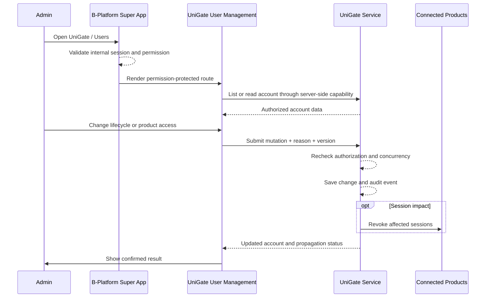

# Customer Account Administration

| | |
|---|---|
| **Author** | tvlong |
| **Updated** | 2026.08.06 |
| **Product** | [UniGate](/products/unigate/README.md) |
| **Priority** | P0 |
| **Tracklogs** | _TBD_ |

---

## The Problem

UniGate centralizes customer accounts across customer-facing products, so authorized internal administrators need one controlled place to inspect accounts, correct supported identity data, manage account lifecycle, and restrict product access. Without centralized administration, products may hold conflicting account status or continue granting access after a customer should be blocked.

- Administrators need to find every customer identity registered in UniGate.
- Account corrections must preserve uniqueness and security controls.
- Deactivation and soft deletion must affect authentication consistently across products.
- Product-access restrictions must be explicit, enforceable, and auditable.
- Sensitive customer and credential data must not be unnecessarily exposed to administrators.

## Proposed Solution

A **B-Platform / UniGate User Management** module installed in the [B-Platform Super App](/products/bplatform-general/architecture/super-app.md). The module contributes permission-protected navigation, routes, search, and server actions to the Super App. Authorized administrators use it to view customer accounts, edit supported identity fields, deactivate/reactivate accounts, soft-delete/restore accounts, and manage access to connected customer-facing products.

### Goals

- Give authorized administrators a complete, searchable account directory.
- Make account information and lifecycle state understandable.
- Support safe corrections to editable identity information.
- Block customer authentication consistently through deactivation or soft deletion.
- Restrict an account to one or more customer-facing products.
- Audit every sensitive administrative action.

### Out-of-scope

- Managing product-specific customer profiles, companies, addresses, orders, subscriptions, or business roles.
- Viewing or editing customer passwords, session cookies, reusable tokens, or credential secrets.
- Internal workforce account administration outside the B-Platform / UniGate management scope.
- Permanent hard deletion outside an approved retention, legal, and security process.
- Defining B-Platform administrator roles and permissions; UniGate consumes the Super App authorization contract.
- Connected-product registration and callback configuration; this is defined in [B-Platform / UniGate Application Management](/products/bplatform-unigate/features/01-application-management.md).

### Measurable Outcomes

- Account search and detail-view success rate.
- Account edit success and validation-failure rates.
- Deactivation, reactivation, soft-delete, and restore success rates.
- Product-access change success and propagation time.
- Unauthorized administration attempts blocked.
- Account-administration support tickets and security incidents.

## Requirements

### 2.1 Administrator accesses B-Platform / UniGate User Management

- [P0] B-Platform / UniGate User Management is installed as an app/module in the B-Platform Super App.
- [P0] Its manifest declares navigation, routes, search providers, server actions, dependencies, and permission expressions according to the [Super App architecture](/products/bplatform-general/architecture/super-app.md).
- [P0] Only an authenticated internal administrator with the required permission can access each User Management function.
- [P0] The Super App and UniGate service enforce authorization server-side for every read and mutation.
- [P0] Navigation visibility or hidden controls must not be treated as authorization enforcement.
- [P0] If the UniGate service is unavailable, the module shows a degraded state and does not display stale information as current.

### 2.2 Administrator views registered accounts

- [P0] An authorized administrator can view a paginated list of all UniGate customer accounts, including active, deactivated, and soft-deleted accounts when permitted.
- [P0] The default list excludes soft-deleted accounts unless the administrator selects an appropriate status filter.
- [P0] Each account row shows a stable account reference, supported customer identifier, display name, lifecycle status, effective product-access summary, registration source, and created/updated timestamps.
- [P0] Administrators can search by supported account identifier, display name, or stable account reference.
- [P0] Administrators can filter by lifecycle status, registration source, and effective product access.
- [P0] Search and filters must not bypass field-level masking or account-scope authorization.
- [P0] If no accounts match, the system shows a clear empty state without implying that no accounts exist globally.
- [P0] If the account list cannot be loaded, the system shows a general error and allows the administrator to retry.

### 2.3 Administrator views account information

- [P0] An authorized administrator can open an account and view supported identity attributes, verification states, lifecycle status, effective product access, registration source, and relevant timestamps.
- [P0] The account detail shows whether access is unrestricted across active connected products or restricted to an explicit allowed-product set.
- [P0] The account detail distinguishes global account status from product-specific access.
- [P0] The system shows recent security-relevant administrative changes and session-revocation status when the administrator has audit permission.
- [P0] Credential secrets, password hashes, raw SSO cookies, authorization codes, refresh tokens, signing keys, and recovery secrets are never displayed.
- [P0] Personal information is masked when the administrator lacks permission to view the full value.
- [P0] If the account no longer exists or is outside the administrator's scope, the system shows a safe unavailable or access-denied state.

### 2.4 Administrator edits account information

- [P0] An authorized administrator can edit only the identity attributes approved as administratively editable by UniGate policy.
- [P0] The edit form distinguishes editable fields, read-only system fields, verification state, and product-specific data that belongs outside UniGate.
- [P0] The system validates required fields, formats, normalization, and global identifier uniqueness before saving.
- [P0] If an email or phone change affects the customer's sign-in identifier, the system applies the approved reverification and security-notification policy.
- [P0] An administrator cannot directly set, reveal, or copy a customer password or credential secret.
- [P0] If validation succeeds, UniGate saves the changes and displays the latest values with a success message.
- [P0] If saving fails, the system keeps the administrator's entered values and shows a safe error.
- [P0] Editing UniGate identity information must not overwrite product-specific profiles automatically.
- [P0] Every successful and rejected account edit is auditable with actor, target account, changed fields, reason where required, timestamp, and outcome.
- [P1] If the administrator navigates away with unsaved changes, the interface warns before discarding them.

### 2.5 Administrator deactivates or reactivates an account

- [P0] An authorized administrator can deactivate an active customer account.
- [P0] Deactivation requires confirmation and an administrative reason.
- [P0] Deactivation preserves the account and its audit history but prevents new sign-up/sign-in authorization across every connected product.
- [P0] Deactivation revokes the central SSO session and initiates connected-product session invalidation according to the approved propagation target.
- [P0] The account detail clearly shows **Deactivated**, the reason, actor, and timestamp to authorized administrators.
- [P0] An authorized administrator can reactivate a deactivated account.
- [P0] Reactivation does not restore product access that was separately restricted and does not recreate expired sessions.
- [P0] Reactivation is audited and may require a reason according to policy.
- [P0] If deactivation or reactivation fails, the previous account state remains authoritative and the interface allows retry.

### 2.6 Administrator soft-deletes or restores an account

- [P0] An authorized administrator can soft-delete an account that is not already soft-deleted.
- [P0] Soft deletion requires explicit confirmation and an administrative reason.
- [P0] Soft deletion marks the account as deleted without immediately removing the identity, audit evidence, or legally retained records.
- [P0] A soft-deleted account cannot sign in, sign up as the same identity, receive a new authorization result, or access any connected product while retained.
- [P0] Soft deletion revokes the central SSO session and initiates connected-product session invalidation.
- [P0] Soft-deleted accounts are excluded from the default account list but remain available to administrators with deleted-account permission.
- [P0] An authorized administrator can restore a soft-deleted account within the approved retention period when legal and security policy allow it.
- [P0] Restoration returns the account to a safe lifecycle state defined by policy and does not silently recreate product sessions.
- [P0] Hard deletion or irreversible anonymization occurs only through a separately approved retention process and is not a standard interface action.
- [P0] Delete and restore actions are audited with actor, reason, timestamp, and outcome.

### 2.7 Administrator manages product access

- [P0] An authorized administrator can view every active customer-facing product connected to UniGate and the account's effective access to each product.
- [P0] An account without a restriction can access all active connected customer-facing products by default.
- [P0] An administrator can restrict an account to an explicit set of one or more products.
- [P0] The interface clearly distinguishes **Access to all connected products** from **Restricted to selected products**.
- [P0] A product-access change requires confirmation that identifies products being granted and removed.
- [P0] Removing access prevents new authorization for the removed product and initiates that product's session invalidation according to the approved propagation target.
- [P0] Granting access permits future authorization but does not bypass product-specific onboarding, approval, membership, subscription, or business permissions.
- [P0] Deactivated and soft-deleted accounts remain globally blocked regardless of their configured product-access set.
- [P0] At least one product must remain selected when restricted mode is used; globally blocking an account must use deactivation rather than an empty product set.
- [P0] Product-access changes are enforced server-side and audited with actor, target account, before/after product set, reason where required, timestamp, and outcome.
- [P0] If an access update fails, the previous effective access remains authoritative and the interface allows retry.

### 2.8 System handles concurrent administration

- [P0] Account updates use optimistic concurrency, version checks, or an equivalent control to prevent one administrator from unknowingly overwriting another administrator's changes.
- [P0] If the account changes after the administrator loaded it, the system rejects or reconciles the stale update and prompts the administrator to review the latest state.
- [P0] Lifecycle and product-access operations are idempotent or protected against duplicate submission.
- [P0] The interface disables repeated submission while an operation is in progress without relying on that control for server-side protection.

### 2.9 Audit, security, and privacy

- [P0] UniGate audits account reads where required by privacy policy and all account edit, deactivate, reactivate, delete, restore, product-access, and session-revocation actions.
- [P0] Audit records include internal actor, action, target account, timestamp, outcome, correlation ID, and approved before/after metadata.
- [P0] Audit records do not contain passwords, password hashes, raw cookies, reusable tokens, recovery secrets, or unnecessary personal data.
- [P0] Audit records are tamper-resistant and retained according to approved policy.
- [P0] The module follows least-privilege and separates view, edit, lifecycle, product-access, deleted-account, and audit permissions where practical.
- [P0] Sensitive actions may require recent reauthentication or step-up authentication according to internal security policy.
- [P0] Bulk export of customer identity data is unavailable unless separately specified, authorized, and audited.

## Interaction Flow

## Appendix

### Account lifecycle states

| State | Authentication | Product access | Standard admin actions |
|---|---|---|---|
| Active | Allowed when credentials/session and product access are valid | All active products or restricted allowed set | Edit, deactivate, soft-delete, change product access |
| Deactivated | Blocked globally | Blocked regardless of configuration | View, reactivate, soft-delete |
| Soft-deleted | Blocked globally | Blocked regardless of configuration | View when permitted, restore within policy |

### Product-access modes

| Mode | Meaning |
|---|---|
| All connected products | Account may authorize into every active connected customer-facing product. |
| Restricted products | Account may authorize only into the explicit non-empty allowed-product set. |

### Recommended permission separation

Exact permission names must follow the Super App convention and be finalized during implementation. Required permission domains should distinguish:

- List/search customer accounts.
- View full account details.
- Edit identity information.
- Deactivate/reactivate accounts.
- Soft-delete/restore accounts.
- Manage product access.
- View audit history.

### Data ownership boundary

| Data | Owner |
|---|---|
| Global customer identifier, credential state, lifecycle status, SSO session, product access | UniGate |
| Internal administrator identity and permission to use UniGate User Management | B-Platform internal identity/authorization boundary |
| Product profile, business/company membership, address, orders, subscriptions, product roles | Individual connected product |
