# Vòng đời Phát triển Phần mềm (SDLC)

> **Phiên bản đầu tiên — 2026-08-11.**
> Quy trình chuẩn mà đội Phát triển Phần mềm B-Platform dùng để biến **yêu cầu từ Business** thành **tính năng chạy trên Production**.
> Tài liệu này là SDLC chuẩn cho tổ chức `github.com/bplatform-vn`. Nó ràng buộc **con người, vai trò, repo, và công cụ** theo hướng rõ ràng **Ai / Cái gì / Khi nào**.

> 🇬🇧 [English version](README.md) · 🇻🇳 **Phiên bản Tiếng Việt**

---

## 1. Mục đích & phạm vi

### 1.1 SDLC là gì?

**Vòng đời Phát triển Phần mềm (Software Development Life Cycle — SDLC)** là quy trình có cấu trúc mà một đội Phát triển Phần mềm tuân theo để đưa một tính năng từ ý tưởng kinh doanh lên production, và duy trì nó hoạt động. SDLC trả lời ba câu hỏi cho mỗi công việc:

- **Ai (Who)** chịu trách nhiệm và ai là người thực hiện ở mỗi bước?
- **Cái gì (What)** — artifact, thay đổi, và kiểm tra nào phải tồn tại trước khi chuyển sang bước tiếp theo?
- **Khi nào (When)** — mỗi bước bắt đầu và kết thúc khi nào, và phải vượt qua cổng (gate) nào để tiếp tục?

SDLC là công cụ giúp việc quản lý công việc dễ dàng, minh bạch và tối ưu. Các công ty phát triển sản phẩm (Tech Product Company) khi mở rộng (Google, Spotify, Shopify, Atlassian, v.v.) đều sử dụng các giai đoạn chuẩn; điều khác nhau chỉ là công cụ, cấu trúc đội, và độ nghiêm ngặt của các cổng. Tài liệu này áp dụng hình mẫu chuẩn đó và điều chỉnh cho kiến trúc và đội ngũ phát triển của B-Platform.

### 1.2 Phạm vi

| Trong phạm vi                                              | Ngoài phạm vi                                                  |
| ---------------------------------------------------------- | -------------------------------------------------------------- |
| Tiếp nhận yêu cầu business → release production → vận hành | Bán hàng, thương lượng thương mại, ra mắt marketing            |
| Tất cả repo `bplatform-vn` (L0–L3 + platform infra)        | Quản trị SaaS bên thứ ba (trừ khi nó chặn một release)         |
| Vai trò con người và hợp tác đội                           | Quản lý nhân sự / con người                                    |
| Artifact code, thiết kế, test, infra, và tài liệu          | Xử lý ticket hỗ trợ khách hàng (chỉ nằm ở phản hồi Operations) |

---

## 2. SDLC nhìn tổng quan

```mermaid
flowchart LR
  BR[Yêu cầu Business] --> P1[1. Phân loại]
  P1 --> P2[2. Phân tích & Thiết kế]
  P2 --> P3[3. Phát triển]
  P3 --> P4[4. Kiểm thử & Chất lượng]
  P4 --> P5[5. Release & Triển khai]
  P5 --> P6[6. Vận hành & Phản hồi]
  P6 -.phản hồi.-> P1
  P6 --> DONE[Tính năng chạy trên Production]

  style BR fill:#1a73e8,color:#fff
  style DONE fill:#34a853,color:#fff
  style P1 fill:#E91E63,color:#fff
  style P2 fill:#9C27B0,color:#fff
  style P3 fill:#FF9800,color:#fff
  style P4 fill:#FF5722,color:#fff
  style P5 fill:#607D8B,color:#fff
  style P6 fill:#455A64,color:#fff
```

| #   | Giai đoạn             | Điều kiện bắt đầu                                            | Cổng kết thúc (Definition of Done)                             |
| --- | --------------------- | ------------------------------------------------------------ | -------------------------------------------------------------- |
| 1   | Phân loại             | Một nhu cầu, bug, hoặc ý tưởng business được nêu             | Multica issue đã phân loại với type, priority, và scope        |
| 2   | Phân tích & Thiết kế  | Issue đã phân loại chuyển sang **Todo**                      | FRD đã duyệt + quyết định kiến trúc + Figma design đã liên kết |
| 3   | Phát triển            | Issue chuyển sang **In Progress**, gán cho Software Engineer | Code merge vào `main` qua PR đạt                               |
| 4   | Kiểm thử & Chất lượng | PR được mở                                                   | Tất cả cổng tự động xanh trên `main`                           |
| 5   | Release & Triển khai  | Merge vào `main` vượt qua các cổng                           | Tính năng truy cập được ở **staging**, sau đó **production**   |
| 6   | Vận hành & Phản hồi   | Tính năng chạy trên production                               | Đã giám sát, tài liệu hoá, và phản hồi về lại Khám phá         |

---

## 3. Các giai đoạn SDLC chuẩn (baseline ngành)

Phần này mô tả SDLC chuẩn như áp dụng tại các công ty sản phẩm, để phần điều chỉnh B-Platform ở §4 dùng chung từ vựng.

1. **Lập kế hoạch & Phân tích yêu cầu** — Các bên liên quan định nghĩa _cái gì_ business cần và _tại sao_. Đầu ra: backlog đã ưu tiên các yêu cầu có spec (Product Requirement Document — PRD, hoặc nhẹ hơn là Feature Requirement Document — FRD).
2. **Thiết kế hệ thống** — Architect và designer định nghĩa _như thế nào_ hệ thống sẽ đáp ứng yêu cầu: quyết định kiến trúc (ADR), API contract, data model, và UI/UX. Đầu ra: design artifact, ADR, API contract.
3. **Triển khai / Phát triển** — Engineer viết code thực thi thiết kế trên các layer đã thoả thuận, tuân theo quy ước branching và code-review. Đầu ra: pull request đã review và merge.
4. **Kiểm thử** — Xác minh tự động và thủ công rằng thay đổi hoạt động đúng spec và không gây hồi quy: unit, integration, E2E, security, và performance. Đầu ra: CI xanh, báo cáo test.
5. **Triển khai (Deployment)** — Thay đổi đã xác minh được đẩy qua các môi trường (dev → staging → production) bằng pipeline tự động với cổng phê duyệt rõ ràng. Đầu ra: một release đã tag, đang chạy.
6. **Bảo trì & Vận hành** — Tính năng đã release được giám sát, hỗ trợ, và cải tiến dựa trên phản hồi và sự cố thực tế. Đầu ra: runbook, metric, và các phản hồi mới quay lại giai đoạn 1.

Các công ty sản phẩm hiện đại nén các bước này thành **dòng chảy liên tục** (CI/CD, trunk-based development, feature flag, progressive delivery), nhưng ranh giới giai đoạn và cổng của nó vẫn còn — đó là thứ làm dòng chảy an toàn.

---

## 4. SDLC B-Platform — điều chỉnh

SDLC B-Platform ánh xạ các giai đoạn chuẩn lên kiến trúc Super App kernel và lên **đội phát triển con người** — những người hợp tác để giao phần mềm.

### 4.1 Vai trò

| Vai trò                  | Sở hữu                                                                                       | Người phụ trách (PiC)                                                                          |
| ------------------------ | -------------------------------------------------------------------------------------------- | ---------------------------------------------------------------------------------------------- |
| **Business Stakeholder** | Nêu nhu cầu business, xác nhận kết quả, nghiệm thu tính năng                                 | Thái, Nhi                                                                                      |
| **Product Owner**        | Ưu tiên backlog, nghiệm thu spec, ký phạm vi release                                         | Long                                                                                           |
| **Business Analyst**     | Product spec, acceptance criteria, FRD, phân loại issue                                      | Long (An hỗ trợ)                                                                               |
| **Solution Architect**   | ADR, topology repo, ranh giới SOLID, kế hoạch work-breakdown                                 | Long                                                                                           |
| **UI/UX Designer**       | Thiết kế Figma, component, mockup, sync design-to-code                                       | _TBD_                                                                                          |
| **Software Engineer**    | Feature branch, code, test, tài liệu repo, PR trên L0–L3                                     | An; Phát Phan 1 (Freelance); Phát Phan 2 (Freelance); Phát Ngô (Freelance); Khương (Freelance) |
| **DevOps Engineer**      | `platform-fluxcd`, `platform-workflows`, cluster k8s (stg/prd), secret, CI/CD, cổng merge PR | Long                                                                                           |
| **QA Engineer**          | Lập kế hoạch test, test thủ công/exploratory, ký chất lượng                                  | Software Engineer cross-check                                                                  |

> **Quy tắc Single Source of Truth (no negotiate):** nhánh `main` remote của `github.com/bplatform-vn/*` là Single Source of Truth (SSoT). Local clone chỉ là mirror. Nếu local và remote khác nhau → remote thắng.

### 4.2 Công cụ & nơi lưu artifact

| Mối quan tâm           | Công cụ / Địa điểm                                             | Ghi chú                                                                                                       |
| ---------------------- | -------------------------------------------------------------- | ------------------------------------------------------------------------------------------------------------- |
| Theo dõi công việc     | **Multica** (self-hosted)                                      | Issue, task, project, status workflow                                                                         |
| Giao tiếp              | **Rocket.Chat** (self-hosted - `https://rocket.b-platform.vn`) | Team chat; yêu cầu business vào `#business-requests` (`https://rocket.b-platform.vn/group/business-requests`) |
| Source control & PR    | **GitHub** (Free plan - `github.com/bplatform-vn`)             | Nhánh mặc định `main`; bắt buộc PR                                                                            |
| Nguồn sự thật thiết kế | **Figma** (Paid plan)                                          | File B-Platform Super App + file từng product                                                                 |
| Pipeline CI/CD         | **`platform-workflows`** (GitHub Actions)                      | Build, test, security scan, publish                                                                           |
| Deployment GitOps      | **`platform-fluxcd`**                                          | Staging = `k8s-dpsrv`, Production = `k8s-dpsrv-prd`                                                           |

---

## 5. Các giai đoạn chi tiết — Ai làm Cái gì Khi nào

Mỗi giai đoạn dưới đây kể như một **câu chuyện hợp tác con người**: ai nói với ai, ở đâu (kênh Rocket.Chat / Multica issue), mỗi người đóng góp gì, và bàn giao nào đóng giai đoạn. Pipeline (`platform-workflows`, `platform-fluxcd`, CI scan) nằm nền làm công cụ hỗ trợ bàn giao — trọng tâm là con người.

Một **release thread** dùng chung (một kênh Rocket.Chat hoặc comment Multica issue được ghim) theo yêu cầu xuyên suốt các giai đoạn, để bất kỳ ai cũng mở một nơi và thấy toàn bộ cuộc trò chuyện.

### Giai đoạn 1 — Khám phá & Phân loại

**Khi bắt đầu:** Business Stakeholder đăng một nhu cầu trong **`#business-requests`** (`https://rocket.b-platform.vn/group/business-requests`) — tính năng mới, bug, hoặc yêu cầu thay đổi, viết bằng ngôn ngữ business thông thường.

**Quy trình hợp tác:**

1. **Business Analyst** xác nhận bài đăng trong cùng kênh, đặt câu hỏi làm rõ, và xác nhận lại hiểu biết với Business Stakeholder trước khi ghi bất kỳ điều gì.
2. Business Analyst ghi nhận nhu cầu thành một **Multica issue** (mô tả ngắn dưới ~600 ký tự — liên kết đường dẫn FRD, không dán cả FRD;) và đăng link issue ngược vào thread `#business-requests` để Business Stakeholder theo dõi.
3. Business Analyst phân loại issue (type / priority / product / layer dự kiến bị ảnh hưởng), kiểm tra trùng lặp, liên kết issue liên quan, và đặt vào **Backlog**.
4. **Product Owner** rà Backlog đã phân loại và quyết định đầu tư vào chu kỳ này.

**Ai làm gì:**

| Hoạt động                              | Người làm            | Hỗ trợ               |
| -------------------------------------- | -------------------- | -------------------- |
| Nêu nhu cầu trong `#business-requests` | Business Stakeholder | Product Owner        |
| Xác nhận & làm rõ trong kênh           | Business Analyst     | Business Stakeholder |
| Tạo Multica issue + đăng link ngược    | Business Analyst     | Product Owner        |
| Phân loại, trùng lặp, liên kết         | Business Analyst     | Product Owner        |
| Rà Backlog & quyết định đầu tư         | Product Owner        | Business Analyst     |

**Cổng kết thúc:** Một Multica issue đã phân loại tồn tại với **type**, **priority**, **product**, và scope một câu; Business Stakeholder có link issue và có thể theo dõi. Issue sẵn sàng được kéo vào chu kỳ.

---

### Giai đoạn 2 — Phân tích & Thiết kế

**Khi bắt đầu:** Product Owner chuyển issue đã phân loại từ **Backlog** sang **Todo** và thông báo trong release thread rằng yêu cầu đang được spec.

**Quy trình hợp tác:**

1. **Business Analyst** soạn **Feature Requirement Document (FRD)** kèm acceptance criteria, trao đổi với Business Stakeholder trong `#business-requests` (hoặc thread riêng) cho các điểm chưa rõ. FRD nằm dưới `products/<product>/features/`; chỉ scope + link vào Multica.
2. **Solution Architect** review FRD và quyết định hướng kỹ thuật với **Software Engineer** được gán trong release thread: layer nào bị chạm, có cần repo mới không (theo quy ước đặt tên v3), và ghi **ADR** cho thay đổi có tính ảnh hưởng lớn. Architect đăng **Work-Breakdown Structure** kèm hướng dẫn cho từng task (template: `technical-requirements/dbo-implementation-plan.md`).
3. **UI/UX Designer** tạo hoặc cập nhật **Figma design** (viewport Web / iPad / Mobile theo quy tắc design catalog B-Platform), giao Product Owner xem qua để duyệt phương án, và cập nhật Figma URL trong FRD.
4. Nếu cần repo mới, **DevOps Engineer** tạo dưới `github.com/bplatform-vn` (theo quy ước v3, seed `README.md` + `.gitignore` + commit đầu trên `main`) và đăng link repo trong release thread.
5. **Product Owner** giao **Business Stakeholder** xem qua FRD + thiết kế cuối trong `#business-requests` để duyệt.

**Ai làm gì:**

| Hoạt động                             | Người làm          | Hỗ trợ                             |
| ------------------------------------- | ------------------ | ---------------------------------- |
| Soạn FRD + acceptance criteria        | Business Analyst   | Business Stakeholder (làm rõ)      |
| Quyết định hướng kỹ thuật + ADR       | Solution Architect | Software Engineer, DevOps Engineer |
| Đăng kế hoạch work-breakdown (lớn)    | Solution Architect | Software Engineer                  |
| Tạo Figma design + dẫn xem qua        | UI/UX Designer     | Product Owner                      |
| Tạo repo mới (nếu cần)                | DevOps Engineer    | Solution Architect                 |
| Trình bày FRD + thiết kế cho business | Product Owner      | Business Stakeholder               |
| Nghiệm thu spec                       | Product Owner      | Business Stakeholder               |

**Cổng kết thúc:** FRD được Product Owner **duyệt** và giao Business Stakeholder xem qua; ADR được ghi nhận cho các thay đổi lớn về kiến trúc; Figma design đã liên kết (hoặc `TBD` với hạn chót); các repo bị ảnh hưởng đã rõ. Issue sẵn sàng gán cho Software Engineer và chuyển **In Progress**.

---

### Giai đoạn 3 — Phát triển

**Khi bắt đầu:** Product Owner gán issue cho **Software Engineer** và chuyển **In Progress**. Product Owner đăng việc gán trong release thread để đội biết ai sở hữu.

**Quy trình hợp tác:**

1. Software Engineer branch từ **remote `main` mới** (không bao giờ local clone cũ — quy tắc SSoT). Đặt tên branch: `<issue-key>-<short-slug>` (vd `BPL-123-order-total-calc`). Đăng tên branch trong release thread.
2. Trong khi phát triển, Software Engineer tham vấn **Solution Architect** trong release thread mỗi khi có câu hỏi contract hoặc ranh giới — quyết định thiết kế được ghi lại, không để trong DM.
3. Software Engineer viết unit test song song code và cập nhật tài liệu repo (`README.md`, JSDoc/TSDoc) trong cùng repo.
4. Khi sẵn sàng, Software Engineer mở **Pull Request** vào `main`, tham chiếu Multica issue key trong title/body PR, và yêu cầu review từ **DevOps Engineer** (cổng PR). Đăng link PR trong release thread.
5. DevOps Engineer review PR; Software Engineer xử lý comment review trong thread. Software Engineer xây tính năng sẵn sàng trả lời câu hỏi của reviewer.

**Ai làm gì:**

| Hoạt động                              | Người làm         | Hỗ trợ                                |
| -------------------------------------- | ----------------- | ------------------------------------- |
| Thông báo gán trong release thread     | Product Owner     | —                                     |
| Branch + đăng tên branch               | Software Engineer | —                                     |
| Tham vấn Architect về câu hỏi contract | Software Engineer | Solution Architect                    |
| Viết code + unit test + tài liệu repo  | Software Engineer | Solution Architect                    |
| Mở PR + đăng link PR                   | Software Engineer | —                                     |
| Review PR (cổng) + quyết định merge    | DevOps Engineer   | Software Engineer, Solution Architect |

**Cổng kết thúc:** PR được **duyệt** và **merge vào `main`** bởi DevOps Engineer. SHA merge commit (đăng trong release thread) là tham chiếu chuẩn cho thay đổi.

---

### Giai đoạn 4 — Kiểm thử & Chất lượng

**Khi bắt đầu:** PR được mở — test liên tục, không phải stage waterfall riêng. Release thread là nơi thảo luận trạng thái và phát hiện test.

**Quy trình hợp tác:**

1. `platform-workflows` chạy CI trên PR (build, lint, unit test, integration/E2E nếu có) và security scan. DevOps Engineer sở hữu pipeline và đưa thất bại ra release thread.
2. **Software Engineer** phân loại và sửa phát hiện CI/security trong thread; DevOps Engineer xác nhận re-run xanh.
3. **QA Engineer** thực hiện test thủ công/exploratory trên branch PR (và trên staging cho thay đổi tác động production), đăng báo cáo test ra release thread: kiểm gì, qua gì, lỗi gì.
4. Khi merge vào `main`, bộ CI đầy đủ chạy lại; DevOps Engineer xác nhận build `main` xanh trong thread.
5. Bất kỳ defect nào QA tìm thấy được đăng ngược cho Software Engineer. **Blocker** trả việc về Giai đoạn 3 (Software Engineer mở lại branch); **non-blocker** được tạo Multica issue mới cho chu kỳ sau.
6. **QA Engineer** ký chất lượng cuối cùng trong release thread cho thay đổi tác động production.

**Ai làm gì:**

| Hoạt động                               | Người làm         | Hỗ trợ                         |
| --------------------------------------- | ----------------- | ------------------------------ |
| Chạy CI + security scan, đưa kết quả    | DevOps Engineer   | platform-workflows             |
| Phân loại & sửa phát hiện CI/security   | Software Engineer | DevOps Engineer                |
| Test thủ công/exploratory + báo cáo     | QA Engineer       | Software Engineer              |
| Chạy lại CI trên `main` + xác nhận xanh | DevOps Engineer   | —                              |
| Đăng defect; blocker → Giai đoạn 3      | QA Engineer       | Software Engineer              |
| Ký chất lượng cuối cùng                 | QA Engineer       | DevOps Engineer, Product Owner |

**Cổng kết thúc:** Tất cả CI check trên `main` **xanh**, security scan sạch, QA Engineer đã ký trong release thread, và (cho thay đổi tác động production) Product Owner đã xác nhận chữ ký. Thay đổi đủ điều kiện release.

---

### Giai đoạn 5 — Release & Triển khai

**Khi bắt đầu:** Merge vào `main` vượt qua tất cả cổng ở Giai đoạn 4.

**Quy trình hợp tác:**

1. **DevOps Engineer** deploy build lên **staging** (`k8s-dpsrv`) và đăng **thông báo staging-ready** trong release thread, tag Product Owner và (cho tính năng thấy được business) Business Stakeholder, kèm: Multica issue key, đổi gì, cách xác nhận, và URL staging.
2. **Xác nhận staging:**
   - **Product Owner** chạy qua acceptance criteria FRD trên staging và đăng phát hiện.
   - **Business Stakeholder** (optional) xác nhận kết quả thấy được business so với yêu cầu gốc và đăng xác nhận hoặc lo ngại.
   - **Software Engineer** xây tính năng sẵn sàng trả lời hoặc sửa nhanh nếu staging phát hiện vấn đề.
   - Phát hiện được đăng ngược release thread và Multica issue. **Blocker** trả việc về Giai đoạn 3; **non-blocker** tạo issue mới cho chu kỳ sau và không chặn release này.
3. **Go/no-go production:** khi staging đã ký, **Product Owner** đăng quyết định **"approved for production"** rõ ràng trong release thread. Cho hotfix, DevOps Engineer có thể cho phê duyệt này với Product Owner được báo. Production deploy **không bao giờ** tự động từ một PR merge — phê duyệt con người trong release thread là cổng.
4. **DevOps Engineer** đẩy cùng image tag lên **production** (`k8s-dpsrv-prd`), thông báo deploy production trong release thread (tag, thời gian, liên hệ rollback), và **tag release trong Git** (`v<version>` hoặc `<repo>-<sha>`) — tag là đơn vị rollback.
5. Sau deploy, DevOps Engineer xác nhận sức khoẻ production trong release thread. **Product Owner** đánh dấu Multica issue **Done** và liên kết release tag.

**Ai làm gì:**

| Hoạt động                                       | Người làm                                  | Hỗ trợ            |
| ----------------------------------------------- | ------------------------------------------ | ----------------- |
| Deploy staging + đăng thông báo staging-ready   | DevOps Engineer                            | platform-fluxcd   |
| Xác nhận theo FRD trên staging                  | Product Owner                              | Software Engineer |
| Xác nhận kết quả business trên staging          | Business Stakeholder                       | Product Owner     |
| Sẵn sàng sửa staging                            | Software Engineer                          | —                 |
| Báo phát hiện / blocker trong release thread    | Product Owner / Business Stakeholder       | Software Engineer |
| Phê duyệt deploy production (go/no-go)          | Product Owner (DevOps Engineer cho hotfix) | —                 |
| Đẩy production + tag release                    | DevOps Engineer                            | platform-fluxcd   |
| Thông báo deploy production + xác nhận sức khoẻ | DevOps Engineer                            | —                 |
| Đánh dấu Multica issue Done + link tag          | Product Owner                              | DevOps Engineer   |
| Rollback nếu cần                                | DevOps Engineer                            | Product Owner     |

**Cổng kết thúc:** Tính năng **truy cập được trên production**, release đã tag và thông báo trong release thread, và Multica issue **Done**. Tính năng giờ là "Running feature in Production".

---

### Giai đoạn 6 — Vận hành & Phản hồi

**Khi bắt đầu:** Tính năng chạy trên production và DevOps Engineer đã xác nhận sức khoẻ trong release thread.

**Quy trình hợp tác:**

1. **DevOps Engineer** theo dõi sức khoẻ production (cluster, error rate, heartbeat DBO worker, DLQ orchestrator, sync-audit) và xác nhận runbook/dashboard observability cập nhật. Bất thường được đăng vào release thread và kênh on-call.
2. Nếu tìm thấy sự cố hoặc hồi quy, **DevOps Engineer** và **Product Owner** cùng quyết định mức độ trong chat. Sự cố được tạo **Multica issue mới** (type: bug) và quay lại Giai đoạn 1 — _không_ sửa tại chỗ. **Software Engineer** được kéo vào hotfix (Giai đoạn 3–5 rút gọn) khi sự cố liên quan code.
3. **Business Stakeholder** quan sát tính năng chạy và chia sẻ phản hồi / ý tưởng mới trong `#business-requests`, Business Analyst ghi nhận thành issue mới cho chu kỳ sau.
4. **Solution Architect** sync `code_bases/<repo>.md` để phản ánh API/hành vi công khai mới (diff trước khi viết — chỉ phần đổi) và đóng vòng trên release thread.
5. **Product Owner** nghiệm thu kết quả dài hạn với Business Stakeholder và đóng release thread.

**Ai làm gì:**

| Hoạt động                                       | Người làm                       | Hỗ trợ               |
| ----------------------------------------------- | ------------------------------- | -------------------- |
| Theo dõi sức khoẻ production + cập nhật runbook | DevOps Engineer                 | —                    |
| Phân loại mức độ sự cố                          | DevOps Engineer + Product Owner | Software Engineer    |
| Tạo sự cố thành Multica issue mới               | Product Owner / DevOps Engineer | Business Stakeholder |
| Hotfix (sự cố liên quan code)                   | Software Engineer               | DevOps Engineer      |
| Chia sẻ phản hồi / ý tưởng mới                  | Business Stakeholder            | Product Owner        |
| Ghi nhận phản hồi thành issue mới               | Business Analyst                | Business Stakeholder |
| Sync tài liệu `code_bases/`                     | Solution Architect              | —                    |
| Nghiệm thu kết quả dài hạn + đóng thread        | Product Owner                   | Business Stakeholder |

**Cổng kết thúc:** Tính năng được giám sát, tài liệu hoá, và mọi việc tiếp theo được ghi nhận thành issue mới đã phân loại trong `#business-requests` / Multica. Release thread đóng — và chu kỳ mở lại qua Giai đoạn 1 cho yêu cầu tiếp theo.

---

## 6. Ma trận tổng — Ai làm Cái gì Khi nào

Đây là bảng tóm tắt cả SDLC. **A** = Accountable (ký cuối cùng), **R** = Responsible (thực hiện), **C** = Consulted, **I** = Informed.

| #   | Hoạt động                      | Giai đoạn | Business Stakeholder | Product Owner | Business Analyst | Solution Architect | UI/UX Designer | Software Engineer | DevOps Engineer | QA Engineer |
| --- | ------------------------------ | --------- | -------------------- | ------------- | ---------------- | ------------------ | -------------- | ----------------- | --------------- | ----------- |
| 1   | Nêu nhu cầu business           | 1         | **R**                | C             | I                | I                  | I              | –                 | –               | –           |
| 2   | Tạo & phân loại Multica issue  | 1         | I                    | **A**         | **R**            | C                  | –              | –                 | –               | –           |
| 3   | Soạn FRD + acceptance criteria | 2         | C                    | **A**         | **R**            | C                  | C              | –                 | –               | –           |
| 4   | Quyết định kiến trúc / ADR     | 2         | –                    | I             | C                | **A/R**            | –              | C                 | C               | –           |
| 5   | Kế hoạch work-breakdown        | 2         | –                    | I             | –                | **A/R**            | –              | C                 | C               | –           |
| 6   | Figma design                   | 2         | C                    | **A**         | C                | I                  | **R**          | –                 | –               | –           |
| 7   | Tạo repo mới (nếu cần)         | 2         | –                    | I             | –                | C                  | –              | –                 | **A/R**         | –           |
| 8   | Branch & triển khai            | 3         | –                    | I             | –                | I                  | C              | **A/R**           | –               | –           |
| 9   | Viết unit test                 | 3         | –                    | –             | –                | –                  | –              | **A/R**           | –               | –           |
| 10  | Mở PR                          | 3         | –                    | I             | –                | C                  | –              | **R**             | **A**           | –           |
| 11  | Chạy CI trên PR & `main`       | 4         | –                    | –             | –                | –                  | –              | –                 | **A/R**         | –           |
| 12  | Phân loại & sửa lỗi CI         | 4         | –                    | –             | –                | C                  | –              | **R**             | **A**           | –           |
| 13  | Ký security scan               | 4         | –                    | I             | –                | –                  | –              | –                 | **A/R**         | C           |
| 14  | Test thủ công/exploratory      | 4         | –                    | –             | –                | –                  | –              | I                 | I               | **A/R**     |
| 15  | Cổng chất lượng cuối           | 4         | –                    | **A**         | –                | –                  | –              | I                 | R               | **R**       |
| 16  | Publish artifact               | 5         | –                    | I             | –                | –                  | –              | –                 | **A/R**         | –           |
| 17  | Deploy staging                 | 5         | –                    | C             | –                | –                  | –              | –                 | **A/R**         | –           |
| 18  | Xác nhận trên staging          | 5         | C                    | **A**         | –                | –                  | –              | C                 | I               | C           |
| 19  | Phê duyệt & deploy production  | 5         | I                    | **A**         | –                | –                  | –              | –                 | **R**           | –           |
| 20  | Tag release                    | 5         | –                    | I             | –                | –                  | –              | –                 | **A/R**         | –           |
| 21  | Rollback (nếu cần)             | 5         | –                    | C             | –                | –                  | –              | –                 | **A/R**         | –           |
| 22  | Giám sát production            | 6         | I                    | I             | –                | –                  | –              | –                 | **A/R**         | –           |
| 23  | Sự cố → Multica issue mới      | 6         | I                    | **A**         | **R**            | –                  | –              | –                 | R               | –           |
| 24  | Sync tài liệu `code_bases/`    | 6         | –                    | –             | –                | **A/R**            | –              | –                 | –               | –           |
| 25  | Nghiệm thu kết quả dài hạn     | 6         | C                    | **A**         | –                | –                  | –              | –                 | –               | –           |

---

## 7. Quy trình trạng thái issue Multica

Trạng thái issue Multica phản ánh các giai đoạn SDLC. Ánh xạ trạng thái → giai đoạn SDLC → ai đang hoạt động:

| Trạng thái issue Multica                | Giai đoạn SDLC        | Ai đang hoạt động                                         |
| --------------------------------------- | --------------------- | --------------------------------------------------------- |
| **Backlog**                             | (trước Giai đoạn 1)   | Business Analyst phân loại                                |
| **Todo**                                | Giai đoạn 2 bắt đầu   | Business Analyst, Solution Architect, UI/UX Designer      |
| **In Progress** (gán Software Engineer) | Giai đoạn 3 bắt đầu   | Software Engineer                                         |
| **In Review** (PR mở)                   | Giai đoạn 3 → 4       | Software Engineer, DevOps Engineer (cổng PR), QA Engineer |
| **In Staging**                          | Giai đoạn 5 (staging) | DevOps Engineer, Product Owner, Business Stakeholder      |
| **Done**                                | Giai đoạn 5 kết / 6   | Tính năng chạy; DevOps Engineer + Product Owner tiếp quản |

> **Lưu ý quy trình:** issue được kéo vào chu kỳ bằng cách chuyển **Backlog** → **Todo** → **In Progress**. Việc gán Software Engineer xảy ra tại chuyển tiếp **In Progress**. Gán lại hoặc bỏ gán issue đang In Progress sẽ trả nó về **Todo** cho đến khi được nhặt lại.

---

## 8. Artifact & nguồn sự thật theo giai đoạn

| Giai đoạn | Artifact                            | Nguồn sự thật                               | Người sở hữu       |
| --------- | ----------------------------------- | ------------------------------------------- | ------------------ |
| 1         | Multica issue (type/priority/scope) | Multica                                     | Business Analyst   |
| 2         | FRD + acceptance criteria           | `products/<product>/features/*.md`          | Business Analyst   |
| 2         | Architecture Decision Record        | `/memories/repo/*.md` + tài liệu ADR        | Solution Architect |
| 2         | Kế hoạch work-breakdown             | `technical-requirements/*.md`               | Solution Architect |
| 2         | Figma design                        | Figma file URL                              | UI/UX Designer     |
| 2         | Repo mới (nếu có)                   | `github.com/bplatform-vn/<repo>` `main`     | DevOps Engineer    |
| 3         | Feature branch + PR                 | GitHub PR                                   | Software Engineer  |
| 3         | Code + test + tài liệu repo         | `github.com/bplatform-vn/<repo>` `main`     | Software Engineer  |
| 4         | Kết quả chạy CI                     | `platform-workflows` runs                   | DevOps Engineer    |
| 4         | Kế hoạch test & ghi chú exploratory | QA workspace (comment Multica / wiki)       | QA Engineer        |
| 5         | Image/package đã publish            | Container registry / npm `@b-platform-vn/*` | DevOps Engineer    |
| 5         | Release tag                         | Git tag trên `main`                         | DevOps Engineer    |
| 5         | Deployment staging                  | `platform-fluxcd` + `k8s-dpsrv`             | DevOps Engineer    |
| 5         | Deployment production               | `platform-fluxcd` + `k8s-dpsrv-prd`         | DevOps Engineer    |
| 6         | `code_bases/<repo>.md` đã sync      | `platform-ecosystem-docs/code_bases/`       | Solution Architect |

---

## 9. Definition of Done (theo giai đoạn) — checklist nhanh

- **Giai đoạn 1:** ✅ Multica issue tồn tại với type, priority, product, scope một câu.
- **Giai đoạn 2:** ✅ FRD duyệt; ✅ ADR ghi (nếu không tầm thường); ✅ Figma liên kết hoặc TBD-có-hạn; ✅ repo bị ảnh hưởng rõ.
- **Giai đoạn 3:** ✅ PR mở trên `main` mới; ✅ ranh giới layer Super App kernel được tôn trọng; ✅ unit test soạn; ✅ tài liệu repo cập nhật.
- **Giai đoạn 4:** ✅ CI xanh trên PR và trên `main`; ✅ security scan sạch; ✅ QA Engineer ký cho thay đổi tác động production.
- **Giai đoạn 5:** ✅ Artifact publish; ✅ staging xác nhận & ký; ✅ production deploy & tag; ✅ Multica issue → Done.
- **Giai đoạn 6:** ✅ Giám sát xác nhận; ✅ runbook/dashboard cập nhật; ✅ việc tiếp theo tạo issue mới; ✅ `code_bases/` sync.

---

## 10. Tiếp theo (ứng viên v2)

Đây là **phiên bản 1** — tập trung thiết lập baseline Ai/Cái gì/Khi nào. Ứng viên cải tiến cho v2:

- **Feature flag & progressive delivery** — tách merge khỏi release.
- **SLO & error budget chính thức** — gắn nhịp release với độ tin cậy.
- **Fast-path hotfix** — luồng Giai đoạn 3–5 rút gọn cho sự cố P0 production.
- **Phối hợp release xuyên repo** — khi một tính năng chạm L0 + L1 + L2 + L3 cùng lúc.
- **Cổng security & compliance** — threat-model và checklist compliance chính thức mỗi release.
- **Metric & retrospective** — đo cycle time, lead time, MTTR, và phản hồi hàng quý.

> Nhật ký thay đổi: **v1 (2026-08-11)** — SDLC ban đầu: 6 giai đoạn, RACI vai trò con người, ma trận tổng, quy trình trạng thái Multica, artifact, và Definition of Done.
