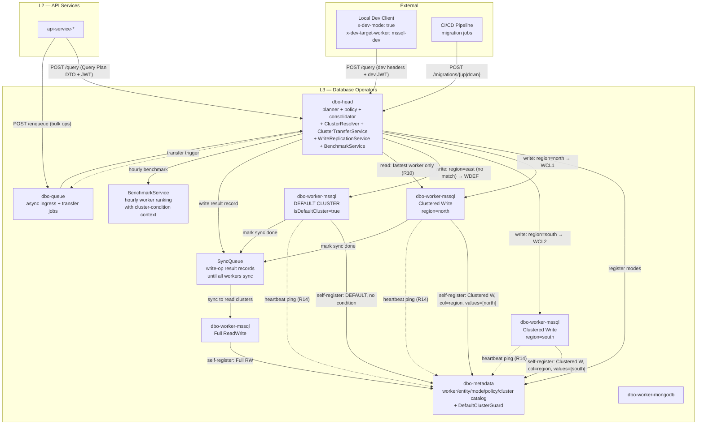

# Database Operation (DBO) — Technical Requirements

> Centralized technical requirements for the DBO sub-layer (`dbo-head`, `dbo-queue`, `dbo-metadata`, `dbo-worker-{mssql,mongodb,postgresql}`). The per-repo pages in [`code_bases/dbo-*.md`](../code_bases/README.md) describe **repo-level** facts (status, language, owner); this document is the **authoritative spec** for behavior, contracts, and cross-cutting rules.
>
> **Status**: approved 2026-08-09 · **ADR**: `/memories/repo/dbo-architecture.md` · **Applies to**: all `dbo-*` repos

---

## 1. Architectural context

The DBO sub-layer is L3 of the B-Platform Super App kernel:

```
L1 (cfc/bof) → L2 (api-service-*) → L3 (dbo-*)
```

- **L2 calls `dbo-head` synchronously** (`POST /query`) for all datastore access, or **enqueues to `dbo-queue`** for async bulk ops. L2 **never** touches `dbo-worker-*` directly, and never makes changes directly on the datastore.
- **`dbo-head`** plans, enforces policy, routes by cluster, fans out to workers, consolidates results.
- **`dbo-worker-*`** execute against a specific datastore stack (MSSQL, MongoDB, PostgreSQL) and self-register their supported entities + modes.
- **`dbo-metadata`** is the catalog: worker → entity → mode → cluster condition → policy.
- **`dbo-queue`** is the async ingress + cluster transfer job queue.



---

## 2. Requirements (R1–R8)

| # | Requirement | Owning component |
|---|---|---|
| **R1** | Remote dev access — storage stays on server, API exposed to client; dev requests route to a specific worker to avoid corrupting remote storage | `dbo-head` (HTTP API + `x-dev-mode` / `x-dev-target-worker` headers + dev JWT claim) |
| **R2** | GraphQL-like relational query — client defines entities + relations in one request to avoid N+1 client round-trips | `dbo-head` `PlannerService` (Query Plan DTO, JSON for MVP; GraphQL-subset syntax parser deferred to phase 2) |
| **R3** | Security: data masking, column-level control, row-level control | `dbo-head` `PolicyEngine` (row predicates injected pre-dispatch; column allow/deny + PII mask post-consolidation). Policies sourced from `dbo-metadata` |
| **R4** | Data migration (up/down) via API, CI/CD-safe | `dbo-head` `MigrationService` + every worker's `migrateUp/Down/Status` |
| **R5** | Worker declares supported entities + mode (6 modes) | `dbo-worker-*` self-registers `EntityModeDeclaration[]` to `dbo-metadata` on boot |
| **R6** | Clustered modes require cluster condition (Column + Strategy: SelectedValues \| RangeValues) | `dbo-metadata` validates on register |
| **R7** | `dbo-metadata` warns if no default cluster; `platform-fluxcd` deploys a catch-all default-cluster worker | `dbo-metadata` `DefaultClusterGuard` + `platform-fluxcd` default-cluster worker instance per stack |
| **R8** | On new cluster deploy, `dbo-head` transfers data from default cluster → new cluster | `dbo-head` `ClusterTransferService` + `dbo-queue` for background transfer jobs |
| **R9** | Multiple matched workers on writes — respond with the fastest result, track the others; B-Platform Super App audits sync status across all workers | `dbo-head` `WriteReplicationService` + Super App sync-audit UI |
| **R10** | Read ops route only to the fastest worker(s) — but only when **multiple workers serve the same cluster condition**; hourly benchmark ranks them with cluster-condition context so the test is fair. If only one worker serves a condition, no benchmark is needed — route directly. | `dbo-head` `BenchmarkService` (hourly cron, scoped to multi-worker conditions) + per-entity ranked-worker cache |
| **R11** | Write-op results are queued so that read-only clusters can sync the changes; the queue entry stays until every matched worker has synced | `dbo-head` `SyncQueue` (write-op result record) + `dbo-worker` marks sync per record |
| **R12** | `dbo-head` checks `dbo-metadata` and attaches all matched read clusters to each write-op result record | `dbo-head` attaches `syncTargets: WorkerRef[]` (read clusters) to every write result record |
| **R13** | `dbo-worker` marks sync on every write-op result record it processes; ensures sync records are applied in the right order | `dbo-worker` `SyncApplier` (in-order, idempotent, marks record after apply) |
| **R14** | Worker sends a heartbeat ping to `dbo-metadata` to signal it is alive; `dbo-metadata` tracks liveness and marks workers stale on ping timeout | `dbo-worker-*` heartbeat → `dbo-metadata` `WorkerHealthTracker` |

---

## 3. Worker modes (R5)

Each worker declares, per entity, exactly one mode:

| Mode | Read any row? | Read clustered rows? | Write any row? | Write clustered rows? |
|---|---|---|---|---|
| **FullReadWrite** | ✅ | ✅ | ✅ | ✅ |
| **ClusteredReadWrite** | ❌ | ✅ | ❌ | ✅ |
| **FullWrite** | ❌ | ❌ | ✅ | ✅ |
| **FullRead** | ✅ | ✅ | ❌ | ❌ |
| **ClusteredWrite** | ❌ | ❌ | ❌ | ✅ |
| **ClusteredRead** | ❌ | ✅ | ❌ | ❌ |

Rules:
- A **Full** mode worker serves any row — no cluster column filter needed in the query.
- A **Clustered** mode worker only serves rows where the cluster column value matches its condition.
- A single worker instance declares **one mode per entity**; combine modes by running separate worker instances.
- `isDefaultCluster: true` workers must have **no** condition (catch-all).

---

## 4. Cluster condition model (R6)

```typescript
enum WorkerMode {
  FullReadWrite,
  ClusteredReadWrite,
  FullWrite,
  FullRead,
  ClusteredWrite,
  ClusteredRead,
}

enum ClusterStrategy {
  SelectedValues, // column IN (v1, v2, v3)
  RangeValues,    // column BETWEEN min AND max
}

class ClusterCondition {
  column: string                        // single column name for cluster check
  strategy: ClusterStrategy
  selectedValues?: (string | number)[]  // required when SelectedValues
  rangeStart?: string | number           // required when RangeValues
  rangeEnd?: string | number             // required when RangeValues
  matches(value: any): boolean
}

class EntityModeDeclaration {
  entity: string
  mode: WorkerMode
  clusterCondition?: ClusterCondition  // required when Clustered*
  isDefaultCluster?: boolean            // true = catch-all, no condition
}
```

Validation in `dbo-metadata`:
- `Clustered*` mode → `clusterCondition` required, else reject registration.
- `isDefaultCluster: true` → `clusterCondition` must be absent (catch-all).
- For every entity with at least one `Clustered*` worker, at least one worker must be `isDefaultCluster: true`. If missing → warn (not reject, since the platform still needs to boot).

---

## 5. Routing semantics

### 5a. Write path (cluster routing — R5, R6, R7, R9, R11, R12)

```
Client (L2) ──POST /query (write plan)──► dbo-head
  Body: { entity: customer, op: insert, row: { id, name, region: "east", ... } }

dbo-head:
  1. ClusterResolver: look up workers for entity=customer with write mode
  2. Extract cluster column value from row: region="east"
  3. Evaluate each clustered worker's condition → matched write workers[]
     - WCL1: region IN [north, west] → "east" not in → skip
     - WCL2: region IN [south] → "east" not in → skip
     - WDEF: default cluster → "east" matches (catch-all)
  4. MetadataService: look up matched READ clusters for entity=customer
     → syncTargets = [WCL1-readonly, WCL2-readonly, WDEF-readonly] (R12)
  5. Dispatcher.fanOutWrite(matched write workers):
     a. Send write op to ALL matched write workers in parallel (R9)
     b. First worker to respond → return result to client immediately (R9)
     c. Keep track of other workers' statuses (pending → done/failed)
  6. WriteReplicationService:
     a. Create write-op result record (sync queue entry) (R11)
     b. Attach syncTargets (read clusters) to the record (R12)
     c. Record stays in queue until ALL matched write workers report done
        AND all syncTargets (read clusters) have synced (R11)
  7. Return fastest result to client
```

**Write response semantics (R9):**
- Client gets the fastest worker's result — does not wait for slow workers.
- `dbo-head` tracks the other write workers' statuses in the write-op result record.
- The B-Platform Super App backoffice exposes a **sync-audit UI** that shows, per write op, which workers have synced and which are pending/failed. This is a read against `dbo-head`'s sync-queue records.

### 5b. Read path — fastest worker routing (R10)

```
Client (L2) ──POST /query (read plan)──► dbo-head
  Body: { entity: customer, filters: { region: "north" } }

dbo-head:
  1. ClusterResolver: look up matched workers for entity=customer with read mode
  2. How many workers serve this exact (entity, cluster condition)?
     - If 1 worker → route directly, no benchmark needed (R10 scope rule)
     - If >1 worker → consult BenchmarkService ranking
  3. (Multi-worker only) BenchmarkService: look up ranked workers for
     entity=customer with cluster condition context region=north (R10)
  4. Route read op to the fastest worker(s)
     - If one fastest worker → send directly
     - If ties → pick by lowest latency in last hour
  5. Return result to client
```

**Read routing semantics (R10):**
- Benchmark runs **only** when multiple workers serve the same cluster condition for the same entity. If only one worker owns `(entity=customer, region=north)`, no benchmark is needed — `dbo-head` routes directly. This avoids unnecessary benchmark load on single-owner entities.
- `BenchmarkService` runs an **hourly cron** scoped to multi-worker conditions only. For each `(entity, clusterCondition)` pair with >1 read worker, it benchmarks all candidate workers using sample queries with that cluster condition.
- The benchmark keeps **clustered condition in the test context** so that the comparison is fair for all workers (a worker serving `region=north` is tested with `region=north` sample queries, not random data it may not own).
- Results are cached in Redis as a per-`(entity, clusterCondition)` ranked-worker list.
- Reads route only to the fastest worker(s) — avoids spreading read load to slow replicas.

### 5c. Read without cluster filter (unchanged from R5)

- **Read without filter**: fan out to all clustered workers + default, merge. If a Full Read worker exists, use it as the catch-all. If only clustered readers exist (no Full Read), this is expensive — flag as a metadata warning.

### 5d. Write-op result queue + read-cluster sync (R11, R12, R13)

```
Write op result record (SyncQueue entry):
{
  id: "wr-123",
  entity: "customer",
  op: insert,
  payload: { ... },              // the write payload
  writeWorkers: [                // matched write workers (R9)
    { workerId: "wdef", status: "done", latencyMs: 12 },
    { workerId: "wcl3", status: "pending" }
  ],
  syncTargets: [                 // matched READ clusters (R12)
    { workerId: "wcl1-ro", status: "pending" },
    { workerId: "wcl2-ro", status: "pending" },
    { workerId: "wdef-ro", status: "pending" }
  ],
  createdAt, completedAt
}

dbo-worker (read cluster) SyncApplier (R13):
  1. Consume write-op result record from SyncQueue
  2. Apply the write op IN ORDER (by record id / sequence) — ensures sync records
     are applied in the right order
  3. Mark the record's syncTargets entry as "done" for this worker
  4. Idempotent — if the worker restarts, it re-applies records where its status
     is still "pending"; already-applied records are skipped (checked by idempotency key)
  5. dbo-head checks: when ALL syncTargets are "done" AND all writeWorkers are "done"
     → mark the SyncQueue entry as "completed" and remove from active queue (R11)
```

**Queue lifecycle (R11):**
- A write-op result record **stays in the queue** until every matched write worker has reported done AND every matched read cluster (syncTargets) has synced.
- If a worker is down, the record stays pending — the sync-audit UI shows it as "pending (worker down)".
- No record is removed until full sync across all matched workers + read clusters.

---

## 6. Relational query (R2)

`dbo-head` accepts a typed Query Plan DTO (GraphQL-like subset, not raw SQL) with a `relations` graph. The planner resolves relations across workers, fans out, and joins in-memory.

```graphql
# Example: a customer with their tickets and recent FB messages
query {
  customer(where: { id: "123" }) {
    id
    name
    email            # masked if role lacks PII access
    tickets {
      id
      status
      messages(channel: facebook, last: 5) {
        id
        body
        createdAt
      }
    }
  }
}
```

Translates internally to:

```
Plan:
  root: { entity: customer, worker: mssql, filter: id=123 }
  relations:
    - { from: customer.id, to: ticket.customerId, worker: mssql, type: one-to-many }
    - { from: ticket.id, to: message.ticketId, worker: mongodb, filter: channel=facebook, sort: createdAt DESC, limit: 5 }
```

`dbo-head` executes `customer` and `tickets` on `mssql-worker`, then `messages` on `mongodb-worker`, joins in-memory, applies masks, returns one nested payload. One client request → one payload, no N+1.

> **MVP**: JSON DTO (typed, validated by zod/typebox). GraphQL-subset syntax parser deferred to phase 2 if clients demand it.

---

## 7. Security enforcement (R3)

| Layer | What | Where |
|---|---|---|
| **Row-level** | Tenant isolation, role-based row predicates | `dbo-head` injects predicates into the sub-plan before sending to worker (worker never sees unfiltered rows) |
| **Column-level** | Field allow/deny per role (e.g., `email` hidden for `agent`, visible for `admin`) | `dbo-head` field projection list; worker returns only allowed columns |
| **Data masking** | PII redaction, partial mask (`a***@x.com`), hash, nullify | `dbo-head` post-processing on the consolidated result, before returning to client |
| **Policy source** | `dbo-metadata` policy slice: `{ entity, role, columns_allow, columns_mask, row_predicate }` | Cached in Redis; refreshed on deploy |

---

## 8. Dev routing (R1)

- Dev JWT has `dev_mode: true` claim (issued by `api-service-identity` for dev accounts only).
- `x-dev-target-worker` header forces routing to a specific worker (e.g., `mssql-dev` which points at a dev/snapshot DB).
- If dev token hits a production worker, `dbo-head` rejects with `403 dev_token_on_prod_worker` or forces read-only.
- Dev requests are tagged in the audit log with `dev_mode=true` so prod data drift is traceable.

---

## 9. Data migration (R4)

### 9a. Migration scope — entity-level operations

Migration requests care about **entities** (tables / collections), not raw SQL or stack-specific DDL. A migration request is a list of entity-level operations:

| Operation | Description | Worker translates to |
|---|---|---|
| **Create entity** | Create a new entity (new table / collection) | `CREATE TABLE` (MSSQL/PG) · `db.createCollection()` (Mongo) |
| **Modify entity** | Add or remove columns on an existing entity | `ALTER TABLE … ADD/DROP COLUMN` (MSSQL/PG) · `$jsonSchema` validator update or field migration (Mongo) |
| **Remove entity** | Drop an existing entity (drop table / collection) | `DROP TABLE` (MSSQL/PG) · `db.collection.drop()` (Mongo) |

```typescript
enum MigrationOpType {
  CreateEntity,
  ModifyEntity,
  RemoveEntity,
}

class ColumnSpec {
  name: string
  type: ColumnType          // int, string, boolean, datetime, decimal, json, ...
  nullable?: boolean
  default?: Literal
}

class MigrationOp {
  type: MigrationOpType
  entity: string            // entity (table/collection) name
  columns?: ColumnSpec[]    // Create: full schema; Modify: columns to add/remove; Remove: omitted
  dropColumns?: string[]    // Modify only: column names to remove
}

class MigrationRequest {
  ops: MigrationOp[]
  options?: { dryRun?: boolean }
}
```

- The caller (CI/CD pipeline or an L2 service) sends **one** `MigrationRequest` to `dbo-head`. The request lists all entity-level ops to apply — the caller does **not** know which workers own which entities.
- `dbo-head` resolves ownership from `dbo-metadata` and fans out sub-requests to the corresponding workers. One migration request may hit multiple workers across multiple stacks (e.g., create `customer` on `mssql` + create `customer_audit` on `mongodb`).

### 9b. Fan-out flow

```
CI/CD pipeline ──POST /migrations──► dbo-head
  Body: MigrationRequest {
    ops: [
      { type: CreateEntity, entity: customer, columns: [ { name: id, type: string }, { name: name, type: string }, ... ] },
      { type: ModifyEntity, entity: ticket, dropColumns: [legacyField] },
      { type: RemoveEntity, entity: old_session }
    ]
  }

dbo-head MigrationService:
  1. For each op, resolve owning worker(s) via dbo-metadata (clustered entities → all clustered workers + default)
  2. Group ops by target worker → per-worker sub-request
  3. Fan out:
     - dryRun=true  → each worker returns its planned DDL diff (no execution)
     - dryRun=false → each worker executes the DDL against its datastore
  4. Aggregate per-worker results → single MigrationResult { perWorker: { workerId, status, diff? } }
  5. Record in audit table (via dbo-head-managed schema)
  6. Return MigrationResult to caller
```

- If any worker fails mid-migration, `dbo-head` records the partial state and returns it. Rollback is via `POST /migrations/down` with the inverse ops (generated from the original request — `Create` ↔ `Remove`, `Modify(add)` ↔ `Modify(drop)`).
- `dbo-head` refuses `up` if any target worker is mid-transaction or a dev token is active.
- Workers translate each `MigrationOp` into their stack's native DDL — the worker owns the stack-specific syntax (`CREATE TABLE` vs `createCollection`), `dbo-head` owns the routing and aggregation.

### 9c. API surface (R4)

| Endpoint | Method | Body | Purpose |
|---|---|---|---|
| `/migrations` | POST | `MigrationRequest` (ops list, `dryRun` flag) | Dry-run or apply — dryRun=true returns DDL diff per worker; dryRun=false executes |
| `/migrations/{id}` | GET | — | Status of a previously-submitted migration (applied, partial, failed, rolled back) |
| `/migrations/{id}/down` | POST | — | Roll back a migration — executes the inverse ops on each affected worker |

- Migration version store: **per-worker** (TypeORM/migrate own their version tables); `dbo-head` aggregates status only.
- CI/CD pipelines call `dbo-head` — never the worker directly.

---

## 10. Cluster transfer (R8)

```
Trigger: dbo-metadata refresh detects new worker WCL3 registered with
  { entity: customer, mode: ClusteredWrite, condition: { column: region, strategy: SelectedValues, values: [east] } }

dbo-head ClusterTransferService:
  1. Detect: WCL3 is new, condition = region IN [east]
  2. Find default cluster worker WDEF (isDefaultCluster=true for entity=customer)
  3. Plan: SELECT * FROM customer WHERE region IN [east] FROM WDEF
  4. Enqueue transfer job to dbo-queue (background)
  5. Consumer picks up:
     a. Read matching rows from WDEF via dbo-head read path
     b. Write rows to WCL3 via dbo-head write path (now WCL3 owns region=east)
     c. Verify row count matches
     d. Delete transferred rows from WDEF
     e. Mark transfer complete in audit
  6. Future writes with region=east now route to WCL3, not WDEF
```

- Transfer trigger: **automatic detect + manual approve** (`POST /transfers/{id}/approve` before execute — avoids surprise bulk moves in prod).
- Transfer jobs are **idempotent** — a retried transfer re-checks which rows already exist in the target before copying, and re-checks which are gone from the source before deleting.
- Default cluster isolation: **separate schema/database** (clean isolation; transfer = cross-DB copy, not intra-DB update).

---

## 11. Technical stack

| Component | Stack | Notes |
|---|---|---|
| `dbo-head` | NestJS 11 + TypeScript (Fastify adapter) | Planner + consolidator + policy engine + cluster router + transfer orchestrator + write replication + benchmark |
| `dbo-worker-mssql` | NestJS 11 + TypeORM + `mssql` driver | MSSQL adapter + SyncApplier |
| `dbo-worker-mongodb` | NestJS 11 + Mongoose 9 | MongoDB adapter + SyncApplier |
| `dbo-worker-postgresql` | NestJS 11 + TypeORM + `pg` | PostgreSQL adapter (conditional) |
| `dbo-queue` | NestJS 11 + Redis Streams | Async ingress + transfer jobs |
| `dbo-metadata` | Static YAML → runtime service with self-registration | Worker/entity/mode/policy/cluster catalog |
| Query Plan DTO | `@b-platform-vn/sdk-platform/dbo-schemas` (zod or typebox) | Typed, validated contract between L2 and L3 |
| Transport | Redis Streams (`@b-platform-vn/sdk-platform/dbo-streams`) | head ↔ worker dispatch; HTTP fallback for dev |
| Auth | JWT (issued by `api-service-identity`, claims: `tenant_id`, `role`, `dev_mode`, `target_worker`) | R1 dev routing + R3 policy decisions |
| Policy engine | Casbin or custom NestJS guard | R3 column/row/mask policies |
| Migration runner | TypeORM migrations (MSSQL/PG) + `migrate` (MongoDB) — workers implement `applyMigration(ops, dryRun)` translating entity-level ops to stack-specific DDL | R4 entity-level ops: CreateEntity, ModifyEntity, RemoveEntity |
| Sync queue | Redis Streams / sorted set (write-op result records until all workers sync) | R9, R11 — persistence to `dbo-head`-managed audit table |
| Benchmark | NestJS Scheduler (hourly cron) + Redis cache for ranked-worker list | R10 — sample queries with cluster-condition context |
| Observability | OpenTelemetry traces (head → worker spans), Prometheus metrics | Per-worker latency, plan complexity, policy denials, sync lag |
| Cache | Redis (hot entity metadata + policy cache) | Avoid round-trip to `dbo-metadata` per request |

---

## 12. `dbo-head` public API surface

| Endpoint | Method | Purpose | Req |
|---|---|---|---|
| `/query` | POST | Synchronous query/operation | R1, R2, R3 |
| `/enqueue` | POST | Async path (bulk ops) | — |
| `/requests/{id}` | GET | Result polling for async ops | — |
| `/migrations` | POST | Submit migration request (entity-level ops list, `dryRun` flag); dryRun=true returns DDL diff per worker, dryRun=false executes | R4 |
| `/migrations/{id}` | GET | Status of a submitted migration (applied / partial / failed / rolled back) | R4 |
| `/migrations/{id}/down` | POST | Roll back a migration — executes inverse ops on each affected worker | R4 |
| `/transfers` | POST | Manually approve a detected cluster transfer | R8 |
| `/transfers/{id}` | GET | Transfer progress + verification status | R8 |
| `/sync/records` | GET | List write-op result records (sync queue) — filter by entity, worker, status | R9, R11 |
| `/sync/records/{id}` | GET | Single sync record — per-worker write status + per-read-cluster sync status | R9, R11, R12 |
| `/sync/status` | GET | Aggregated sync health — counts by status (pending/done/failed) across all workers | R9 |
| `/benchmark/rankings` | GET | Per-entity ranked worker list (latency by cluster condition) | R10 |

---

## 13. Logical design — class diagram

```mermaid
classDiagram
  class DboHeadController {
    +postQuery(plan: QueryPlanDTO, jwt: JwtClaims): ResultDTO
    +postEnqueue(plan: QueryPlanDTO, jwt: JwtClaims): AckDTO
    +postMigration(cmd: MigrationCmd, jwt: JwtClaims): MigrationResult
    +postTransfer(cmd: TransferCmd): AckDTO
  }

  class QueryPlanDTO {
    +entities: EntityQuery[]
    +relations: RelationSpec[]
    +options: PlanOptions
  }

  class EntityQuery {
    +name: string
    +fields: string[]
    +filters?: FilterTree
    +pagination?: PageSpec
    +sort?: SortSpec
  }

  class RelationSpec {
    +from: FieldRef
    +to: FieldRef
    +type: RelType
    +filter?: FilterTree
    +sort?: SortSpec
    +limit?: number
  }

  class JwtClaims {
    +tenant_id: string
    +role: string
    +dev_mode: boolean
    +target_worker?: string
  }

  class PlannerService {
    +resolve(plan: QueryPlanDTO, claims: JwtClaims): ExecutionPlan
    -queryMetadata(entities: string[]): WorkerOwnership[]
  }

  class ExecutionPlan {
    +steps: PlanStep[]
    +joinStrategy: JoinType
  }

  class PlanStep {
    +workerId: string
    +entity: string
    +filteredFields: string[]
    +rowPredicate: FilterTree
    +relations: RelationSpec[]
    +isDev: boolean
  }

  class PolicyEngine {
    +applyRowLevel(plan: ExecutionPlan, claims: JwtClaims): ExecutionPlan
    +applyColumnLevel(plan: ExecutionPlan, claims: JwtClaims): ExecutionPlan
    +mask(result: ResultDTO, claims: JwtClaims): ResultDTO
    -loadPolicies(entities: string[]): Policy[]
  }

  class Policy {
    +entity: string
    +role: string
    +columnsAllow: string[]
    +columnsMask: MaskSpec[]
    +rowPredicate: FilterTree
  }

  class MetadataService {
    +getOwnership(entities: string[]): WorkerOwnership[]
    +getPolicies(entities: string[]): Policy[]
    +getModeDeclarations(entity: string): EntityModeDeclaration[]
    +registerWorker(workerId: string, decls: EntityModeDeclaration[]): void
    +getClusterConditions(entity: string): ClusterCondition[]
  }

  class ClusterResolver {
    +resolveWriteTarget(entity: string, row: Row): WorkerRef
    +resolveReadTargets(entity: string, filters?: FilterTree): WorkerRef[]
    -matchCondition(value: any, cond: ClusterCondition): boolean
    -findDefaultCluster(entity: string): WorkerRef
  }

  class ClusterTransferService {
    +detectNewClusters(): TransferPlan[]
    +planTransfer(source: WorkerRef, target: WorkerRef, cond: ClusterCondition): TransferPlan
    +executeTransfer(plan: TransferPlan): TransferResult
    -verifyRowCount(plan: TransferPlan): boolean
    -cleanupSource(plan: TransferPlan): void
  }

  class TransferPlan {
    +entity: string
    +sourceWorker: WorkerRef
    +targetWorker: WorkerRef
    +condition: ClusterCondition
    +batchSize: number
  }

  class DefaultClusterGuard {
    +validate(declarations: EntityModeDeclaration[]): Warning[]
    -hasClusteredMode(decls: EntityModeDeclaration[]): boolean
    -hasDefaultCluster(decls: EntityModeDeclaration[]): boolean
  }

  class EntityModeDeclaration {
    +entity: string
    +mode: WorkerMode
    +clusterCondition?: ClusterCondition
    +isDefaultCluster?: boolean
  }

  class ClusterCondition {
    +column: string
    +strategy: ClusterStrategy
    +selectedValues?: (string | number)[]
    +rangeStart?: string | number
    +rangeEnd?: string | number
    +matches(value: any): boolean
  }

  class WorkerMode {
    <<enumeration>>
    FullReadWrite
    ClusteredReadWrite
    FullWrite
    FullRead
    ClusteredWrite
    ClusteredRead
  }

  class ClusterStrategy {
    <<enumeration>>
    SelectedValues
    RangeValues
  }

  class WorkerOwnership {
    +workerId: string
    +entity: string
    +mode: WorkerMode
    +clusterCondition?: ClusterCondition
    +isDefaultCluster: boolean
    +endpoint: string
  }

  class DispatcherService {
    +fanOut(plan: ExecutionPlan): Promise~WorkerResult[]~
    +dispatchClusteredWrite(target: WorkerRef, step: PlanStep): WorkerResult
    +dispatchRead(targets: WorkerRef[], step: PlanStep): WorkerResult[]
    +fanOutWrite(workers: WorkerRef[], step: PlanStep): Promise~WorkerResult[]~
  }

  class WriteReplicationService {
    +createRecord(op: WriteOp, writeWorkers: WorkerRef[], syncTargets: WorkerRef[]): SyncRecord
    +getRecord(id: string): SyncRecord
    +listRecords(filter: SyncFilter): SyncRecord[]
    +isCompleted(id: string): boolean
    -attachSyncTargets(record: SyncRecord, entity: string): void
  }

  class BenchmarkService {
    +runHourlyBenchmark(): void
    +getRanking(entity: string, clusterCtx: ClusterCondition): WorkerRef[]
    +needsBenchmark(entity: string, clusterCtx: ClusterCondition): boolean
    -sampleQuery(entity: string, cond: ClusterCondition): QueryPlanDTO
  }

  class WorkerHealthTracker {
    +receivePing(workerId: string): void
    +isAlive(workerId: string): boolean
    +getStaleWorkers(): string[]
    -checkTimeouts(): void
  }

  class SyncRecord {
    +id: string
    +entity: string
    +op: WriteOp
    +payload: any
    +writeWorkers: WorkerSyncStatus[]
    +syncTargets: WorkerSyncStatus[]
    +createdAt: DateTime
    +completedAt?: DateTime
  }

  class WorkerSyncStatus {
    +workerId: string
    +status: SyncStatus
    +latencyMs?: number
    +syncedAt?: DateTime
  }

  class SyncStatus {
    <<enumeration>>
    pending
    done
    failed
  }

  class WriteOp {
    +entity: string
    +type: WriteOpType
    +row: Row
  }

  class WriteOpType {
    <<enumeration>>
    insert
    update
    delete
  }

  class SyncApplier {
    +consume(record: SyncRecord): void
    +applyInOrder(records: SyncRecord[]): void
    +markSync(recordId: string, workerId: string): void
    -isIdempotent(record: SyncRecord): boolean
  }

  class ConsolidatorService {
    +merge(results: WorkerResult[], plan: ExecutionPlan): ResultDTO
    +joinCrossStack(results: WorkerResult[], relations: RelationSpec[]): ResultDTO
    +mergeClusteredReads(results: WorkerResult[]): ResultDTO
  }

  class MigrationService {
    +submit(req: MigrationRequest): MigrationResult
    +getStatus(id: string): MigrationStatus
    +rollback(id: string): MigrationResult
    -resolveOwners(ops: MigrationOp[]): WorkerOwnership[]
    -fanOut(ops: MigrationOp[], workers: WorkerRef[]): Promise~WorkerMigrationResult[]~
    -aggregate(results: WorkerMigrationResult[]): MigrationResult
    -inverseOf(ops: MigrationOp[]): MigrationOp[]
  }

  class MigrationRequest {
    +ops: MigrationOp[]
    +dryRun: boolean
  }

  class MigrationOp {
    +type: MigrationOpType
    +entity: string
    +columns?: ColumnSpec[]
    +dropColumns?: string[]
  }

  class MigrationOpType {
    <<enumeration>>
    CreateEntity
    ModifyEntity
    RemoveEntity
  }

  class ColumnSpec {
    +name: string
    +type: ColumnType
    +nullable?: boolean
    +default?: Literal
  }

  class DboWorkerInterface {
    <<interface>>
    +execute(plan: PlanStep): WorkerResult
    +applyMigration(ops: MigrationOp[], dryRun: boolean): WorkerMigrationResult
    +migrationStatus(): MigrationStatus
    +getModeDeclarations(): EntityModeDeclaration[]
    +applySync(record: SyncRecord): void
    +markSync(recordId: string): void
    +ping(): void
  }

  class MssqlWorker {
    +execute(plan: PlanStep): WorkerResult
    +getModeDeclarations(): EntityModeDeclaration[]
    -typeorm: TypeOrmDataSource
    -syncApplier: SyncApplier
  }

  class MongoWorker {
    +execute(plan: PlanStep): WorkerResult
    +getModeDeclarations(): EntityModeDeclaration[]
    -mongoose: MongooseConnection
    -syncApplier: SyncApplier
  }

  DboHeadController --> PlannerService : resolves plan
  DboHeadController --> ClusterTransferService : R8 transfers
  PlannerService --> ClusterResolver : R5/R6 write+read routing
  PlannerService --> MetadataService : mode declarations
  PlannerService --> PolicyEngine : R3 enforcement
  ClusterResolver --> MetadataService : cluster conditions + default
  ClusterTransferService --> MetadataService : detect new clusters
  MetadataService --> DefaultClusterGuard : R7 validation on register
  MetadataService --> WorkerHealthTracker : R14 liveness tracking
  DboWorkerInterface ..> MetadataService : heartbeat ping (R14)
  DboHeadController --> DispatcherService : fans out
  DispatcherService ..> DboWorkerInterface : dispatches
  DboHeadController --> ConsolidatorService : merges
  ConsolidatorService ..> ConsolidatorService : mergeClusteredReads
  DboHeadController --> MigrationService : R4 migrations
  MigrationService ..> DboWorkerInterface : applyMigration
  DboHeadController --> WriteReplicationService : R9/R11/R12 writes
  WriteReplicationService --> MetadataService : attach syncTargets
  DboHeadController --> BenchmarkService : R10 hourly benchmark
  BenchmarkService --> ClusterResolver : cluster-condition context
  BenchmarkService ..> WorkerHealthTracker : skip stale workers
  DispatcherService --> WriteReplicationService : create record on write
  WriteReplicationService *-- SyncRecord : owns
  SyncRecord *-- WorkerSyncStatus : contains
  SyncRecord *-- WriteOp : contains
  WorkerSyncStatus --> SyncStatus
  WriteOp --> WriteOpType
  DboWorkerInterface ..> SyncRecord : applySync + markSync
  DboWorkerInterface ..> SyncApplier : delegates in-order sync
  MssqlWorker ..|> DboWorkerInterface
  MongoWorker ..|> DboWorkerInterface
  EntityModeDeclaration --> WorkerMode
  EntityModeDeclaration --> ClusterCondition : if Clustered*
  ClusterCondition --> ClusterStrategy
  WorkerOwnership --> WorkerMode
  WorkerOwnership --> ClusterCondition
  MigrationRequest *-- MigrationOp : contains
  MigrationOp --> MigrationOpType
  MigrationOp ..> ColumnSpec : Create/Modify
```



---

## 14. Open decisions

| # | Decision | MVP recommendation |
|---|---|---|
| 1 | Policy store — `dbo-metadata` policy slice vs. dedicated `dbo-policy` slice | Keep in `dbo-metadata` |
| 2 | Dev worker isolation — dedicated `dbo-worker-{stack}-dev` repo vs. dev tag on existing worker | Dev tag + dev DB connection string (no new repo) |
| 3 | Query language — GraphQL syntax vs. JSON DTO | JSON DTO; GraphQL parser deferred to phase 2 |
| 4 | Migration version store — per-worker vs. centralized in `dbo-head` | Per-worker; `dbo-head` aggregates status only |
| 5 | Cluster column per entity — one vs. multiple | One for MVP |
| 6 | Transfer trigger — automatic vs. manual | Automatic detect + manual `POST /transfers/{id}/approve` before execute |
| 7 | Default cluster isolation — separate database vs. same database with `__cluster=default` tag | Separate schema/database |
| 8 | Full Read on clustered entity — required vs. warning | Metadata warning, not hard requirement |
| 9 | Sync queue store — in-memory (Redis) vs. persistent (via `dbo-head`-managed table through a worker) | MVP: Redis with persistence to a `dbo-head`-managed audit table; full DB-backed queue if durability demands it |
| 10 | Benchmark sample size — how many sample queries per entity per worker per hourly run | MVP: 5 sample queries per (entity, cluster-condition) pair; increase if ranking is noisy |
| 11 | Read-fastest routing — strictly one fastest worker vs. top-N fastest workers (load-balanced) | MVP: strictly one; top-N deferred until read load justifies |
| 12 | Sync order guarantee — global sequence vs. per-entity sequence | MVP: per-entity sequence (global sequence is expensive and cross-entity order is not required) |
| 13 | Sync-audit UI — live polling vs. webhook push to the Super App | MVP: live polling via `GET /sync/status`; webhook push deferred |
| 14 | Heartbeat interval — how often workers ping `dbo-metadata` | MVP: every 30s; stale timeout = 90s (3 missed pings) |
| 15 | Stale worker handling — exclude from routing immediately vs. grace period | MVP: exclude immediately after stale timeout; `WorkerHealthTracker` updates the ownership cache so `dbo-head` stops routing to stale workers |

---

## 15. Reliability

Legacy `mcm-dlq-consumer` / `mcm-retry-scheduler` are retired. DBO reliability (retry/DLQ for the sync + async + transfer paths) to be redesigned with the new MCM architecture.

---

## 16. `platform-fluxcd` deployment note (R7)

The default-cluster worker is deployed via `platform-fluxcd` manifests:
- One `dbo-worker-{stack}` instance per datastore stack (mssql, mongodb) with `isDefaultCluster: true` env flag.
- No cluster condition (catch-all).
- Pointed at a dedicated "default" database/schema so misconfigured data is isolated, not mixed into production data.
- The worker self-registers to `dbo-metadata` with `isDefaultCluster: true` on boot; `DefaultClusterGuard` confirms presence for every clustered entity.

---

## 17. Worker heartbeat (R14)

Workers send a heartbeat ping to `dbo-metadata` to signal liveness. `dbo-metadata`'s `WorkerHealthTracker` component tracks pings and marks workers stale on timeout.

- **Ping**: every worker calls `POST /metadata/heartbeat` (or the runtime self-registration endpoint) every **30s** with `{ workerId, timestamp, modeDeclarations? }`.
- **Liveness**: `WorkerHealthTracker.isAlive(workerId)` returns `true` if the last ping was within the **stale timeout (90s = 3 missed pings)**; `false` otherwise.
- **Stale workers**:
  - `WorkerHealthTracker.getStaleWorkers()` returns workers past the timeout.
  - `dbo-head`'s `MetadataService` ownership cache is invalidated when a worker goes stale, so `ClusterResolver` and `BenchmarkService` skip stale workers in routing and benchmarking.
  - Stale workers are excluded from new read routing (R10) and new write fan-out (R9). Existing in-flight sync records (R11) for a stale worker stay pending until it recovers.
- **Recovery**: when a stale worker resumes pinging, `WorkerHealthTracker` marks it alive again and the ownership cache is refreshed. The worker catches up on pending sync records via its `SyncApplier` (R13).
- **Multi-worker benchmark scoping** (R10 refinement): `BenchmarkService.needsBenchmark(entity, clusterCondition)` returns `true` only if there are **>1 alive read workers** serving that exact `(entity, clusterCondition)` pair. Single-owner conditions are never benchmarked.
