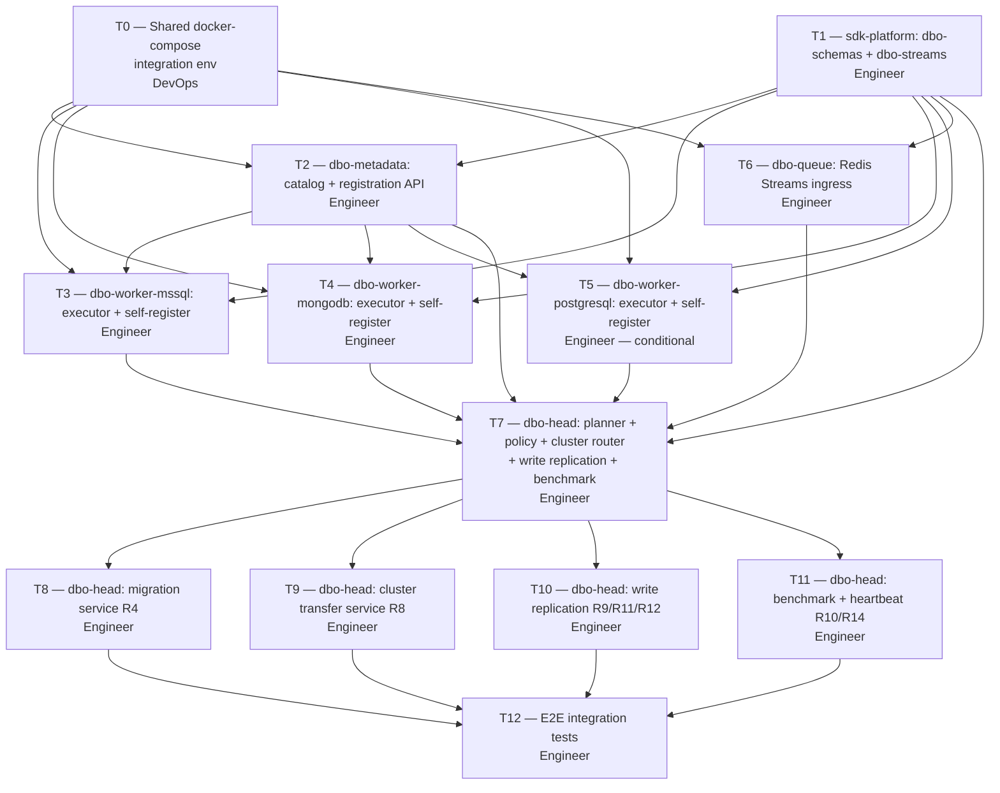

# DBO Implementation Plan — Work Breakdown

> Implementation-ready work breakdown for the DBO sub-layer (`dbo-head`, `dbo-queue`, `dbo-metadata`, `dbo-worker-{mssql,mongodb,postgresql}`). Each task has a **best-fit agent profile**, **dependencies**, and **acceptance criteria**. The authoritative behavioral spec is [`technical-requirements/database-operation.md`](./database-operation.md) (R1–R14). The per-repo facts live in [`code_bases/dbo-*.md`](../code_bases/README.md).
>
> **Status**: approved 2026-08-09 · **ADR**: `/memories/repo/dbo-architecture.md` · **Repo status**: all 6 created (private, `main`) on `github.com/bplatform-vn`

---

## 1. Dependency order (critical path)



**Phases:**

| Phase | Tasks | Parallelizable? | Owner |
|---|---|---|---|
| **P0 — Foundation** | T0, T1 | ✅ parallel | DevOps (T0) + Engineer (T1) |
| **P1 — Catalog + Workers** | T2, T3, T4, T5, T6 | ✅ parallel (T2 must finish before workers can self-register) | Engineer |
| **P2 — Head core** | T7 | ❌ after P1 | Engineer |
| **P3 — Head advanced** | T8, T9, T10, T11 | ✅ parallel after T7 | Engineer |
| **P4 — E2E** | T12 | ❌ after P3 | Engineer |

---

## 2. Task matrix

| # | Task | Repo | Best-fit agent | Depends on | TR ref |
|---|---|---|---|---|---|
| **T0** | Shared docker-compose integration env | (none — infra) | `[B-Platform] DevOps` | — | §11 stack |
| **T1** | `sdk-platform`: `dbo-schemas` + `dbo-streams` packages | `sdk-platform` | `[B-Platform] Engineer` | — | §11 (Query Plan DTO, transport) |
| **T2** | `dbo-metadata`: catalog + worker self-registration API + `DefaultClusterGuard` + `WorkerHealthTracker` | `dbo-metadata` | `[B-Platform] Engineer` | T0, T1 | R5, R6, R7, R14 (§3, §4, §17) |
| **T3** | `dbo-worker-mssql`: TypeORM executor + self-register + `SyncApplier` + heartbeat | `dbo-worker-mssql` | `[B-Platform] Engineer` | T0, T1, T2 | R5, R13, R14 (§3, §5d, §17) |
| **T4** | `dbo-worker-mongodb`: Mongoose executor + self-register + `SyncApplier` + heartbeat | `dbo-worker-mongodb` | `[B-Platform] Engineer` | T0, T1, T2 | R5, R13, R14 (§3, §5d, §17) |
| **T5** | `dbo-worker-postgresql`: TypeORM executor + self-register + `SyncApplier` + heartbeat (conditional) | `dbo-worker-postgresql` | `[B-Platform] Engineer` | T0, T1, T2 | R5, R13, R14 |
| **T6** | `dbo-queue`: Redis Streams ingress + cluster transfer job consumer | `dbo-queue` | `[B-Platform] Engineer` | T0, T1 | §10 (R8) |
| **T7** | `dbo-head` core: `DboHeadController` + `PlannerService` + `PolicyEngine` + `ClusterResolver` + `DispatcherService` + `ConsolidatorService` + `MetadataService` client | `dbo-head` | `[B-Platform] Engineer` | T1, T2, T3, T4, T5, T6 | R1, R2, R3, R5, R6 (§5, §6, §7, §8) |
| **T8** | `dbo-head` migration: `MigrationService` (entity-level ops, fan-out, rollback) | `dbo-head` | `[B-Platform] Engineer` | T7 | R4 (§9) |
| **T9** | `dbo-head` cluster transfer: `ClusterTransferService` (detect + plan + execute + verify) | `dbo-head` | `[B-Platform] Engineer` | T7 | R8 (§10) |
| **T10** | `dbo-head` write replication: `WriteReplicationService` + `SyncQueue` + `WorkerSyncStatus` lifecycle | `dbo-head` | `[B-Platform] Engineer` | T7 | R9, R11, R12 (§5a, §5d) |
| **T11** | `dbo-head` benchmark + heartbeat: `BenchmarkService` (multi-worker scope, `needsBenchmark`) + `WorkerHealthTracker` client + `ping()` | `dbo-head` | `[B-Platform] Engineer` | T7 | R10, R14 (§5b, §17) |
| **T12** | E2E integration tests across all DBO components via shared docker-compose | (integration repo) | `[B-Platform] Engineer` | T8, T9, T10, T11 | all |

---

## 3. Per-repo work breakdown + acceptance criteria

### T0 — Shared docker-compose integration env

**Repo**: none (infra; `docker-compose.yml` + `.env.example` lives in the integration test workspace).
**Best-fit agent**: `[B-Platform] DevOps`.
**Depends on**: nothing.
**TR ref**: §11 (stack table).

**Scope:**
- `docker-compose.yml` that brings up:
  - `redis:7` — for `dbo-queue` (Redis Streams), `dbo-head` cache, sync queue, benchmark ranking cache.
  - `mssql:2022-latest` (or `mcr.microsoft.com/mssql/server:2022-latest`) — for `dbo-worker-mssql` + a `default` DB + a `north` DB + a `south` DB.
  - `mongo:7` — for `dbo-worker-mongodb` + a `default` DB + a `north` DB.
  - `postgres:16` — for `dbo-worker-postgresql` (conditional, but include in compose).
- `.env.example` with all connection strings, ports, default passwords.
- A healthcheck for each datastore service.
- Named volumes so data persists across restarts during dev.
- A `wait-for-it` or `healthcheck`-based init so `dbo-*` services don't start before the datastores are ready.

**Acceptance criteria:**
- [ ] `docker-compose up -d` starts Redis, MSSQL, MongoDB, PostgreSQL with healthy status within 60s.
- [ ] Each datastore is reachable from the host on its mapped port (Redis 6379, MSSQL 1433, Mongo 27017, PG 5432).
- [ ] `.env.example` lists every env var the DBO services need (connection strings, ports, `isDefaultCluster` flag).
- [ ] Volumes persist data across `docker-compose down` + `up`.
- [ ] A `docker-compose down -v` clean-slate works and removes all data.

---

### T1 — `sdk-platform`: `dbo-schemas` + `dbo-streams` packages

**Repo**: `github.com/b-platform-vn/sdk-platform` (existing or new — verify).
**Best-fit agent**: `[B-Platform] Engineer`.
**Depends on**: nothing (T0 runs in parallel).
**TR ref**: §11 (Query Plan DTO `@b-platform-vn/sdk-platform/dbo-schemas`; transport `@b-platform-vn/sdk-platform/dbo-streams`).

**Scope:**
- `packages/dbo-schemas/` — zod/typebox DTOs matching §13 class diagram + §6 (Query Plan DTO):
  - `QueryPlanDTO`, `EntityQuery`, `RelationSpec`, `PlanOptions`, `FilterTree`, `PageSpec`, `SortSpec`, `FieldRef`, `RelType`, `JoinType`.
  - `ExecutionPlan`, `PlanStep`, `WorkerRef`, `WorkerOwnership`, `WorkerResult`, `ResultDTO`.
  - `EntityModeDeclaration`, `ClusterCondition`, `WorkerMode`, `ClusterStrategy`.
  - `MigrationRequest`, `MigrationOp`, `MigrationOpType`, `ColumnSpec`, `ColumnType`.
  - `SyncRecord`, `WorkerSyncStatus`, `SyncStatus`, `WriteOp`, `WriteOpType`.
  - `JwtClaims` (dev_mode, target_worker).
- `packages/dbo-streams/` — Redis Streams transport helpers:
  - `fanOut(plan, workerResults)` + `dispatch(planStep)` over Redis Streams.
  - HTTP fallback for dev mode (no Redis).
  - Stream naming convention: `dbo:dispatch:{workerId}`, `dbo:result:{planId}`.

**Acceptance criteria:**
- [ ] `packages/dbo-schemas` exports all DTOs listed above as TypeScript types + zod schemas.
- [ ] Every DTO round-trips through `zod.parse` + `zod.parse(JSON.parse(JSON.stringify(x)))` without error.
- [ ] `packages/dbo-streams` can publish a `PlanStep` to a Redis stream and consume it back, in a unit test against `ioredis-mock` or a real Redis (T0).
- [ ] HTTP fallback mode works without a Redis connection (unit tested).
- [ ] Both packages build with `tsc --noEmit` and publish under `@b-platform-vn/sdk-platform/*`.

---

### T2 — `dbo-metadata`: catalog + registration + guards

**Repo**: `github.com/b-platform-vn/dbo-metadata`.
**Best-fit agent**: `[B-Platform] Engineer`.
**Depends on**: T0, T1.
**TR ref**: R5, R6, R7, R14 (§3, §4, §17).

**Scope:**
- NestJS 11 bootstrap (Fastify).
- `MetadataService` (server-side) — `POST /metadata/register` (worker self-registers `EntityModeDeclaration[]`), `GET /metadata/ownership?entities=...`, `GET /metadata/policies?entities=...`, `GET /metadata/cluster-conditions?entity=...`.
- `DefaultClusterGuard` (R7) — validates a default-cluster worker exists for every clustered entity; returns warnings if missing.
- `WorkerHealthTracker` (R14) — `POST /metadata/heartbeat` endpoint; `receivePing(workerId)`, `isAlive(workerId)`, `getStaleWorkers()`; 30s ping interval, 90s stale timeout (`checkTimeouts()` cron).
- Validation (R6): `Clustered*` mode → `clusterCondition` required else reject; `isDefaultCluster: true` → no condition else reject.
- Persistence: in-memory map for MVP (graduates to a real store later); seed with a `default-cluster` worker per stack.
- `GET /metadata/health` — liveness.

**Acceptance criteria:**
- [ ] `POST /metadata/register` with a valid `EntityModeDeclaration[]` returns 200 and the worker appears in `GET /metadata/ownership`.
- [ ] `POST /metadata/register` with a `ClusteredWrite` mode missing `clusterCondition` returns 400 with a clear error.
- [ ] `POST /metadata/register` with `isDefaultCluster: true` + a `clusterCondition` returns 400.
- [ ] `DefaultClusterGuard.validate()` returns a warning when a clustered entity has no default-cluster worker.
- [ ] `POST /metadata/heartbeat` from a worker updates `WorkerHealthTracker`; `isAlive(workerId)` returns `true` within 90s of the last ping.
- [ ] After 90s+ without a ping, `getStaleWorkers()` includes the worker and `isAlive()` returns `false`.
- [ ] `GET /metadata/health` returns 200.
- [ ] Unit tests cover registration validation + heartbeat lifecycle.

---

### T3 — `dbo-worker-mssql`: TypeORM executor + self-register + SyncApplier + heartbeat

**Repo**: `github.com/b-platform-vn/dbo-worker-mssql`.
**Best-fit agent**: `[B-Platform] Engineer`.
**Depends on**: T0, T1, T2.
**TR ref**: R5, R13, R14 (§3, §5d, §17).

**Scope:**
- NestJS 11 bootstrap (Fastify).
- `MssqlWorker` implements `DboWorkerInterface`:
  - `execute(plan: PlanStep): WorkerResult` — translates `PlanStep` to a TypeORM query, executes against MSSQL.
  - `getModeDeclarations(): EntityModeDeclaration[]` — from config/env.
  - `applyMigration(ops: MigrationOp[], dryRun: boolean): WorkerMigrationResult` — translates entity-level ops to `CREATE TABLE` / `ALTER TABLE` / `DROP TABLE` via TypeORM schema API.
  - `migrationStatus(): MigrationStatus`.
  - `applySync(record: SyncRecord): void` — delegate to `SyncApplier`.
  - `markSync(recordId: string): void`.
  - `ping(): void` — HTTP POST to `dbo-metadata` `/metadata/heartbeat` every 30s (NestJS Scheduler).
- `SyncApplier` (R13) — consumes `SyncRecord` from the sync queue in per-entity order, applies idempotently, marks done.
- On boot: self-register to `dbo-metadata` via `POST /metadata/register`.
- Config: connection string, mode declarations, `isDefaultCluster` flag, `dbo-metadata` URL.
- `GET /worker/health` — liveness.

**Acceptance criteria:**
- [ ] On boot, the worker self-registers its `EntityModeDeclaration[]` to `dbo-metadata`; `GET /metadata/ownership` includes it.
- [ ] `execute(plan)` for a simple `SELECT` on an existing table returns the rows.
- [ ] `applyMigration([CreateEntity customer])` creates a `customer` table in MSSQL; `dryRun=true` returns the DDL diff without executing.
- [ ] `applyMigration([RemoveEntity customer])` drops the table.
- [ ] `applySync(record)` applies an insert `SyncRecord` to the worker's DB and marks it done in the sync queue.
- [ ] Idempotency: re-applying the same `SyncRecord` is a no-op (checked by idempotency key).
- [ ] `ping()` fires every 30s; `dbo-metadata`'s `isAlive(workerId)` stays `true`.
- [ ] After killing the worker, `dbo-metadata` marks it stale within 90s.
- [ ] Unit tests for execute + migration + sync apply + heartbeat.

---

### T4 — `dbo-worker-mongodb`: Mongoose executor + self-register + SyncApplier + heartbeat

**Repo**: `github.com/b-platform-vn/dbo-worker-mongodb`.
**Best-fit agent**: `[B-Platform] Engineer`.
**Depends on**: T0, T1, T2.
**TR ref**: R5, R13, R14.

**Scope:** Same as T3 but MongoDB + Mongoose 9:
- `MongoWorker` implements `DboWorkerInterface`.
- `applyMigration` translates entity ops to `db.createCollection()` / `$jsonSchema` validator update / `db.collection.drop()`.
- Same self-register + `SyncApplier` + `ping()` as T3.

**Acceptance criteria:**
- [ ] Same as T3, but against MongoDB (Mongoose 9).
- [ ] `applyMigration([CreateEntity customer])` creates a `customer` collection.
- [ ] `applyMigration([RemoveEntity customer])` drops the collection.
- [ ] `applySync` works against Mongo collections.
- [ ] Heartbeat + staleness work the same as T3.

---

### T5 — `dbo-worker-postgresql`: TypeORM executor + self-register + SyncApplier + heartbeat (conditional)

**Repo**: `github.com/b-platform-vn/dbo-worker-postgresql`.
**Best-fit agent**: `[B-Platform] Engineer`.
**Depends on**: T0, T1, T2.
**TR ref**: R5, R13, R14.
**Note**: Conditional — only if PG footprint stays on PostgreSQL after the ecom fold. If the decision is "no PG", this task is skipped and the repo stays as an empty shell.

**Scope + AC:** Same as T3 but against PostgreSQL (`pg` driver). `applyMigration` uses `CREATE TABLE` / `ALTER TABLE` / `DROP TABLE` (same DDL as MSSQL).

---

### T6 — `dbo-queue`: Redis Streams ingress + cluster transfer job consumer

**Repo**: `github.com/b-platform-vn/dbo-queue`.
**Best-fit agent**: `[B-Platform] Engineer`.
**Depends on**: T0, T1.
**TR ref**: §10 (R8 cluster transfer jobs).

**Scope:**
- NestJS 11 bootstrap (Fastify).
- `POST /enqueue` — accepts a bulk/background op, pushes to a Redis Stream (`dbo:queue:ingress`).
- Consumer group that picks up ingress jobs and forwards to `dbo-head` via `POST /query`.
- Cluster transfer job consumer (R8) — picks up transfer jobs from `dbo-head`'s `ClusterTransferService`, reads matching rows from the source worker, writes to the target worker, verifies row count, deletes from source.

**Acceptance criteria:**
- [ ] `POST /enqueue` with a bulk op returns 202 + a job ID.
- [ ] The consumer forwards the op to `dbo-head` and the result is retrievable.
- [ ] A cluster transfer job moves rows from the default-cluster worker to a new clustered worker and verifies row count.
- [ ] Transfer is idempotent — re-running a completed transfer is a no-op.
- [ ] `GET /worker/health` returns 200.
- [ ] Unit tests for ingress + transfer consumer.

---

### T7 — `dbo-head` core: controller + planner + policy + cluster router + dispatcher + consolidator + metadata client

**Repo**: `github.com/b-platform-vn/dbo-head`.
**Best-fit agent**: `[B-Platform] Engineer`.
**Depends on**: T1, T2, T3, T4, T5, T6.
**TR ref**: R1, R2, R3, R5, R6 (§5, §6, §7, §8).

**Scope:**
- NestJS 11 bootstrap (Fastify).
- `DboHeadController` — `POST /query`, `POST /enqueue`, `GET /requests/{id}`.
- `PlannerService` (R2) — resolves entity→worker from `dbo-metadata`, builds `ExecutionPlan` with relations; JSON DTO for MVP.
- `PolicyEngine` (R3) — `applyRowLevel` (inject predicates pre-dispatch), `applyColumnLevel` (field projection list), `mask` (post-consolidation). Policies from `dbo-metadata`.
- `ClusterResolver` (R5–R7) — `resolveWriteTarget(entity, row)` (match cluster condition or default), `resolveReadTargets(entity, filters)`.
- `DispatcherService` — `fanOut(plan)`, `dispatchClusteredWrite`, `dispatchRead`, `fanOutWrite` over Redis Streams (or HTTP dev fallback).
- `ConsolidatorService` — `merge`, `joinCrossStack`, `mergeClusteredReads`.
- `MetadataService` (client) — cached lookup against `dbo-metadata`; cache invalidated on worker staleness.
- Dev routing (R1) — `x-dev-mode` + `x-dev-target-worker` headers + `dev_mode` JWT claim.
- `GET /health` — liveness.

**Acceptance criteria:**
- [ ] `POST /query` with a single-entity read plan returns the rows from the correct worker.
- [ ] `POST /query` with a multi-entity relational plan (customer → tickets → messages across mssql + mongo) returns a single nested payload, no N+1.
- [ ] Row-level policy: a `tenant_id` predicate is injected before dispatch; the worker never sees unfiltered rows.
- [ ] Column-level policy: `email` is hidden when the role lacks PII access.
- [ ] Masking: `email` is partially masked (`a***@x.com`) when the policy says mask.
- [ ] Write routing: a write with `region=north` routes to the `north` clustered worker; a write with `region=east` (no match) routes to the default-cluster worker.
- [ ] Read routing: a read with `region=north` filter routes to the matching worker (+ default for misconfigured rows).
- [ ] Read without filter fans out to all clustered workers + default and merges.
- [ ] Dev routing: a request with `x-dev-target-worker: mssql-dev` routes only to that worker; a dev token hitting a prod worker is rejected with `403`.
- [ ] `GET /health` returns 200.
- [ ] Unit tests for planner + policy + cluster resolver + consolidator.

---

### T8 — `dbo-head` migration: `MigrationService` (R4)

**Repo**: `dbo-head` (same repo, new service).
**Best-fit agent**: `[B-Platform] Engineer`.
**Depends on**: T7.
**TR ref**: R4 (§9).

**Scope:**
- `MigrationService` — `submit(MigrationRequest)`, `getStatus(id)`, `rollback(id)`.
- `resolveOwners(ops)` — from `dbo-metadata`; groups ops by target worker.
- `fanOut(ops, workers)` — per-worker sub-request; `dryRun=true` returns DDL diff, `dryRun=false` executes.
- `aggregate(results)` — single `MigrationResult` with per-worker status.
- `inverseOf(ops)` — `Create ↔ Remove`, `Modify(add) ↔ Modify(drop)`.
- `POST /migrations`, `GET /migrations/{id}`, `POST /migrations/{id}/down`.
- Refuse `up` if any target worker is mid-transaction or a dev token is active.

**Acceptance criteria:**
- [ ] `POST /migrations` with `[CreateEntity customer]` creates the entity on the owning worker(s); `dryRun=true` returns the DDL diff without executing.
- [ ] A single migration request hitting multiple workers (mssql + mongo) fans out correctly and aggregates per-worker results.
- [ ] `POST /migrations/{id}/down` rolls back by executing inverse ops.
- [ ] `POST /migrations` with a dev token active returns 403.
- [ ] If a worker fails mid-migration, the partial state is recorded and returned.
- [ ] Migration version store is per-worker (TypeORM/migrate own their tables); `dbo-head` aggregates status only.
- [ ] Unit tests for resolveOwners + fanOut + inverseOf + aggregate.

---

### T9 — `dbo-head` cluster transfer: `ClusterTransferService` (R8)

**Repo**: `dbo-head` (same repo, new service).
**Best-fit agent**: `[B-Platform] Engineer`.
**Depends on**: T7.
**TR ref**: R8 (§10).

**Scope:**
- `ClusterTransferService` — `detectNewClusters()`, `planTransfer(source, target, cond)`, `executeTransfer(plan)`, `verifyRowCount(plan)`, `cleanupSource(plan)`.
- On metadata refresh: detect a new clustered worker → plan a default→new transfer → enqueue to `dbo-queue`.
- `POST /transfers` (manual approve), `GET /transfers/{id}`.
- Transfer is idempotent + manual-approve before execute.

**Acceptance criteria:**
- [ ] Registering a new clustered worker (`region=east`) triggers a detected transfer plan.
- [ ] `POST /transfers/{id}/approve` executes the transfer: reads matching rows from the default-cluster worker, writes to the new worker, verifies row count, deletes from source.
- [ ] Future writes with `region=east` route to the new worker, not default.
- [ ] Re-running a completed transfer is a no-op (idempotent).
- [ ] `GET /transfers/{id}` shows progress + verification status.
- [ ] Unit tests for detect + plan + execute + verify + cleanup.

---

### T10 — `dbo-head` write replication: `WriteReplicationService` + `SyncQueue` (R9, R11, R12)

**Repo**: `dbo-head` (same repo, new service).
**Best-fit agent**: `[B-Platform] Engineer`.
**Depends on**: T7.
**TR ref**: R9, R11, R12 (§5a, §5d).

**Scope:**
- `WriteReplicationService` — `createRecord(op, writeWorkers, syncTargets)`, `getRecord(id)`, `listRecords(filter)`, `isCompleted(id)`.
- On write: fan out to all matched write workers in parallel (R9); first result → return to client; track others.
- Create `SyncRecord` in `SyncQueue` (R11); attach `syncTargets: WorkerRef[]` (read clusters from `dbo-metadata`, R12).
- Record stays in queue until ALL write workers report done AND all syncTargets have synced (R11).
- `GET /sync/records`, `GET /sync/records/{id}`, `GET /sync/status` — sync-audit API.

**Acceptance criteria:**
- [ ] A write op with 2 matched write workers returns the fastest worker's result to the client immediately; the other's status is tracked in the `SyncRecord`.
- [ ] The `SyncRecord` has `writeWorkers[]` + `syncTargets[]` with `pending` statuses.
- [ ] As workers report done + syncTargets sync, the record approaches `completed`.
- [ ] The record is not removed from the queue until ALL write workers are done AND ALL syncTargets have synced.
- [ ] If a worker is down, the record stays `pending`; `GET /sync/status` shows it as pending.
- [ ] `GET /sync/records/{id}` shows per-worker write status + per-read-cluster sync status.
- [ ] Unit tests for createRecord + isCompleted + attachSyncTargets.

---

### T11 — `dbo-head` benchmark + heartbeat: `BenchmarkService` + `WorkerHealthTracker` client (R10, R14)

**Repo**: `dbo-head` (same repo, new service).
**Best-fit agent**: `[B-Platform] Engineer`.
**Depends on**: T7.
**TR ref**: R10, R14 (§5b, §17).

**Scope:**
- `BenchmarkService` — `runHourlyBenchmark()` (NestJS Scheduler cron), `getRanking(entity, clusterCtx)`, `needsBenchmark(entity, clusterCtx)`.
- `needsBenchmark` returns `true` only if >1 alive read workers serve the same `(entity, clusterCtx)` pair (R10 scope rule).
- Hourly cron benchmarks only multi-worker conditions with cluster-condition sample queries; caches ranked list in Redis.
- Skips stale workers (via `WorkerHealthTracker`).
- `MetadataService` client: invalidates ownership cache when a worker goes stale.
- `GET /benchmark/rankings`.

**Acceptance criteria:**
- [ ] `needsBenchmark(entity, clusterCtx)` returns `false` when only 1 read worker serves the condition; `true` when >1.
- [ ] The hourly cron benchmarks only multi-worker conditions; single-worker conditions are never benchmarked.
- [ ] Benchmark uses cluster-condition sample queries (fair comparison).
- [ ] `getRanking(entity, clusterCtx)` returns workers ranked by latency.
- [ ] A stale worker is skipped in benchmarking and read routing.
- [ ] When a stale worker recovers, the ownership cache is refreshed and it rejoins benchmarking.
- [ ] `GET /benchmark/rankings` returns the ranked list.
- [ ] Unit tests for needsBenchmark + runHourlyBenchmark + getRanking + stale-skip.

---

### T12 — E2E integration tests across all DBO components

**Repo**: integration test workspace (lives alongside the shared `docker-compose.yml` from T0).
**Best-fit agent**: `[B-Platform] Engineer`.
**Depends on**: T8, T9, T10, T11.
**TR ref**: all.

**Scope:**
- Bring up the full stack via `docker-compose up` (T0 env + all 6 DBO services as containers).
- E2E test scenarios:
  1. **Registration**: workers self-register; `dbo-metadata` ownership is correct.
  2. **Single-entity read/write**: `POST /query` read + write against a single worker.
  3. **Relational query** (R2): customer → tickets → messages across mssql + mongo, single nested payload.
  4. **Policy** (R3): row-level predicate injected, column hidden, PII masked.
  5. **Cluster routing** (R5–R7): write `region=north` → north worker; `region=east` → default; read with filter → matching worker.
  6. **Dev routing** (R1): `x-dev-target-worker` routes to a specific worker; dev token on prod worker → 403.
  7. **Migration** (R4): `POST /migrations` create + down rollback, multi-worker fan-out.
  8. **Cluster transfer** (R8): register a new clustered worker → approve transfer → rows move → future writes route to the new worker.
  9. **Write replication** (R9/R11/R12): write to 2 workers → fastest result returned → sync record stays until all workers + syncTargets sync.
  10. **Benchmark** (R10): with >1 read worker on the same condition, `GET /benchmark/rankings` returns a ranked list; single-worker conditions are not benchmarked.
  11. **Heartbeat** (R14): kill a worker → `dbo-metadata` marks it stale within 90s → routing skips it → restart → recovers + sync catch-up.
  12. **Async** (T6): `POST /enqueue` → job processed → result retrievable.

**Acceptance criteria:**
- [ ] All 12 E2E scenarios pass against the shared docker-compose stack.
- [ ] `docker-compose up -d && npm run test:e2e` runs green from a clean slate.
- [ ] The test suite tears down cleanly (`docker-compose down -v` leaves no orphan volumes).
- [ ] A CI job runs the same E2E suite and fails the pipeline on any scenario failure.

---

## 4. Shared docker-compose — service manifest

The `docker-compose.yml` from T0 must bring up both **infrastructure** and **DBO services** so T12 can test E2E:

```yaml
# docker-compose.yml (T0 + service images from T2–T7)
services:
  # --- Infrastructure (T0) ---
  redis:
    image: redis:7-alpine
    ports: ["6379:6379"]
    volumes: ["redis-data:/data"]
    healthcheck:
      test: ["CMD", "redis-cli", "ping"]
      interval: 5s
      timeout: 3s
      retries: 10

  mssql:
    image: mcr.microsoft.com/mssql/server:2022-latest
    env_file: .env
    ports: ["1433:1433"]
    volumes: ["mssql-data:/var/opt/mssql"]
    healthcheck:
      test: ["CMD", "/opt/mssql-tools/bin/sqlcmd", "-S", "localhost", "-U", "sa", "-P", "$${MSSQL_SA_PASSWORD}", "-Q", "SELECT 1"]
      interval: 10s
      timeout: 5s
      retries: 10

  mongo:
    image: mongo:7
    env_file: .env
    ports: ["27017:27017"]
    volumes: ["mongo-data:/data/db"]
    healthcheck:
      test: ["CMD", "mongosh", "--eval", "db.adminCommand('ping')"]
      interval: 10s
      timeout: 5s
      retries: 10

  postgres:
    image: postgres:16-alpine
    env_file: .env
    ports: ["5432:5432"]
    volumes: ["pg-data:/var/lib/postgresql/data"]
    healthcheck:
      test: ["CMD", "pg_isready", "-U", "$${POSTGRES_USER}"]
      interval: 5s
      timeout: 3s
      retries: 10

  # --- DBO services (built from their repos) ---
  dbo-metadata:
    build: ../b-platform-vn/dbo-metadata
    env_file: .env
    ports: ["4000:4000"]
    depends_on:
      redis: { condition: service_healthy }
    healthcheck:
      test: ["CMD", "curl", "-f", "http://localhost:4000/metadata/health"]
      interval: 10s
      timeout: 5s
      retries: 10

  dbo-worker-mssql:
    build: ../b-platform-vn/dbo-worker-mssql
    env_file: .env
    depends_on:
      mssql: { condition: service_healthy }
      dbo-metadata: { condition: service_healthy }
      redis: { condition: service_healthy }

  dbo-worker-mongodb:
    build: ../b-platform-vn/dbo-worker-mongodb
    env_file: .env
    depends_on:
      mongo: { condition: service_healthy }
      dbo-metadata: { condition: service_healthy }
      redis: { condition: service_healthy }

  dbo-worker-mssql-default:
    build: ../b-platform-vn/dbo-worker-mssql
    env_file: .env
    environment:
      - IS_DEFAULT_CLUSTER=true
    depends_on:
      mssql: { condition: service_healthy }
      dbo-metadata: { condition: service_healthy }

  dbo-worker-mssql-north:
    build: ../b-platform-vn/dbo-worker-mssql
    env_file: .env
    environment:
      - CLUSTER_COLUMN=region
      - CLUSTER_VALUES=north
    depends_on:
      mssql: { condition: service_healthy }
      dbo-metadata: { condition: service_healthy }

  dbo-queue:
    build: ../b-platform-vn/dbo-queue
    env_file: .env
    ports: ["4001:4001"]
    depends_on:
      redis: { condition: service_healthy }
      dbo-metadata: { condition: service_healthy }

  dbo-head:
    build: ../b-platform-vn/dbo-head
    env_file: .env
    ports: ["4002:4002"]
    depends_on:
      redis: { condition: service_healthy }
      dbo-metadata: { condition: service_healthy }
      dbo-worker-mssql: { condition: service_started }
      dbo-worker-mongodb: { condition: service_started }
      dbo-queue: { condition: service_started }

volumes:
  redis-data:
  mssql-data:
  mongo-data:
  pg-data:
```

**Cluster topology in compose** (matches §1 architecture diagram):
- `dbo-worker-mssql-default` — `isDefaultCluster=true`, no condition (catch-all).
- `dbo-worker-mssql-north` — `ClusteredWrite`, `region=north`.
- (Add `dbo-worker-mssql-south` + `dbo-worker-mongodb` clustered variants when E2E tests need them.)

---

## 5. Open decisions that block implementation

These are **MVP-resolved** (per §14 of the TR doc) but the Engineer should confirm before starting:

| # | Decision | MVP resolution | Blocks |
|---|---|---|---|
| 3 | Query language — GraphQL vs JSON DTO | JSON DTO (zod/typebox); GraphQL parser deferred | T1, T7 |
| 4 | Migration version store — per-worker vs centralized | Per-worker; `dbo-head` aggregates status only | T3, T4, T5, T8 |
| 9 | Sync queue store — Redis vs persistent | Redis + persistence to `dbo-head`-managed audit table | T10 |
| 14 | Heartbeat interval | 30s ping, 90s stale timeout | T2, T3, T4, T5, T11 |
| 15 | Stale worker handling | Exclude immediately after stale timeout | T11 |

---

## 6. Hand-off

This plan is ready for execution. The next step is to create Multica tasks T0–T12, link `depends_on`, and assign:
- **T0** → `[B-Platform] DevOps`.
- **T1–T12** → `[B-Platform] Engineer`.

The shared `docker-compose.yml` (T0) is the integration backbone — every DBO service image builds from its repo and joins the compose stack, so T12 can test E2E across all components in one `docker-compose up`.
