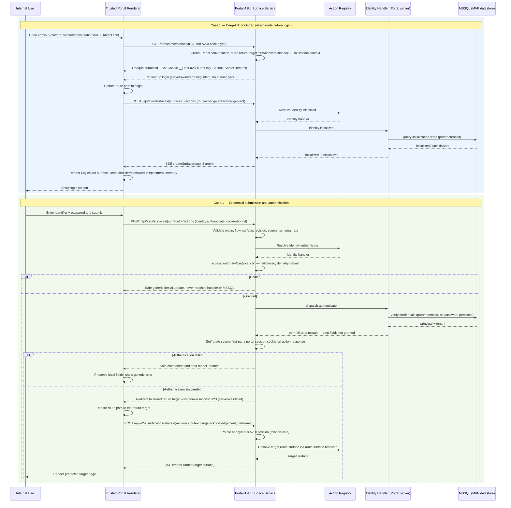
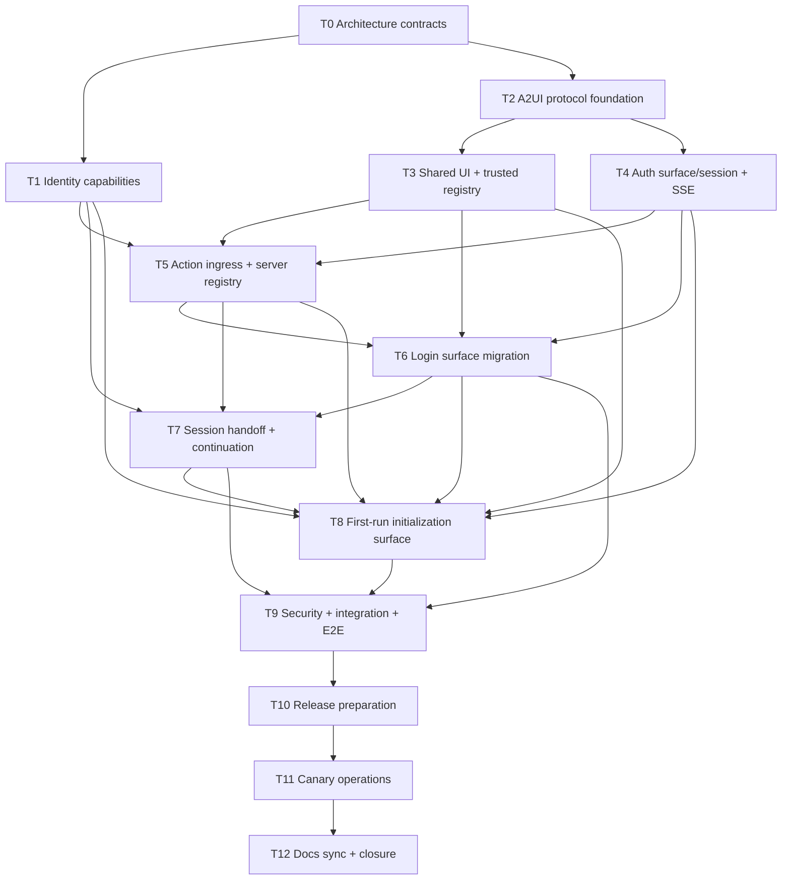

# Login A2UI First Vertical Slice — Refactoring Work Breakdown

> Implementation-ready first-slice plan for the B-Platform internal login surface in [`bof-web-bplatform`](../code_bases/bof-web-bplatform.md). The cross-feature runtime contract is [`portal-a2ui-runtime.md`](./portal-a2ui-runtime.md), including its [User–Client–Server–APIs collaboration and Admin Portal integration diagrams](./portal-a2ui-runtime.md#13-runtime-collaboration-and-integration-diagrams); the product requirements remain authoritative in [`products/bplatform-general/features/sign-in.md`](../products/bplatform-general/features/sign-in.md), and the platform boundaries remain authoritative in the [Super App architecture](../products/bplatform-general/architecture/super-app.md#server-authoritative-declarative-ui).
>
> **Status**: proposed 2026-08-15 (reworked 2026-08-15 — aligned to the runtime §13 collaboration/integration diagrams and the [accesscontrol ADR](../products/bplatform-general/architecture/decisions/accesscontrol-authorization.md)); engineering implementation is blocked until T0 is approved · **Protocol baseline**: official A2UI v0.9.1 · **ADR**: `/memories/repo/adr-server-authoritative-a2ui-json-render.md`
>
> **Remote verification**: `b-platform-vn/bof-web-bplatform@main` was checked on 2026-08-15. Remote default branch is the implementation source of truth; local login/shared-ui refinements are unmerged WIP until they appear on the remote. During MVP there is no `api-service-identity` or `api-service-orchestrator` in the runtime — the Portal Next.js server is the entire backend and accesses MSSQL directly.

---

## 1. Objective and boundaries

Adopt the shared Portal A2UI runtime for login and first-run initialization as its first production vertical slice. Refactor the hardcoded React login composition into a server-authoritative declarative surface that:

- receives official A2UI v0.9.1 surface messages over same-origin SSE;
- validates and maps those messages through an explicit A2UI-to-json-render adapter;
- renders only versioned, trusted cohesive widgets such as `LoginCard` and `InitializationCard`, which internally compose `@b-platform-vn/shared-ui` atoms;
- creates an opaque Redis-backed A2UI session on first bootstrap, stores its identifier only in a secure cookie, and recovers the credential-free conversation from Redis after connection loss;
- keeps credentials ephemeral in browser memory and submits them only in an explicit A2UI action request;
- executes initialization checks, authentication, session creation, authorization-sensitive decisions, and auditing on the server;
- replaces or deletes the surface after the server changes authoritative state;
- preserves a validated return target without allowing declarative UI to select a URL, service, import, or endpoint.

### In scope

- Normal internal sign-in surface.
- Conformance with the shared Redis-backed A2UI session and `surfaceId` lifecycle.
- The first implementation and verification of the portal-wide A2UI schemas, cohesive-widget catalog, trusted registry, reducer, SSE transport, and action ingress.
- Server action registry entry for `identity.authenticate`.
- Secure session handoff and safe continuation to the requested internal route.
- First-run state detection and a separate root-initialization surface required by the sign-in FRD.
- Accessibility, hostile-input, reconnect, replay, integration, and end-to-end tests.
- Feature-flagged migration from the hardcoded `LoginCard`.

### Out of scope

- Public/customer sign-in and customer SSO.
- Post-initialization account creation. It remains available only through B-Platform / UniGate / Users.
- Password recovery, MFA, social login, and persistent “Remember me” behavior until separate product/session contracts approve them.
- Letting A2UI or json-render choose backend service names, capability providers, route-handler paths, or internal API URLs.
- Resolving the portal-to-orchestrator topology implicitly inside UI code; that decision is deferred to a post-MVP ADR. During MVP the Portal server owns identity handlers directly and accesses MSSQL through a server-only data-access layer.
- Treating A2UI as login-only or creating an authentication-specific runtime that future Portal features must duplicate.

## 2. Verified current state and gaps

| Area | Canonical remote state on 2026-08-15 | Gap to target |
|---|---|---|
| Login UI | `LoginCard` is a client component with local email/password state and a direct `login(...)` server-action call. | No declarative surface, catalog, A2UI validation, reducer, SSE, or action envelope. |
| Portal auth action | `src/server/actions/auth.ts` forwards to `/identity/auth/login`; secure cookie creation remains TODO. | No action registry, session contract, safe error normalization, replay control, or A2UI action ingress. During MVP the handler moves into the Portal server, not a separate L2 service. |
| Portal BFF | A generic server-only `forward<T>(path, ...)` targets the orchestrator. | The declarative surface must never provide `path`; during MVP the Portal server owns handlers directly and accesses MSSQL through a server-only data-access layer. |
| Shared UI | Remote `@b-platform-vn/shared-ui` exports only `Button` and `Card`. | Required accessible input, password, text, link, logo, alert, checkbox, and layout primitives are not canonical yet. Local versions are WIP, not architecture facts. |
| Identity handlers | No identity handler exists yet. | Initialization, authentication, session, and sign-out handlers do not exist yet. During MVP they live inside the Portal server and access MSSQL directly, not in a separate `api-service-identity` service. |
| Datastore | MSSQL is the only MVP datastore. | No server-only data-access layer, parameterized-query contract, or connection-secret isolation exists yet. |
| Tests | Portal script reports “no tests yet.” | No protocol, security, integration, or browser evidence exists. |

**Consequence:** the renderer and transport can be developed against a deterministic fake server adapter, but production login cannot be enabled until the Portal server implements the identity handlers, the session contract, and the server-only MSSQL data-access layer.

## 3. Target architecture

### 3.1 Responsibility split

| Layer | Responsibility | Prohibited responsibility |
|---|---|---|
| `packages/shared-ui` | Accessible native presentation atoms and visual tokens used inside cohesive widgets. | A2UI parsing, catalog entries, action routing, domain logic, internal fetches. |
| Portal browser renderer host | Validate inbound messages, reduce surfaces, render trusted cohesive widgets, own local presentation/secret stores, inject controlled props/callbacks, emit typed actions. | Authentication, authorization, session issuance, endpoint selection, generated code execution, serializing secret state. |
| Catalog widget | Render supplied controlled props and emit supplied typed callbacks while composing `shared-ui` atoms. | Inner state, React context, A2UI/json-render hooks, domain fetches, business handlers, persistence. |
| Portal A2UI runtime + handlers | Own Redis-backed A2UI sessions and surfaces, validate actions, resolve server handlers, execute handlers, access MSSQL through the server-only data-access layer, publish ordered messages. | Trusting browser identity/roles/revisions, interpolating untrusted values into SQL, or logging credential context. |
| Identity handler (MVP, inside Portal) | Initialization state, atomic root creation, credential verification, authenticated sessions, sign-out, audit events. Accesses MSSQL through the server-only data-access layer. | UI layout/composition, direct browser-reachable handlers, or datastore connections outside the data-access layer. |
| A2UI surface document | Component tree, safe display state, declared action names, non-sensitive error/status state. | Password/email echo, service routes, arbitrary links, scripts, imports, handler code. |

The A2UI integration belongs to the Portal runtime under `apps/portal`; `packages/shared-ui` stays protocol-agnostic. Login consumes the portal-wide runtime defined in [`portal-a2ui-runtime.md`](./portal-a2ui-runtime.md). During MVP, identity handlers live inside the Portal server; extracting them into a separate `api-service-identity` service (and reintroducing the orchestrator/DBO layers) requires a post-MVP ADR and must preserve the A2UI runtime unchanged. An extraction to a reusable L0 package requires a later demonstrated second consumer and ADR.

### 3.2 Login message and action flow — Case 1: direct route before login

This is the login-slice view of the runtime's authoritative [User–Client–Server–datastore collaboration diagram](./portal-a2ui-runtime.md#131-user--client--server--datastore-collaboration). §13.1 defines the full three-phase chain (bootstrap → action ingress with authentication transition → reconnect) where the Portal server resolves the action, validates it, and reads/writes MSSQL directly through the server-only data-access layer.

The common entry path is **Case 1 — deep-link access to a specific page before login**: the user opens a direct protected link (e.g. `admin.b-platform.vn/crm/conversations/u123`), the runtime bootstraps an anonymous A2UI session, stores the requested route as the server-owned return target, and drives the client to the login surface. Entry at the portal root (`admin.b-platform.vn`) is the degenerate case of the same bootstrap with an empty return target.

The diagram below models Case 1 end to end; it must not contradict §13.1's cookie-first Redis-before-cookie rule, server-only MSSQL access, authentication-transition session rotation, or the §13.2 authorization rule that every handler dispatch runs a fail-closed `accesscontrol` `tryCan` check and calls `perm.filter()` on read results.

Route-change acknowledgement protocol:

- The browser never invents or selects a route. The server stores the requested route as a **return target in the A2UI session context** at bootstrap and resolves it server-side when authentication succeeds; the client applies only server-directed route changes.
- After applying a server-directed route change (to `/login`, then to the return target), the client posts a **route-change acknowledgement action** so the runtime can create the surface for the current route. This is transport bookkeeping, not a privilege grant: it carries no target choice, role, credentials, or return URL.
- Redirect intent travels only through the action response or SSE as trusted host behavior; surface content can never generate `openUrl`, an arbitrary `href`, or a service/endpoint selection. The `LoginScreen` route renders the cohesive `LoginCard` catalog widget (see §3.5).
- Successful authentication commits/rotates the first-party portal session cookie in the action response **before** any navigation or surface transition; the anonymous A2UI session is then rotated so no anonymous privilege carries forward.

Authorization model for the login slice:

- Anonymous (pre-auth) principals are evaluated against a **limited anonymous role** that grants only identity bootstrap and read-only `identity.initialized`; every other action is deny-by-default. This is not a bypass of `tryCan` — bootstrap and SSE let the server own surface creation and routing, while every action and handler call still passes through the fail-closed `tryCan` gate.
- `perm.filter()` applies to every read result (initialization state, authenticated principal) so the surface receives only fields the anonymous or post-auth role is granted to see.
- The `access` audit event emitted by each `tryCan`/`perm.filter()` check feeds the login flow's audit record with the bounded pre-auth tenant representation and a non-bearer anonymous principal, exactly as T5 requires.

### 3.3 Endpoint contract

| Endpoint | Purpose | Required controls |
|---|---|---|
| `POST /api/a2ui/sessions/bootstrap` | Create or resume the Redis-backed Portal A2UI conversation; set an opaque HttpOnly A2UI session cookie; capture the requested route as the server-owned return target; create the login surface when selected by the server. | Redis write succeeds before usable response, strict same-origin check, CSRF policy, request limit, idle/absolute expiry, fixation prevention, safe return-target capture. |
| `GET /api/a2ui/surfaces/{surfaceId}/events` | Deliver ordered A2UI v0.9.1 messages as SSE. | Flow-cookie binding, `text/event-stream`, no-store/no-transform, event limits, heartbeat, monotonic IDs/revisions, expiry handling. |
| `POST /api/a2ui/surfaces/{surfaceId}/actions` | Receive official A2UI `action`/`error` envelopes, including the route-change acknowledgement and `identity.authenticate`. | Origin/CSRF, content type, closed schemas, source/action/revision validation, rate limit, replay/duplicate controls, redaction. |
| Portal route surface resolver (e.g. `GET /crm/conversations/u123`, `/login`) | Apply the server-owned return target and route changes; render the surface for the current route. | Fixed same-origin route handlers, authenticated-session check, allowlist and safe fallback, server-directed route changes only, no browser-selected return URL. |

Exact route filenames may follow repository conventions, but these externally observable responsibilities must stay separate.

### 3.4 A2UI-over-HTTP/SSE binding

A2UI v0.9.1 messages remain unmodified. B-Platform transport metadata must not be inserted as undeclared fields in an A2UI envelope.

- An SSE response uses `Content-Type: text/event-stream`.
- Each mutating SSE event uses `event: a2ui`, an opaque monotonic `id`, and `data` containing exactly one schema-valid official A2UI v0.9.1 server-to-client message.
- Heartbeats are SSE comments (`: heartbeat`) and are never passed to the A2UI parser.
- `Last-Event-ID` is the only reconnect cursor. The server resolves it to its server-owned surface revision; the browser does not manufacture a revision.
- An action/error POST body contains exactly one official A2UI v0.9.1 client-to-server message and uses `Content-Type: application/a2ui+json`.
- `X-A2UI-Catalog-ID` identifies the selected deployment-approved catalog. The bootstrap request advertises supported catalog IDs with `X-A2UI-Supported-Catalog-IDs`; the server rejects a request with no exact supported match. Inline catalogs are prohibited for authentication surfaces.
- `X-A2UI-Expected-Event-ID` carries the last A2UI SSE event applied by the client. The server maps it to authoritative state and rejects stale transitions. It is transport metadata, not an A2UI message property.
- `X-A2UI-Attempt-ID` is an opaque one-attempt duplicate/concurrency guard for a password-bearing action. It must not key a cache containing credentials or a reusable authentication result.
- CSRF proof uses the portal's approved cookie/header mechanism plus strict `Origin`/`Sec-Fetch-Site` checks. Correlation and audit IDs are minted or normalized server-side; client-supplied values never establish trust.

The bootstrap response is a small same-origin JSON transport contract containing only the opaque `surfaceId`, selected `catalogId`, SSE URL, action URL, and expiry. The opaque A2UI session ID remains only in its HttpOnly cookie and Redis lookup; the JSON contains no session ID, credentials, internal service route, provider identity, authenticated session token, or return target.

### 3.5 Authentication catalog v1

Per the Portal runtime catalog policy, the first production catalog contains cohesive workflow widgets, not generatable atoms:

| Catalog entry | Trusted implementation | Notes |
|---|---|---|
| `LoginCard` | Portal auth widget composed from reviewed `shared-ui` atoms | Closed controlled props for safe display state and renderer-local bindings; declares only `identity.authenticate`. |
| `InitializationCard` | Portal initialization widget composed from reviewed `shared-ui` atoms | Closed controlled props and renderer-local bindings; declares only `identity.initializeRoot`. |
| `UnavailablePanel` | Portal status widget composed from reviewed `shared-ui` atoms | Safe code/message and bounded retry presentation; no arbitrary URL or generic action. |

`TextInput`, `PasswordInput`, `Button`, `Stack`, `Typography`, `Logo`, and similar atoms remain implementation details and are not independently selectable by generated A2UI content. Each widget is a controlled, context-free view: no inner state, React context, A2UI/json-render hooks, fetches, or business handlers. The renderer host injects values and typed callbacks.

Do not include demo credentials, social login buttons, account creation, raw HTML, arbitrary CSS, arbitrary image/URL props, arbitrary child composition, or a generic “fetch”/“submit object” action.

For every authentication and initialization surface, A2UI `createSurface.sendDataModel` must be absent or `false`. The validator must reject `sendDataModel: true`; credential fields are not synchronized data-model fields.

### 3.6 Credential isolation rules

- Identifier and password fields live only in the renderer host's explicitly non-persisted input stores; catalog widgets receive them as controlled props.
- Password visibility, focus, and pending display live in renderer-owned local presentation state, not widget inner state or context.
- Password values must never enter A2UI `updateDataModel`, SSE payloads, surface snapshots, browser storage, URLs, React server-component payloads, analytics, logs, traces, metrics labels, or audit details.
- The action resolver serializes only the closed `identity.authenticate` context at submit time.
- Auth surfaces reject `createSurface.sendDataModel: true`; neither password nor password confirmation participates in automatic A2UI data-model synchronization.
- Request-body logging is disabled/redacted before the action route can emit application logs.
- The browser never automatically retries a password-bearing action after reconnect or network ambiguity.
- Duplicate clicks are prevented in the UI, while the server separately rejects concurrent/stale duplicate attempts.
- Authentication attempts are not treated like ordinary safely replayable idempotent writes: an attempt identifier prevents accidental duplicate execution but must not cache a credential-bearing request or successful response.
- Failure messages are generic and do not disclose whether the identifier exists.
- Surface deletion, expiry, sign-in success, page unload, and owner/session mismatch clear local sensitive state.

### 3.7 Redis-backed session and surface lifecycle

Use the shared Redis authority defined in [`portal-a2ui-runtime.md`](./portal-a2ui-runtime.md) and maintain the server-owned mapping:

`a2uiSessionId + surfaceId -> owner=identity-auth + catalogVersion + currentRevision + eventCursor + expiry + safeReturnTarget + status`

The first bootstrap creates the Redis conversation before setting a usable opaque A2UI session cookie. The A2UI session can own later Portal feature surfaces and is distinct from the authenticated Portal session. Redis stores credential-free metadata, snapshots, ordered event history, and bounded attempt status only; it never stores identifiers/passwords, raw action bodies, raw cookies, session tokens, or reusable authentication results. Process-local authority is test-only, and Redis outage fails closed.

The A2UI session cookie follows the shared Portal runtime contract: at least 128 bits of entropy, `HttpOnly`, `Secure` outside explicitly approved local development, `SameSite=Lax` or stricter, `Path=/`, no `Domain`, and preferably a `__Host-` name. It has idle and absolute expiry, rotates on fixation/privilege boundaries, and is invalidated after expiry, reset, or ownership mismatch. The server never accepts a browser-selected session ID. Pre-auth abuse controls combine the server-owned session/surface with privacy-safe network and identifier attempt signals; raw identifiers never become metric labels.

Progressive component updates may contain bounded temporary forward references permitted by A2UI. The reducer keeps unresolved references in a size/time-bounded pending set and renders a safe placeholder; it still rejects cross-surface references, cycles, invalid types, limit violations, and references that remain unresolved beyond the configured boundary.

Reconnect behavior:

1. Resolve the A2UI session from the secure cookie, load its conversation from Redis, and accept `Last-Event-ID` only for a surface owned by that session.
2. Resume validated Redis-retained events when sequence-contiguous.
3. Otherwise send ordered `deleteSurface` then `createSurface` messages for the same server-owned ID, or require a fresh bootstrap with a new ID; never call `createSurface` over an active surface. Either reset clears local fields and pending actions before rendering the credential-free replacement.
4. Never replay an upstream action or infer that a password submission should be repeated.
5. Delete/replace the surface when the flow expires, the session changes, or authentication completes.

## 4. Dependency order

### Phases

| Phase | Tasks | Parallelizable? | Release effect |
|---|---|---|---|
| P0 — Contract gate | T0 | No | Resolves service boundary and identity/session contracts; adopts the shared Portal Redis runtime contract. |
| P1 — Foundations | T1, T2 | Yes after T0 | Backend capability and UI protocol foundations progress independently. |
| P2 — Runtime | T3, T4 | Yes after T2 | Trusted component registry and transport/session lifecycle. |
| P3 — Login | T5, T6, T7 | Mostly ordered | End-to-end normal sign-in behind a disabled-by-default feature flag. |
| P4 — FRD completion | T8 | After shared runtime | First-run initialization and post-initialization lockout. |
| P5 — Verification | T9 | After login and initialization | Security and product release gate. |
| P6 — Rollout and closure | T10, T11, T12 | Ordered, cross-profile handoff | Release preparation, DevOps canary, then Architecture sync. |

## 5. Task matrix

| ID | Task | Repository | Best-fit profile | Depends on |
|---|---|---|---|---|
| T0 | Approve auth capability, session, and service-boundary contracts; confirm Portal A2UI runtime adoption | `platform-ecosystem-docs` | `[B-Platform] Architecture` | — |
| T1 | Implement MVP identity handlers (initialization/auth/session) inside the Portal server | `bof-web-bplatform` (Portal server + server-only MSSQL data-access layer) | `[B-Platform] Engineer` | T0 |
| T2 | Build A2UI v0.9.1 protocol and json-render adapter foundation | `bof-web-bplatform` | `[B-Platform] Engineer` | T0 |
| T3 | Canonicalize shared auth atoms and controlled cohesive-widget registry | `bof-web-bplatform` | `[B-Platform] Engineer` | T2 |
| T4 | Implement Redis-backed A2UI session, auth surface lifecycle, and ordered SSE | `bof-web-bplatform` | `[B-Platform] Engineer` | T0, T2 |
| T5 | Implement A2UI action ingress and server action registry | `bof-web-bplatform` | `[B-Platform] Engineer` | T1, T2, T3, T4 |
| T6 | Replace hardcoded login composition behind a feature flag | `bof-web-bplatform` | `[B-Platform] Engineer` | T3, T4, T5 |
| T7 | Complete secure session handoff and safe continuation | `bof-web-bplatform` | `[B-Platform] Engineer` | T1, T5, T6 |
| T8 | Add server-selected first-run initialization surface | `bof-web-bplatform` | `[B-Platform] Engineer` | T1, T3, T4, T5, T6, T7 |
| T9 | Add hostile, protocol, integration, and browser tests | affected repositories | `[B-Platform] Engineer` | T6, T7, T8 |
| T10 | Prepare release flag, dashboards, and legacy-removal change | `bof-web-bplatform` | `[B-Platform] Engineer` | T9 |
| T11 | Execute canary, alerts, observation, and rollback operations | deployment/observability repositories | `[B-Platform] DevOps` | T10 |
| T12 | Synchronize living architecture docs and close the migration | `platform-ecosystem-docs` | `[B-Platform] Architecture` | T11 |

## 6. Detailed work breakdown

### T0 — Approve contracts and close architecture blockers

**Best-fit profile:** `[B-Platform] Architecture`  
**Depends on:** none.

**Scope:**

- Record the MVP identity action names the Portal server must implement directly:
  - `identity.initialized`;
  - `identity.initializeRoot`;
  - `identity.authenticate`;
  - `identity.session`;
  - `identity.signOut`.
- Confirm that during MVP these handlers live inside the Portal server and access MSSQL through the server-only data-access layer; no `api-service-identity`, orchestrator, or `dbo-*` is in the runtime. Defer the post-MVP extraction to a separate ADR.
- Approve adoption of [`accesscontrol`](https://github.com/onury/accesscontrol) v3 as the single authorization engine for the Portal server, per the [accesscontrol ADR](../products/bplatform-general/architecture/decisions/accesscontrol-authorization.md). Approve the mapping from the B-Platform permission-expression convention (`app.module.action(param:value)`) to `accesscontrol` roles, custom actions, `.where()` conditions, `.require()` gates, ownership resolution, attribute filtering, and `getGrantsList()`/`snapshot()` serialization.
- Approve the bootstrap grants for MVP: roles (root, admin, operator, viewer), identity action grants (`identity.initialized`, `identity.authenticate`, `identity.initializeRoot`, `identity.session`, `identity.signOut`), and any cross-cutting `.require()` gates (e.g. `$.env`, `$.mfa`).
- Approve the anonymous (pre-auth) role: grants only identity bootstrap and read-only `identity.initialized`, deny-by-default for everything else. Confirm that bootstrap/SSE surface creation is server-owned and does not bypass `tryCan` — every action and handler dispatch still passes the fail-closed check.
- Define typed safe outcomes, error codes, timeout behavior, and audit fields for each capability.
- Define the first-party portal session cookie contract: contents/reference model, rotation, expiry, SameSite, Secure, HttpOnly, revocation, and sign-out.
- Approve Redis configuration and operations for the normative Portal session/surface/event model: topology, atomicity, TTL, event retention, persistence, ACL/TLS, eviction, backup, and outage behavior.
- Define safe return-target capture and the server-directed route-change flow: the requested route is stored in the A2UI session context at bootstrap, applied via a server-directed redirect after successful authentication, and acknowledged by a route-change acknowledgement action; no browser-selected return URL, and no fixed `/api/auth/continue` 303 hop.
- Approve the A2UI-over-HTTP/SSE binding in §3.4, including catalog negotiation and transport-only cursor/attempt headers.
- Define the bounded tenant representation for pre-auth audit events: resolved tenant, platform tenant, or explicit `unresolved`/not-applicable value derived server-side.
- Approve the login slice's conformance to the runtime's [collaboration and integration diagrams](./portal-a2ui-runtime.md#13-runtime-collaboration-and-integration-diagrams): the login flow must reuse the §13.1 bootstrap → action ingress → reconnect phases and the §13.2 Portal-server → Action-Registry → handler → MSSQL dispatch chain, not invent a login-only path.

**Acceptance criteria:**

- [ ] An approved ADR names the MVP identity handler owner (Portal server during MVP) and records that post-MVP extraction to `api-service-identity` is deferred to a separate ADR.
- [ ] The login slice is documented as conforming to the runtime's §13 collaboration and integration diagrams, with no login-only session, transport, Redis schema, or dispatch path.
- [ ] The anonymous pre-auth role is approved and grants only bootstrap + read-only `identity.initialized`, deny-by-default otherwise; bootstrap/SSE surface creation is server-owned and never bypasses `tryCan` on actions.
- [ ] The existing portal/orchestrator documentation drift is marked as deferred to a post-MVP ADR; during MVP the Portal server owns handlers directly.
- [ ] Credentials, session artifacts, and audit redaction rules are explicit.
- [ ] Pre-auth audit events have a server-derived bounded tenant representation; the browser cannot select it.
- [ ] Production surface ownership, event ordering, retention, and reconnect storage are explicit.
- [ ] Redis is approved as the production authority; process-local state is test-only and Redis outage fails closed.
- [ ] The exact A2UI transport binding is approved without adding proprietary fields to official envelopes.
- [ ] T1, T2, and T4 can implement without inventing service routes or session semantics. During MVP T1 implements handlers inside the Portal server, not in a separate service.
- [ ] `accesscontrol` v3 is approved as the authorization engine; the permission-convention-to-accesscontrol mapping, bootstrap grants, and gates are explicit.

### T1 — Implement identity capabilities

**Best-fit profile:** `[B-Platform] Engineer`  
**Depends on:** T0.

**Scope:**

- Implement the approved MVP identity handlers inside the Portal server (`apps/portal/src/server/identity/` or equivalent) and the server-only MSSQL data-access layer.
- Set up the `accesscontrol` instance: load bootstrap grants (roles, identity action grants, gates), configure the ownership resolver against MSSQL records, enable `strict: { actions: true, resources: true }`, and wire the `access` event stream to the audit path. Persist grants to MSSQL via `getGrantsList()` and reload on mutation.
- Make initialization eligibility server-owned and root creation atomic.
- Implement operator credential verification with generic typed failures, abuse controls, and audit redaction.
- Issue/rotate the server result needed by the portal to establish its secure first-party session.
- Implement session inspection and sign-out/revocation behavior.
- Register all identity handlers with the Portal Action Registry and expose a typed not-ready/degraded outcome until the handler and MSSQL connectivity are healthy.

**Acceptance criteria:**

- [ ] Normal authentication returns a typed success/failure without exposing raw internal errors.
- [ ] The `accesscontrol` instance loads bootstrap grants at startup, enforces `tryCan` on every identity action, resolves ownership against MSSQL records, filters response attributes via `perm.filter()`, and emits an `access` audit event per check.
- [ ] Wrong identifiers and wrong passwords are externally indistinguishable.
- [ ] Root initialization succeeds exactly once under concurrent attempts.
- [ ] Plaintext credentials and reusable session artifacts are absent from logs, traces, and audit records.
- [ ] Contract and integration tests cover initialization, authentication, expiry/revocation, and sign-out.
- [ ] Handler registration is discoverable by the Portal Action Registry, and missing/unhealthy handler or MSSQL connectivity yields the safe degraded result used by the auth surface.

### T2 — Build protocol and adapter foundation

**Best-fit profile:** `[B-Platform] Engineer`  
**Depends on:** T0.

**Suggested areas:** `apps/portal/src/a2ui/protocol/`, `apps/portal/src/a2ui/renderer/`, and test counterparts.

**Scope:**

- Pin compatible `@json-render/core`, `@json-render/react`, and schema-validation dependencies; document exact versions.
- Represent and validate official A2UI v0.9.1 `createSurface`, `updateComponents`, `updateDataModel`, `deleteSurface`, `action`, and `error` messages.
- Define catalog-version negotiation and reject any unsupported protocol/catalog pair.
- Implement an explicit adapter from validated A2UI surface state to the internal json-render renderer model.
- Implement a deterministic reducer with revision/event ordering, duplicate suppression, bounded graph validation, and safe unknown-entry behavior.
- Implement the §3.4 transport adapter: unmodified A2UI bodies, SSE cursor handling, exact catalog match, and transport-only expected-event/attempt metadata.
- Support bounded temporary forward references for progressive rendering without permitting cross-surface references or unbounded pending graphs.
- Do not use json-render SpecStream as the A2UI wire protocol.

**Acceptance criteria:**

- [ ] Official v0.9.1 fixtures validate and reduce deterministically.
- [ ] Legacy illustrative `surfaceUpdate`, `dataModelUpdate`, and `beginRendering` messages fail validation.
- [ ] Unknown components/actions, cross-surface references, cycles, stale revisions, duplicate events, and oversized trees fail closed.
- [ ] Bounded valid forward references resolve when later updates arrive; unresolved/oversized references time out to a safe error.
- [ ] SSE heartbeats never reach the A2UI parser, and transport metadata is absent from validated A2UI bodies.
- [ ] No generated value can become code, import path, handler source, API route, or arbitrary CSS/HTML.
- [ ] Unit tests prove A2UI and json-render SpecStream remain separate protocol paths.

### T3 — Canonicalize shared atoms and controlled widget registry

**Best-fit profile:** `[B-Platform] Engineer`  
**Depends on:** T2.

**Suggested areas:** `packages/shared-ui/src/components/`, `packages/shared-ui/src/index.ts`, `apps/portal/src/a2ui/catalog/auth-v1.ts`, `apps/portal/src/a2ui/registry/auth-v1.tsx`.

**Scope:**

- Promote the required accessible auth atoms to remote `main`; do not assume local WIP is already canonical.
- Keep atoms protocol-agnostic and based on semantic Design Catalog variables.
- Define closed schemas and a static registry for the cohesive `LoginCard`, `InitializationCard`, and `UnavailablePanel` catalog entries; do not expose atoms as generatable entries.
- Implement catalog widgets as controlled, context-free views with no inner state, React context, A2UI/json-render hooks, fetches, persistence, or domain handlers.
- Keep password visibility and other presentation-only behavior in renderer-owned local presentation state and inject it into widgets as controlled props/callbacks.
- Resolve link route keys through a static allowlist; do not accept arbitrary `href`.
- Ensure control size derives from padding, typography, and line-height rather than fixed heights.
- Reject inline auth catalogs and reject `createSurface.sendDataModel: true` for login and initialization.

**Acceptance criteria:**

- [ ] The registry renders the reviewed login and initialization layouts using only cohesive catalog v1 widgets.
- [ ] Catalog validation rejects `TextInput`, `PasswordInput`, `Button`, layout atoms, arbitrary children, and other non-catalog composition attempts.
- [ ] Static/lint and rendering tests prove catalog widgets use no inner state, React context, renderer/provider hooks, browser storage, hidden singleton stores, persistence, fetch/server actions, or domain handlers and only emit injected typed callbacks.
- [ ] Every interactive atom supports labels, keyboard interaction, focus, pending, disabled, and error states.
- [ ] Unknown props and route keys are rejected.
- [ ] Tests prove full data-model synchronization cannot be enabled for credential-bearing surfaces.
- [ ] `packages/shared-ui` has no dependency on A2UI, json-render, portal server code, or identity logic.
- [ ] Visual regression/accessibility checks cover desktop and mobile login states.

### T4 — Implement Redis-backed A2UI session, surface lifecycle, and SSE

**Best-fit profile:** `[B-Platform] Engineer`  
**Depends on:** T0, T2.

**Suggested areas:** `apps/portal/src/server/a2ui/`, `apps/portal/src/app/api/a2ui/sessions/bootstrap/route.ts`, `apps/portal/src/app/api/a2ui/surfaces/[surfaceId]/events/route.ts`.

**Scope:**

- Create the Redis conversation before returning bootstrap, then issue the opaque shared Portal A2UI session cookie and a server-owned auth surface identifier.
- Enforce the cookie entropy, fixation prevention, flags, Portal-wide path, idle/absolute lifetime, rotation, and invalidation rules in §3.7.
- Persist credential-free session metadata, owner, catalog version, revision, cursor, status, expiry, safe return target, snapshots, and ordered event history in Redis using atomic revision/event updates.
- Resolve initialization state server-side before choosing the login, initialization, or unavailable surface.
- Negotiate an exact deployment-approved catalog ID at bootstrap; reject inline or unsupported catalogs.
- Publish schema-validated A2UI messages with monotonic event IDs/revisions over SSE.
- Implement heartbeat, limits, cancellation, expiry, `Last-Event-ID`, resume-or-replace behavior, and proxy-safe headers.
- Ensure one A2UI session/surface cannot observe another session's events or surface; define isolated behavior for multiple tabs sharing the session cookie.
- Fail closed with a safe unavailable state during Redis outage; never promote process-local memory to production authority.

**Acceptance criteria:**

- [ ] Guessing another `surfaceId` or reusing it with another A2UI session cookie fails closed.
- [ ] First bootstrap persists Redis state before the cookie/surface becomes usable.
- [ ] Tests prove the A2UI session ID has approved entropy, appears only in an `HttpOnly`, `Secure` outside approved local development, SameSite, host-only, `Path=/` cookie, and is absent from response bodies, URLs, A2UI messages, logs, telemetry, and client-readable state.
- [ ] Browser-supplied session IDs and fixation attempts are ignored/rejected and cannot select or replace a Redis conversation.
- [ ] Reconnect loads the cookie-bound Redis conversation and resumes from a valid `Last-Event-ID` or receives a credential-free authoritative replacement.
- [ ] Cross-session, cross-surface, future, malformed, and trimmed cursors fail or replace safely.
- [ ] Expiry/session change emits a safe delete/replacement and closes the stream.
- [ ] SSE responses cannot be cached or shared across users.
- [ ] No surface event or snapshot contains identifier/password values, tokens, cookies, stack traces, or internal endpoints.
- [ ] An unavailable handler/MSSQL produces a safe degraded surface rather than assuming login or initialization eligibility.

### T5 — Implement action ingress and server registry

**Best-fit profile:** `[B-Platform] Engineer`  
**Depends on:** T1, T2, T3, T4.

**Suggested areas:** `apps/portal/src/app/api/a2ui/surfaces/[surfaceId]/actions/route.ts`, `apps/portal/src/server/a2ui/actions/`, and the Portal Action Registry.

**Scope:**

- Accept only official A2UI v0.9.1 `action` and `error` envelopes with `application/a2ui+json`; receive catalog, expected event cursor, attempt ID, and CSRF proof only through the approved transport binding.
- Validate A2UI session/surface ownership, catalog, server-mapped event/revision state, source widget, declared action, closed context schema, timestamp format, request size, origin/CSRF, and rate limits.
- Run a fail-closed `accesscontrol` `tryCan(role, ctx).action(action, resource)` check before dispatching to any handler. A thrown error must never become an accidental allow. On denial, emit a safe surface update with a generic denial reason; do not echo `accesscontrol` internals. Call `perm.filter()` on read results to strip fields not granted to the caller.
- Resolve `identity.authenticate` from the static Portal Action Registry to the MVP identity handler, with server-owned `app_id: "b-platform"`.
- Normalize provider failures to safe surface updates; never echo provider messages directly.
- Use attempt IDs/concurrency guards to prevent accidental duplicates without storing or automatically replaying credentials.
- Redact the action context before application logs, traces, metrics, and audit serialization.
- Audit the server-derived tenant representation and an anonymous principal represented by a separate non-bearer server correlation ID or irreversible pseudonym, plus surface, source widget, action, target capability, server correlation ID, and safe outcome; never use or include the raw A2UI session ID, credentials, or raw context.

**Acceptance criteria:**

- [ ] A valid action executes the identity handler exactly once (after `accesscontrol` `tryCan` grants) and emits only validated safe updates.
- [ ] A denied `accesscontrol` check never reaches the handler or MSSQL and emits a safe generic denial surface.
- [ ] Read results are filtered via `perm.filter()` so only granted fields are returned.
- [ ] Bootstrap/SSE surface creation is server-owned and never bypasses `tryCan`; an anonymous-principal action other than bootstrap/`identity.initialized` is denied and never reaches the identity handler.
- [ ] An action from the wrong A2UI session/surface/source/revision or an undeclared action never reaches the identity handler or MSSQL.
- [ ] Extra context fields, client-supplied app/provider/role/return URL, and malformed values are rejected.
- [ ] Concurrent duplicate submissions cannot create two handler executions.
- [ ] Network reconnect does not automatically resubmit credentials.
- [ ] Captured logs/traces/audits contain no plaintext identifier/password pair or session artifact.
- [ ] Audit evidence contains the required tenant/pre-auth-session/surface/source/action/capability/correlation/outcome fields with bounded, redacted values.

### T6 — Replace the hardcoded login composition

**Best-fit profile:** `[B-Platform] Engineer`  
**Depends on:** T3, T4, T5.

**Suggested areas:** `apps/portal/src/features/login/`, the `(auth)/login` route, and a disabled-by-default rollout flag.

**Scope:**

- Replace the hardcoded tree with an A2UI surface host behind a server-controlled feature flag.
- Keep identifier/password values in the renderer host's non-persisted input stores, inject them into the controlled `LoginCard`, and resolve them into action context only on submit.
- Keep password visibility, focus, and pending display in renderer-owned presentation state; the widget has no inner state or context.
- Clear pending state only from action acknowledgement or authoritative stream transition, not optimistic business logic.
- Preserve the Design Catalog visual language and existing approved shared atoms.
- Remove demo credentials and unsupported social-login controls from production surfaces.
- Omit account creation. Show password-recovery/help links only when backed by an approved route and route-key allowlist.
- Keep the legacy card as a temporary rollback fallback, not as a second active authentication implementation.

**Acceptance criteria:**

- [ ] The normal login surface matches the approved product design at desktop and mobile widths.
- [ ] The UI contains platform identity, identifier, password, primary sign-in action, and only supported help links.
- [ ] No create-account action is present when initialized.
- [ ] Typing remains responsive without network round trips.
- [ ] Reload/reconnect never restores credential fields from Redis, SSE, a snapshot, or browser storage.
- [ ] Client validation improves UX but server rejection remains authoritative.
- [ ] Unknown/malformed surface content produces a safe unavailable state and error report, not a blank or executable fallback.

### T7 — Complete session handoff and safe continuation

**Best-fit profile:** `[B-Platform] Engineer`  
**Depends on:** T1, T5, T6.

**Scope:**

- Set/rotate the approved HttpOnly, Secure, SameSite first-party portal session cookie on successful action response.
- Acknowledge success only after the action response has established/rotated the cookie; then apply the server-directed route change and clear browser credentials immediately. No same-stream `deleteSurface` + `createSurface` pair is used for the authenticated transition; the route surface resolver creates the target surface after the client acknowledges the route change.
- Apply the stored server-owned return target (captured at bootstrap, e.g. `/crm/conversations/u123`) through a server-directed redirect; the client updates its route path and posts a route-change acknowledgement action so the runtime creates the surface for the target route.
- Implement the server-directed route changes and the surface resolver for direct-route entry: `GET /crm/conversations/u123` (no cookie) bootstraps the anonymous session, stores the return target, and redirects to `/login`; authenticated route access resolves the surface for the requested route.
- Fall back to the default internal landing page for missing, expired, unsafe, or unauthorized targets. A route-change acknowledgement carries no target choice, role, credentials, or return URL and cannot select a route.
- Distinguish authenticated-but-unauthorized from unauthenticated; never restart a sign-in loop for authorization denial.
- Wire session inspection and sign-out through the approved capabilities, clear the first-party cookie, and verify protected routes require sign-in after revocation.

**Acceptance criteria:**

- [ ] No token/session artifact appears in a URL or client-readable response body; the return target appears only in server-owned session state, never in the bootstrap JSON.
- [ ] Deep-link entry (`/crm/conversations/u123` with no cookie) bootstraps the anonymous session, stores the return target, and redirects to `/login`; after successful authentication the client lands on the stored return target.
- [ ] Open-redirect and external-target attempts fall back safely; the client cannot invent or select a route.
- [ ] Successful sign-in rotates/establishes the Portal session, invalidates or rotates the anonymous A2UI session boundary, and clears the auth surface.
- [ ] An SSE success event cannot navigate before the successful action response has committed the cookie; navigation is trusted host behavior applying a server-directed route change, never generated `openUrl` behavior.
- [ ] Authorization denial lands on an access-denied state rather than `/login`.
- [ ] Session expiry/revocation is enforced by protected portal routes.
- [ ] Sign-out emits the required bounded audit event and contains no raw cookie, token, or unnecessary personal data.

### T8 — Add first-run initialization surface

**Best-fit profile:** `[B-Platform] Engineer`  
**Depends on:** T1, T3, T4, T5, T6, T7.

**Scope:**

- Render a distinct initialization catalog surface only after the server capability reports uninitialized.
- Add a closed `identity.initializeRoot` action schema for full name, email or username, password, and password confirmation.
- Recheck eligibility inside the identity provider at submission and create the first root atomically.
- Enforce the server-side password policy, compare and discard confirmation safely, and grant the approved highest initial administrative permission.
- Handle the race where another actor initializes first by replacing the surface with normal sign-in.
- Permanently reject initialization after setup; do not expose user counts or root details.

**Acceptance criteria:**

- [ ] The browser cannot choose initialization mode or force the root action onto a login surface.
- [ ] Two concurrent initialization attempts create at most one root user.
- [ ] After initialization, no account-creation/root-setup component or action appears on login.
- [ ] Initialization passwords follow the same credential isolation and redaction rules.
- [ ] `sendDataModel: true` is rejected, and neither password nor confirmation appears in synchronized data, SSE, snapshots, logs, audit records, or storage.
- [ ] Initialization start, success, race/rejection, and post-initialization rejection are audited without credentials, user counts, or root-user details.
- [ ] Success continues into an authenticated internal experience through the approved session flow.

### T9 — Security, protocol, integration, and E2E verification

**Best-fit profile:** `[B-Platform] Engineer`  
**Depends on:** T6, T7, T8.

**Scope:**

- Add reducer/catalog/registry unit tests and action/stream integration tests.
- Add hostile tests for unknown entries, atomic-control composition, widget-local state/context, injection, binding traversal, oversized/deep graphs, cross-session access, stale/out-of-order events, replay, concurrent attempts, and session expiry.
- Add payload-capture assertions proving credentials never enter Redis, SSE, snapshots, logs, traces, audits, queues, idempotency records, or browser storage.
- Add browser E2E for login failure, login success, safe return, unsafe return fallback, reconnect, initialization, race loss, and authenticated-but-unauthorized behavior.
- Add browser E2E for session inspection, sign-out, revocation/expiry, and protected-route enforcement.
- Add integration tests proving the login slice follows the runtime's [§13.1](./portal-a2ui-runtime.md#131-user--client--server--datastore-collaboration) dispatch chain (bootstrap creates Redis before cookie; action routes through Portal → Action Registry → identity handler → MSSQL via the server-only data-access layer; the authenticated transition applies a server-directed redirect and the client acknowledges the route change before the route surface resolver creates the target surface; reconnect uses cookie + `Last-Event-ID`) and the [§13.2](./portal-a2ui-runtime.md#132-admin-portal-integration-with-application-modules) Portal-server ownership rule (module packages never call handlers or MSSQL directly).
- Run accessibility checks for labels, focus, keyboard flow, alert announcement, pending state, and reduced motion.

**Acceptance criteria:**

- [ ] All hostile tests in the json-render/A2UI security checklist pass.
- [ ] Captured action and SSE payloads validate against official A2UI v0.9.1 and catalog v1.
- [ ] Tests prove domain authentication executes server-side exactly once per accepted attempt.
- [ ] Redis reconnect, expiry, outage, multi-replica, and multi-tab tests satisfy the shared Portal runtime requirement.
- [ ] Bundle/source inspection finds no domain handler, internal credential, provider endpoint, or generated executable path in client code.
- [ ] Lint, typecheck, unit/integration/E2E tests, accessibility checks, and production build pass.

### T10 — Prepare release and legacy-removal change

**Best-fit profile:** `[B-Platform] Engineer`  
**Depends on:** T9.

**Scope:**

- Implement a server-controlled allowlist/percentage flag with immediate rollback to the legacy surface.
- Instrument surface creation failures, SSE connection/reconnect health, protocol rejection counts, safe authentication outcomes, duplicate-block counts, and login-loop incidents.
- Use bounded-cardinality labels; never put identifier, password, token, cookie, raw surface/context, or return URL in telemetry.
- Prepare, but do not activate, the change that removes the direct `LoginCard -> login()` path after the production gate.

**Acceptance criteria:**

- [ ] Feature-flag, rollback, instrumentation, and legacy-removal changes pass the full T9 suite.
- [ ] Dashboard/alert metric contracts use bounded, redacted fields and are handed to DevOps.
- [ ] Security review approves telemetry fields and redaction evidence.

### T11 — Execute canary and operational observation

**Best-fit profile:** `[B-Platform] DevOps`  
**Depends on:** T10.

**Scope:**

- Configure dashboards and alerts for the approved bounded metrics.
- Execute staged allowlist/percentage rollout with the documented immediate rollback.
- Observe surface creation, SSE reconnects, protocol rejections, identity dependency health, authentication outcomes, duplicate blocks, latency, and login loops for the approved window.
- Activate rollback if thresholds are exceeded; do not inspect credential-bearing request bodies.
- After the Human/production gate approves stability, enable the prepared legacy-removal release.

**Acceptance criteria:**

- [ ] Alerts exist for stream failures, protocol rejection spikes, identity dependency failure, latency, and login loops.
- [ ] Canary and rollback evidence is recorded without sensitive payloads or high-cardinality identity fields.
- [ ] The approved observation window passes, or rollback completes without session/cross-user leakage.
- [ ] Legacy removal is activated only after the explicit production acceptance gate.

### T12 — Synchronize living docs and close the migration

**Best-fit profile:** `[B-Platform] Architecture`  
**Depends on:** T11.

**Scope:**

- Re-scan the merged remote default branches for the portal, identity provider, and approved dispatch boundary.
- Synchronize `code_bases/` from remote implementation and resolve any remaining documented drift.
- Record final catalog, transport, session, and repository-boundary decisions in repo-scoped architecture memory.
- Mark this plan complete only when remote implementation and living docs agree.

**Acceptance criteria:**

- [ ] `code_bases/bof-web-bplatform.md`, identity, and dispatch-boundary docs match remote default branches.
- [ ] Final architecture memory contains no local-WIP-only facts.
- [ ] Every temporary adapter/feature flag has a documented owner and removal status.
- [ ] No architecture-owned task remains unassigned.

## 7. Release gates

| Gate | Required evidence | Blocks |
|---|---|---|
| G0 — Architecture | Approved T0 ADR and typed contracts. | All production implementation. |
| G1 — Protocol | Official v0.9.1 fixture tests, catalog/reducer hostile tests. | Surface transport integration. |
| G2 — Identity | Real initialized/authenticate/session contracts and redaction tests. | Production sign-in flag. |
| G3 — Security | Credential isolation, cross-flow, replay, origin/CSRF, rate-limit evidence. | Any canary traffic. |
| G4 — Product | Normal sign-in + first-run initialization satisfy the FRD; no post-init account creation. | General availability. |
| G5 — Operations | Canary metrics, alerts, rollback, safe telemetry, and observation window approved. | Legacy removal. |
| G6 — Architecture closure | Remote implementation re-scanned and living docs synchronized. | Plan completion. |

## 8. Definition of done

The refactor is complete only when:

- login and initialization use the same Redis-backed Portal A2UI runtime required for all future Super App features;
- the canonical remote portal renders login/initialization from validated official A2UI v0.9.1 messages through a trusted json-render adapter;
- the catalog exposes cohesive controlled widgets and no generatable input/button/layout atoms;
- catalog widgets contain no inner state or React context and receive all state/actions from the renderer host;
- the browser contains no authentication/domain implementation and never calls internal services directly;
- identity capabilities and secure first-party sessions are real, not mocked or TODOs;
- passwords are observable only in ephemeral browser input memory and the single protected upstream action request/provider execution path;
- Redis, SSE, snapshots, logs, audit records, traces, metrics, URLs, idempotency records, and browser storage are proven credential-free;
- initialization eligibility and root creation are server-authoritative and race-safe;
- post-initialization account creation remains absent;
- safe continuation, authorization-denial handling, reconnect, replay, accessibility, and hostile tests pass;
- the feature completes DevOps-owned canary rollout and the legacy direct-login path is removed after the production gate;
- the login slice conforms to the runtime's [§13 collaboration and integration diagrams](./portal-a2ui-runtime.md#13-runtime-collaboration-and-integration-diagrams) and introduces no login-only session, transport, Redis schema, dispatch path, or widget contract;
- the authenticated transition drives navigation via a **server-directed redirect / re-route signal** (to the stored return target or the post-auth default), the client acknowledges the route change, and no same-stream `deleteSurface` + `createSurface` pair is used for the transition; the browser never selects a route or return target; the route surface resolver creates the surface for the acknowledged route;
- every action and handler dispatch passes a fail-closed `accesscontrol` `tryCan` check (deny-by-default, anonymous role limited to bootstrap + `identity.initialized`), every read result passes `perm.filter()`, and no bootstrap/SSE path bypasses authorization or reaches MSSQL except through the server-only data-access layer;
- living `code_bases/` documentation is synchronized from the merged remote default branches.
