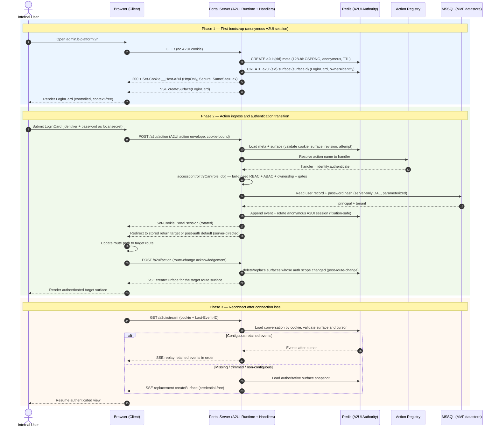
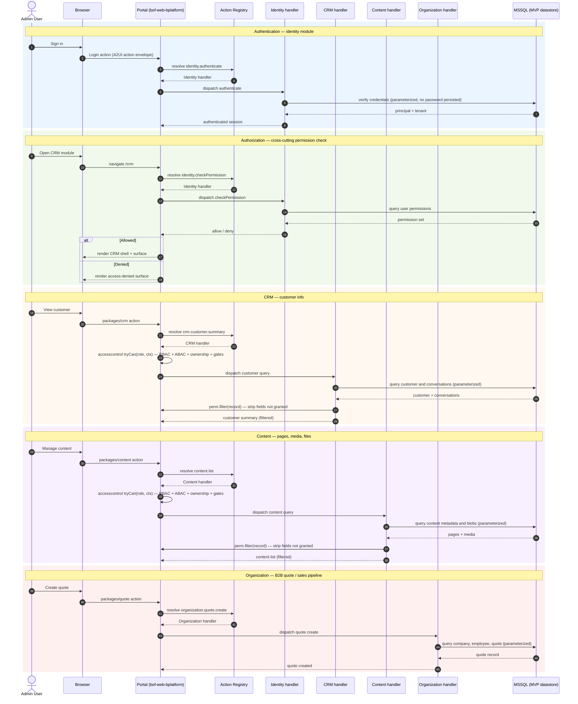

# Portal A2UI Runtime — Technical Requirement

> Normative cross-feature runtime contract for server-authoritative declarative UI in the B-Platform Portal. The [Super App architecture](../products/bplatform-general/architecture/super-app.md#server-authoritative-declarative-ui) owns the platform boundary. The [login plan](./login-json-render-a2ui-refactoring-plan.md) is the first vertical slice, not the runtime boundary.
>
> **Status**: proposed 2026-08-15 · **Protocol baseline**: official A2UI v0.9.1 · **Owner**: B-Platform Super App kernel in `bof-web-bplatform/apps/portal`
>
> **MVP scope**: B-Platform is not yet at the full L0 sdk → L1 bof → L2 `api-service-*` → L3 `dbo-*` topology. During MVP, the Portal Next.js server **is the entire backend**: it owns A2UI session/surface state in Redis, hosts the cohesive-widget catalog and action handlers, and accesses the single datastore — **MSSQL** — directly through a server-only data-access layer. There is no `api-service-*`, no Service Orchestrator, and no `dbo-head`/`dbo-worker-*` in the MVP runtime. When the platform graduates to the full topology, an ADR will reintroduce the service boundary and move handlers out of the Portal; this contract is written so that migration replaces the data-access layer, not the A2UI runtime.

---

## 1. Scope and principles

The Portal A2UI runtime applies to every B-Platform Super App feature that renders server-produced declarative UI, including authentication, initialization, global shell workflows, and installed application features. It provides one shared implementation for session/conversation lifecycle, Redis persistence, catalog negotiation, surface reduction, trusted rendering, action ingress, SSE delivery, isolation, and observability.

Login is the first adoption slice. It must not create an authentication-only renderer, transport, Redis schema, or action protocol that later features need to duplicate.

The runtime follows these principles:

- The server owns business state, authorization, workflow decisions, persistence, and side effects.
- The browser renders validated surfaces, holds explicitly classified ephemeral state, and emits typed intent.
- Official A2UI v0.9.1 envelopes are the wire contract; json-render supplies catalog/registry/renderer concepts through an explicit adapter.
- Generated data cannot select code, imports, providers, capabilities, service routes, endpoint URLs, arbitrary HTML, or arbitrary CSS.
- A2UI session state is stored in Redis. Process-local session/event state is test-only and must not be a production fallback.
- Catalog entries are cohesive, reviewable workflow widgets, not independently generated atomic controls.
- Catalog widget implementations are controlled and context-free: no inner state, React context, domain fetches, or business action handlers.
- Navigation changes are **server-directed**: the runtime signals the client to enter a route (e.g. the stored return target after sign-in), the client applies the route change and acknowledges it, and the route surface resolver creates the surface for that route. The browser never invents, selects, or deletes/recreates routes itself; authenticated transitions use a redirect / re-route signal rather than a same-stream `deleteSurface` + `createSurface` pair.

## 2. Runtime terminology

| Term | Definition |
|---|---|
| A2UI session | A server-issued, cookie-bound portal conversation that may own one or more surfaces. It is not an authenticated user session. |
| Portal session | The authenticated first-party session established after successful authentication. It is separate from the A2UI session. |
| Surface | A server-owned A2UI component graph and safe data model identified by an opaque `surfaceId`. |
| Conversation context | Credential-free server state needed to continue the interaction: active surfaces, owner mappings, safe workflow state, revisions, event cursors, and expiry. |
| Catalog | A versioned allowlist of cohesive widgets, props, bindings, and typed actions. |
| Registry | Static mapping from catalog widget names to reviewed native implementations. |
| Route surface resolver | Portal-side resolver that, at a server-directed route, creates the surface for that route (e.g. the login surface at `/login`, the target surface at the stored return target). It is server-owned; the browser never selects a route. |
| Server surface state | Credential-free authoritative A2UI state eligible for Redis snapshots and SSE delivery. |
| Local presentation state | Non-domain browser-only state such as focus, password visibility, disclosure, and pending visual state. It is never persisted to Redis. |
| Local secret state | Non-serializable browser-only sensitive input such as passwords and password confirmation. It is never synchronized, snapshotted, logged, or stored. |

## 3. Portal-wide runtime boundary

The reusable runtime belongs under `apps/portal`, with feature/domain packages contributing catalog widgets and typed action declarations through reviewed manifests. `packages/shared-ui` remains protocol-agnostic and supplies native atoms used inside widgets.

The runtime owns:

- secure A2UI session bootstrap and cookie lifecycle;
- Redis conversation, surface snapshot, event history, and replay metadata;
- A2UI schema validation and deterministic per-surface reduction;
- catalog negotiation and the trusted registry boundary;
- renderer-owned local presentation and secret stores;
- same-origin action ingress and allowlisted server action resolution;
- ordered SSE delivery and reconnect/resume behavior;
- server-directed routing: redirect / re-route signals, return-target capture in session context, route-change acknowledgement handling, and the route surface resolver;
- tenant, principal, session, surface, and owner isolation;
- protocol-safe telemetry and audit correlation.

During MVP, the Portal server also owns:

- the server-only MSSQL data-access layer used by action handlers;
- feature handlers for identity (authentication, initialization, session), CRM, content, organization, and other MVP domains, registered as Portal route handlers/server actions until a separate ADR extracts them into `api-service-*` services.

Installed features own:

- cohesive widget schemas and reviewed native widget implementations;
- typed domain action names and closed context schemas;
- server handlers registered through the Portal action registry (and, once introduced, the Super App kernel);
- feature-specific authorization, domain state, outcomes, and tests.

Installed features must not create parallel A2UI session cookies, Redis key spaces, reducers, SSE protocols, generic action endpoints, or component-local state conventions.

## 4. Redis-backed A2UI sessions

### 4.1 First connection and cookie

The first bootstrap request to the shared Portal A2UI runtime creates an opaque A2UI session identifier using a cryptographically secure random generator with at least 128 bits of entropy. The server stores the new session metadata in Redis before returning a usable bootstrap response and sets the identifier in a secure cookie.

The production cookie contract is:

- `HttpOnly`;
- `Secure` outside explicitly approved local development;
- `SameSite=Lax` or stricter;
- `Path=/` so all Portal A2UI features use the same conversation;
- no `Domain` attribute; prefer a `__Host-` cookie name;
- opaque and meaningless outside server-side lookup;
- short idle lifetime with an absolute maximum lifetime;
- rotated on fixation risk, privilege transition, or policy-defined renewal;
- invalidated on expiry, explicit conversation reset, ownership mismatch, or security event.

The browser never reads the cookie value, puts it in an A2UI envelope, sends it as an application field, or chooses a session identifier. A missing, invalid, expired, or unknown cookie creates a fresh session only through bootstrap; feature endpoints fail closed instead of accepting a browser-selected replacement.

### 4.2 Redis data model

A conceptual key model is:

| Key | Purpose |
|---|---|
| `a2ui:{sessionId}:meta` | Lifecycle, tenant/principal binding, selected catalog set, active surfaces, idle/absolute expiry, and safe conversation metadata. |
| `a2ui:{sessionId}:surface:{surfaceId}` | Credential-free authoritative surface snapshot, owner domain, catalog ID, current revision, status, and expiry. |
| `a2ui:{sessionId}:events` | Ordered resumable A2UI server-message history with monotonic event IDs. |
| `a2ui:{sessionId}:attempt:{attemptId}` | Bounded duplicate/concurrency status and safe outcome metadata; never an action body, credential, token, or reusable authentication result. |

All keys for a session use the same Redis Cluster hash tag where atomic multi-key mutation is required. Implementations may refine the physical schema, but must preserve the ownership, credential-isolation, ordering, and expiry contracts.

Redis requirements:

- Use atomic compare-and-append or transaction/script semantics so the expected revision check, surface mutation, and event append cannot diverge.
- Apply both idle and absolute TTLs to session-owned keys; child keys must not outlive their session.
- Store a bounded event history sufficient for the approved reconnect window.
- Use Redis Streams or an equivalent ordered log. Do not use a consumer group to distribute a user's events among competing Portal connections.
- Apply payload size, event count, surface count, component count, and connection limits.
- Keep production process-local memory as a disposable read optimization only, never the authority.
- During Redis unavailability, fail closed with a safe unavailable state. Do not silently fall back to unbound process-local sessions.
- Configure persistence, replication, backup, ACL, TLS/network isolation, and eviction policy so runtime data follows platform security and availability requirements.

### 4.3 Conversation recovery

A network reconnect presents two independent inputs:

1. the secure cookie, which identifies the server-side A2UI session; and
2. `Last-Event-ID`, which is only the cursor for a specific cookie-bound surface stream.

The server loads the conversation from Redis using the cookie, verifies that the requested `surfaceId` belongs to that session and current tenant/principal binding, then validates the cursor.

- If retained events after the cursor are contiguous, replay them in order.
- If history is missing, trimmed, stale, or non-contiguous, send a credential-free authoritative replacement using valid A2UI surface lifecycle messages.
- Reject unknown, cross-session, cross-surface, future, malformed, or expired cursors.
- Never treat `Last-Event-ID` as authentication or authorization.
- Never replay or infer an upstream action after reconnect.
- A full page reload may bootstrap the cookie-bound conversation and receive fresh authoritative snapshots; it must not persist transport cursors in browser storage unless separately approved.

Multiple tabs may share one A2UI session cookie but must use distinct server-issued surfaces. Actions remain surface-scoped, expected-event checked, and owner-routed so one tab cannot overwrite or clear another tab's local inputs.

### 4.4 Authentication transition

The anonymous A2UI session cookie is not the authenticated Portal session cookie. On successful sign-in:

1. establish or rotate the authenticated Portal session cookie;
2. clear local secret state immediately after the action response commits the cookie;
3. invalidate or rotate the anonymous A2UI session to prevent fixation and privilege carry-over;
4. rebind any approved continuing conversation server-side to the authenticated principal and tenant without exposing either identifier to the browser; and
5. drive the authenticated transition with a **server-directed redirect / re-route signal** instead of a same-stream `deleteSurface` + `createSurface` pair: the runtime tells the client which route to enter (the stored return target or the post-auth default), the client updates its route path, posts a route-change acknowledgement action, and the route surface resolver creates the surface for the target route. Surfaces whose authorization scope changed are deleted or revalidated as a consequence of the route change, never through a browser-selected route or an explicit delete+create pair on the same stream. The client never selects the post-auth route itself.

Redis must never store passwords, password confirmation, raw credential-bearing action bodies, reusable authentication results, session tokens, or raw cookies. TTL does not make secret persistence acceptable.

## 5. Cohesive widget catalog

Catalog entries represent product-level widgets whose complete interaction and accessibility contract can be reviewed as a unit. Examples include:

- `LoginCard`;
- `InitializationCard`;
- `UnavailablePanel`;
- future feature widgets such as `CustomerSummary`, `ApprovalPanel`, or `SearchResults`.

Atomic controls and layout primitives such as `TextInput`, `PasswordInput`, `Button`, `Stack`, `Typography`, and `Logo` remain native `shared-ui` implementation details composed inside a widget. They are not independently generatable catalog entries.

Each widget requires:

- a stable versioned catalog name;
- a closed props schema with unknown fields rejected;
- explicit A2UI data bindings for non-secret server state;
- explicit renderer-local bindings for presentation/secret fields where allowed;
- a finite set of typed action declarations;
- accessible labels, keyboard behavior, focus behavior, pending/disabled/error states, and reduced-motion behavior;
- bounded text, collection, child slot, and route-key inputs;
- no arbitrary `children`, CSS, HTML, image URL, route, endpoint, handler, provider, or capability prop.

A cohesive widget may expose bounded slots only when the catalog explicitly types the permitted child widget set and tree limits. The server still cannot decompose a security-sensitive workflow into arbitrary atomic controls.

## 6. Controlled, context-free widget contract

Catalog widget implementations must be deterministic controlled views of supplied props and callbacks.

They must not use:

- `useState`, `useReducer`, mutable module-level state, or equivalent inner state;
- `createContext`, `useContext`, or framework/provider state access;
- direct A2UI/json-render hooks inside the widget;
- cookies, browser storage, environment globals, or hidden singleton stores;
- `fetch`, server actions, internal API clients, domain handlers, or endpoint selection;
- optimistic domain mutations or authorization decisions.

The trusted registry adapter is responsible for resolving validated A2UI bindings and injecting plain serializable view props plus typed callbacks. A renderer-owned external store may use framework subscription mechanisms in the host/adapter layer, but catalog widget implementations remain unaware of that mechanism.

For example, `LoginCard` receives controlled values and callbacks conceptually equivalent to:

- identifier value and `onIdentifierChange`;
- password value and `onPasswordChange`;
- password visibility and `onPasswordVisibilityChange`;
- pending/error display state;
- `onSubmit` that emits the declared typed A2UI intent.

The widget composes `shared-ui` atoms but does not own those values or implement authentication. Password visibility is renderer-owned local presentation state, not component inner state.

## 7. State classification and serialization barrier

Every renderer value is assigned exactly one state class:

| State class | Owner | May enter A2UI data model/SSE? | May enter Redis/snapshot? | Example |
|---|---|---:|---:|---|
| Server surface | Portal server | Yes, after validation | Yes, credential-free only | Generic error code, workflow status, safe display data |
| Local presentation | Portal renderer host | No | No | Focus, disclosure, password visibility, pending visual state |
| Local secret | Portal renderer host | No | No | Password, password confirmation |

Identifier handling is action-specific. For authentication it remains local input and must not be echoed through SSE or persisted in Redis; logging and telemetry must redact it according to the identity policy.

The runtime must enforce this split with separate types/APIs and stores. Generic serializer, snapshot, devtool, analytics, error-reporting, or debugging paths must have no access to local secret state. Auth and initialization surfaces reject `createSurface.sendDataModel: true`.

Input changes update renderer-owned local state without network actions. A submit action resolves the action-specific closed context from allowed local values at dispatch time, sends one same-origin TLS-protected request, then drops transient request material. Password-bearing actions are never automatically retried or cached.

## 8. Actions and server authority

The browser sends exactly one schema-valid official A2UI v0.9.1 `action` or `error` envelope per request. Transport metadata remains in approved headers and server state.

Before a handler executes, the Portal runtime validates:

- secure session cookie and server-resolved tenant/principal;
- surface ownership and owner domain;
- protocol and catalog version;
- expected event/revision state;
- source widget existence and its declared action;
- closed action context schema and size;
- strict origin, approved CSRF proof, and content type;
- duplicate/concurrency status and rate limit;
- **authorization** — a fail-closed `accesscontrol` `tryCan(role, ctx).action(action, resource)` check that evaluates RBAC roles + ABAC conditions + ownership + gates in one call. See the [accesscontrol ADR](../products/bplatform-general/architecture/decisions/accesscontrol-authorization.md). A thrown error must never become an accidental allow;
- current server-side authoritative resource state.

Action names resolve through a static Portal server registry to reviewed server handlers. During MVP those handlers live inside the Portal Next.js server and access MSSQL through a server-only data-access layer; no handler is callable from the browser and no handler may be selected by a UI payload. A widget/action payload cannot supply an import, handler, provider, app ID, tenant, role, permission result, service route, endpoint, return URL, or arbitrary capability name.

Audit records use bounded server-derived tenant, principal/session, surface, source widget, action, target capability, correlation, and safe outcome values. Raw action context, secrets, tokens, cookies, and high-cardinality payload values are excluded.

## 9. Surface and feature isolation

The server maintains:

`tenant/principal + a2uiSessionId + surfaceId -> ownerDomain + catalogId + revision + status + expiry`

- Each surface has exactly one authoritative owner at a revision.
- Actions and errors route only to that owner.
- The browser cannot choose or override ownership.
- Cross-surface references fail closed unless an explicit portal-owned composition contract permits a bounded reference.
- Data forwarded to another domain contains only fields required by the target action schema and no non-owned surface models or metadata.
- Session rotation, sign-out, authorization loss, or ownership change deletes or revalidates affected surfaces.

## 10. Transport and operational requirements

- SSE responses use `text/event-stream`; each mutating event has `event: a2ui`, a monotonic opaque `id`, and exactly one valid official A2UI server message in `data`.
- Heartbeats are SSE comments and never enter the A2UI parser or Redis event history as mutations.
- Streams are no-store/no-transform, enforce connection/event/rate limits, and stop when session ownership or authorization expires.
- Multi-replica Portal deployments read/write the Redis authority and must deliver a session's ordered events without instance affinity assumptions.
- Telemetry uses bounded labels and safe codes. It must not contain session IDs, surface payloads, action context, identifiers, credentials, tokens, cookies, or return targets.
- Redis health, append failures, trim lag, active sessions/surfaces, stream reconnects, replacement rate, protocol rejects, and action outcomes require dashboards and alerts using bounded metrics.

## 11. Required verification

At minimum, tests must prove:

- first bootstrap creates Redis state before setting a usable secure cookie;
- a missing/forged/fixed session ID cannot select another conversation;
- reconnect retrieves the cookie-bound conversation and resumes from a valid `Last-Event-ID`;
- cross-session/cross-surface/future/trimmed cursors fail or replace safely;
- multiple replicas and tabs preserve ordering and isolation;
- Redis outage fails closed without process-local authority;
- TTL expiration deletes session-owned surfaces/events and closes streams;
- catalog atomic controls cannot be generated independently;
- widgets remain controlled and context-free, with lint/static tests rejecting prohibited APIs/imports;
- renderer-local presentation and secret state never enter A2UI, Redis, SSE, snapshots, browser storage, telemetry, logs, traces, audit, queues, or idempotency records;
- unknown widgets/props/actions, arbitrary URLs/code/CSS/HTML, oversized trees, stale events, duplicate actions, and owner tampering fail closed;
- domain behavior executes once on the server for each accepted action;
- the authenticated transition drives navigation via a **server-directed redirect / re-route signal** followed by a client **route-change acknowledgement action**; the browser never invents a route, never selects a return target, and never performs a same-stream `deleteSurface` + `createSurface` pair for the transition;
- the authenticated transition rotates session boundaries and cannot carry anonymous privilege state forward.

## 12. Adoption rule

Every new Portal feature using server-authoritative declarative UI must reuse this runtime and contribute cohesive widgets/actions through its reviewed catalog extension. Feature plans specify only their vertical widgets, actions, domain capabilities, permissions, and product tests; they do not redefine session storage, wire framing, reconnect, reducer, or renderer state semantics.

The login and initialization migration in [`login-json-render-a2ui-refactoring-plan.md`](./login-json-render-a2ui-refactoring-plan.md) is the first conformance and rollout gate for this runtime.

## 13. Runtime collaboration and integration diagrams

This section provides the two required sequence diagrams: (1) how the User, the Browser (Client), the Portal Server, and the datastore collaborate through the A2UI runtime; and (2) how the Admin Portal integrates with installed application modules — identity, CRM, content, and organization — inside the single Portal server, with all data access going directly to MSSQL through a server-only data-access layer.

### 13.1 User — Client — Server — datastore collaboration

This diagram shows the three phases of an A2UI conversation: first bootstrap (anonymous session creation), action ingress with authentication transition (the Portal server resolves the action, validates it, and reads/writes MSSQL directly through its server-only data-access layer), and reconnect after connection loss (cookie-bound Redis recovery).

Actors and participants:

| Participant | Role in the A2UI runtime |
|---|---|
| Internal User | Operator interacting with the Portal through the browser. |
| Browser (Client) | Renders controlled widget surfaces; holds local presentation and local secret state; emits typed A2UI action envelopes. |
| Portal Server | Next.js server runtime hosting the A2UI runtime (session, Redis, SSE, catalog, reducer, action ingress), the action handler registry, and the server-only MSSQL data-access layer. During MVP this is the entire backend. |
| Redis | Production authority for A2UI session metadata, surface snapshots, ordered event history, and bounded attempt status. |
| Action Registry | Static Portal-owned lookup that resolves action names to reviewed server handlers. |
| MSSQL | The single MVP datastore. Accessed only by Portal server handlers through the server-only data-access layer. |

Collaboration requirements:

- [P0] The browser must never call MSSQL, the data-access layer, or a server handler directly. All actions flow through the Portal server's same-origin action ingress.
- [P0] The Portal server must validate the cookie, surface ownership, expected revision, action schema, origin, CSRF proof, and duplicate/concurrency status before dispatching any action.
- [P0] The Portal server must run a fail-closed `accesscontrol` `tryCan` check (RBAC + ABAC conditions + ownership + gates) before any handler touches MSSQL. A thrown error must never become an accidental allow. See the [accesscontrol ADR](../products/bplatform-general/architecture/decisions/accesscontrol-authorization.md).
- [P0] The Portal server must create Redis session state before returning a usable bootstrap response and setting the secure cookie.
- [P0] Server handlers access MSSQL only through the server-only data-access layer using parameterized queries; handlers must never interpolate untrusted values into SQL or hold long-lived connections in browser-reachable code.
- [P0] Reconnect must use the cookie to load the conversation from Redis and use `Last-Event-ID` only as a surface-scoped cursor — never as authentication.
- [P0] The authentication transition drives navigation through a **server-directed redirect / re-route signal** (to the stored return target or the post-auth default), followed by a client **route-change acknowledgement action** and the route surface resolver creating the surface for that route. The browser never invents, selects, or deletes/recreates routes via a same-stream `deleteSurface` + `createSurface` pair; surfaces whose authorization scope changed are deleted or revalidated as a consequence of the route change.
- [P0] The authentication transition must rotate or invalidate the anonymous A2UI session and must not carry anonymous privilege state into the authenticated Portal session.

### 13.2 Admin Portal integration with application modules

This diagram shows how the Admin Portal (`bof-web-bplatform`) integrates with installed application modules during MVP. There is no Service Orchestrator and no separate L2 service: every module's action handler lives inside the Portal Next.js server and accesses MSSQL directly through the shared server-only data-access layer. The diagram covers authentication (identity), cross-cutting authorization, CRM customer workflows, Content management, and Organization B2B quote management.

Actors and participants:

| Participant | Role in Portal integration |
|---|---|
| Admin User | Operator signed into the Admin Portal. |
| Browser | Renders Portal surfaces and emits A2UI actions. |
| Portal | `bof-web-bplatform/apps/portal` — single Next.js app container hosting the A2UI runtime, shell, and module package routes. During MVP it is also the entire backend. |
| Action Registry | Static Portal-owned lookup that resolves module action names to reviewed server handlers. |
| Identity handler | MVP identity handler inside the Portal server (authentication, initialization, session, sign-out). Maps to the future `api-service-identity` / UniGate domain. |
| CRM handler | MVP CRM handler inside the Portal server (customers, tickets, communications). Maps to the future `api-service-crm` domain. |
| Content handler | MVP content handler inside the Portal server (pages, media, files). Maps to the future `api-service-content` domain. |
| Organization handler | MVP organization handler inside the Portal server (B2B company, employee, member, quote, sales pipeline). Maps to the future `api-service-organization` domain. |
| MSSQL | The single MVP datastore. Accessed only through the server-only data-access layer. |

Integration requirements:

- [P0] The Portal is the single app container and, during MVP, the single backend. Module packages (`packages/identity`, `packages/crm`, `packages/content`, `packages/quote`) own routes, pages, and reviewed server handlers but must not become standalone services or hold their own datastore connections.
- [P0] Module handlers must register actions through the Portal Action Registry. No module may reach MSSQL except through the shared server-only data-access layer, and no module may expose a handler callable from the browser.
- [P0] Authentication, authorization, session inspection, and sign-out are handled by the MVP identity handler inside the Portal server. When the platform adopts the full topology, these will move to `api-service-identity` (UniGate) behind the Super App kernel `execute(...)` contract without changing the A2UI runtime.
- [P0] All datastore access is MSSQL only during MVP, through parameterized queries in the server-only data-access layer. Handlers must never interpolate untrusted values into SQL, log query parameters containing credentials, or expose connection strings to client-reachable code.
- [P0] Every action must be auditable with tenant, principal/session, surface, source widget, action, target capability, correlation ID, and safe outcome. Raw action context, secrets, tokens, cookies, and high-cardinality payload values are excluded. The `accesscontrol` `access` event stream feeds this audit record.
- [P0] Every handler dispatch must run a fail-closed `accesscontrol` `tryCan` check (RBAC + ABAC + ownership + gates) before touching MSSQL, and must call `perm.filter()` on read results to strip fields not granted to the caller. See the [accesscontrol ADR](../products/bplatform-general/architecture/decisions/accesscontrol-authorization.md).
- [P0] A2UI action payloads must never select the handler, datastore, table, or query. The Portal server resolves the target through the Action Registry; the browser supplies only the typed action intent.
- [P0] The MVP handler placement is a temporary architecture state. Extracting handlers into `api-service-*` services requires a separate ADR and must preserve the A2UI runtime, catalog, session, transport, and isolation contracts unchanged.
